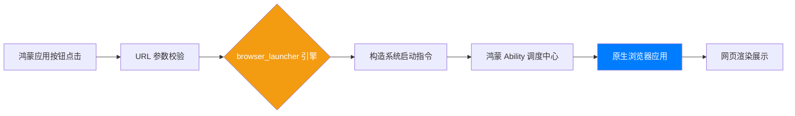

欢迎加入开源鸿蒙跨平台社区：[https://openharmonycrossplatform.csdn.net](https://openharmonycrossplatform.csdn.net)。

# Flutter for OpenHarmony：browser_launcher — 让鸿蒙应用无缝跳转外部浏览器

## 前言

在移動應用開發中，我们经常需要实现从应用内部跳转到系统浏览器来打开特定网页的需求。例如：展示长篇的服务协议、跳转到官方活动页面，或者引导用户下载三方资源。

在 **Flutter for OpenHarmony** 开发中，虽然我们可以使用强大的 `url_launcher`，但有些场景下我们希望使用更轻量级、更专注于浏览器唤起的方案。`browser_launcher` 为我们提供了一种直接、简单的命令行式浏览器启动能力，让我们能在鸿蒙平台上，一键开启外部世界的窗口。

## 一、为什么需要 browser_launcher？

### 1.1 跳转外部的必要性
某些复杂的 Web 页面包含大量的三方 Cookie、复杂的手势交互或是特定的浏览器插件，在应用内的嵌入式 Webview 中可能无法获得最佳体验。此时，引导用户去原生的鸿蒙浏览器是更好的选择。

### 1.2 核心优势
- **极简 API**：无需复杂的参数配置，只需一个 URL 即可启动。
- **环境自适应**：自动识别宿主环境中的默认浏览器。
- **纯 Dart 调用**：逻辑清晰，与鸿蒙系统的意图（Intent）机制完美契合。

### 1.3 浏览器唤起链路模型（Mermaid）



## 二、核心 API 与功能讲解

### 2.1 引入依赖
在 `pubspec.yaml` 中配置库：

```yaml
dependencies:
  # 极简浏览器启动工具
  browser_launcher: ^1.1.0
```

### 2.2 基础唤起操作
启动系统默认浏览器并打开指定网址。

```dart
import 'package:browser_launcher/browser_launcher.dart';

void openPortal() async {
  // 💡 无需实例化，直接静态调用
  await Chrome.start(['https://openharmony.cn']);
}
```

### 2.3 自定义启动参数（进阶）
有些浏览器支持传入特定的启动参数。

```dart
void openWithArguments() async {
  // 🎨 使用特定的命令行风格参数
  await Chrome.start(
    ['https://csdn.net'],
    options: ['--incognito'], // 模拟无痕模式启动（取决于浏览器支持）
  );
}
```

## 三、鸿蒙应用实战场景

### 3.1 场景一：帮助手册阅读
在鸿蒙手机的设置页面，点击“查看详细教程”。应用不占用应用内内存加载 Webview，而是拉起鸿蒙浏览器，让用户可以利用浏览器的多标签管理能力，随时切回应用查看。

### 3.2 场景二：引导外部更新
当检测到鸿蒙应用有重大版本更新，且必须通过官方下载页手动下载安装包时。通过该库引导用户进入浏览器下载中心。

<!-- IMAGE_PLACEHOLDER: [唤起浏览器后的系统截图] -->
<!-- 类型: 截图 -->
<!-- 设备: 鸿蒙手机 -->
<!-- 内容: 展现应用顺滑跳转到鸿蒙原生浏览器的动作 -->

## 四、OpenHarmony 平台适配建议

### 4.1 网络权限与白名单
- **✅ 建议**：虽然 `browser_launcher` 主要是唤起外部应用，但为了确保 URL 能够正常请求，请确保鸿蒙工程的 `module.json5` 中申请了网络权限。

### 4.2 适配鸿蒙多设备
- **📌 提醒**：在鸿蒙平板或智慧屏上，系统可能会以平行视界（分屏模式）打开浏览器。在编写跳转逻辑时，应确保应用在失去焦点（Inactive）后能正确保存当前页面的状态。

### 4.3 跳转失败处理
- **⚠️ 警告**：并非所有鸿蒙设备都预装了或是开放了外部浏览器唤起路径（如某些特定行业定制平板）。在调用启动命令时，务必包裹 `try-catch`块，并在捕获到异常时给用户提供一个“手动复制链接”的备选方案。

## 五、完整示例代码

演示一个功能直观的“外链跳转中心”。

```dart
import 'package:flutter/material.dart';
import 'package:browser_launcher/browser_launcher.dart';

void main() => runApp(const MaterialApp(home: BrowserLab()));

class BrowserLab extends StatelessWidget {
  const BrowserLab({super.key});

  void _launchUrl() async {
    try {
      // ✅ 实战：一键唤起鸿蒙默认浏览器
      await Chrome.start(['https://openharmonycrossplatform.csdn.net']);
    } catch (e) {
      debugPrint('跳转失败，可能是环境中未找到匹配浏览器：$e');
    }
  }

  @override
  Widget build(BuildContext context) {
    return Scaffold(
      appBar: AppBar(title: const Text('browser_launcher 鸿蒙实验室')),
      body: Center(
        child: Column(
          mainAxisAlignment: MainAxisAlignment.center,
          children: [
            const Icon(Icons.open_in_browser, size: 80, color: Colors.blue),
            const SizedBox(height: 20),
            const Text('点击下方按钮，将离开应用跳转至浏览器', textAlign: TextAlign.center),
            const SizedBox(height: 30),
            ElevatedButton.icon(
              icon: const Icon(Icons.launch),
              onPressed: _launchUrl, 
              label: const Text('前往鸿蒙开发者社区'),
            ),
          ],
        ),
      ),
    );
  }
}
```

## 六、总结

`browser_launcher` 为 **Flutter for OpenHarmony** 提供了一个稳定且极其简单的“外链通行证”。它摒弃了冗余的代码，通过最直接的系统调用，架起了应用内部与外部广阔 Web 世界的桥梁。

核心要点回顾：
1. **静态调用**：无需初始化，代码极其简洁。
2. **意图调度**：利用鸿蒙底层的 Ability 调用机制，跳转逻辑稳定。
3. **鸿蒙适配**：注意跳转异常处理，并考虑多设备分屏体验。
4. **轻量选择**：在不需要应用内嵌 Webview 时，这是最佳的降级体验方案。

让您的鸿蒙应用，能够更加开放地拥抱互联网的每一个精彩角落！

---

> 📦 **完整代码已上传至 AtomGit**：[open-harmony-examples/browser_launcher](https://atomgit.com/dragonbady/open-harmony-examples/tree/main/examples/browser_launcher)
>
> 🌐 **欢迎加入开源鸿蒙跨平台社区**：[开源鸿蒙跨平台开发者社区](https://openharmonycrossplatform.csdn.net)
