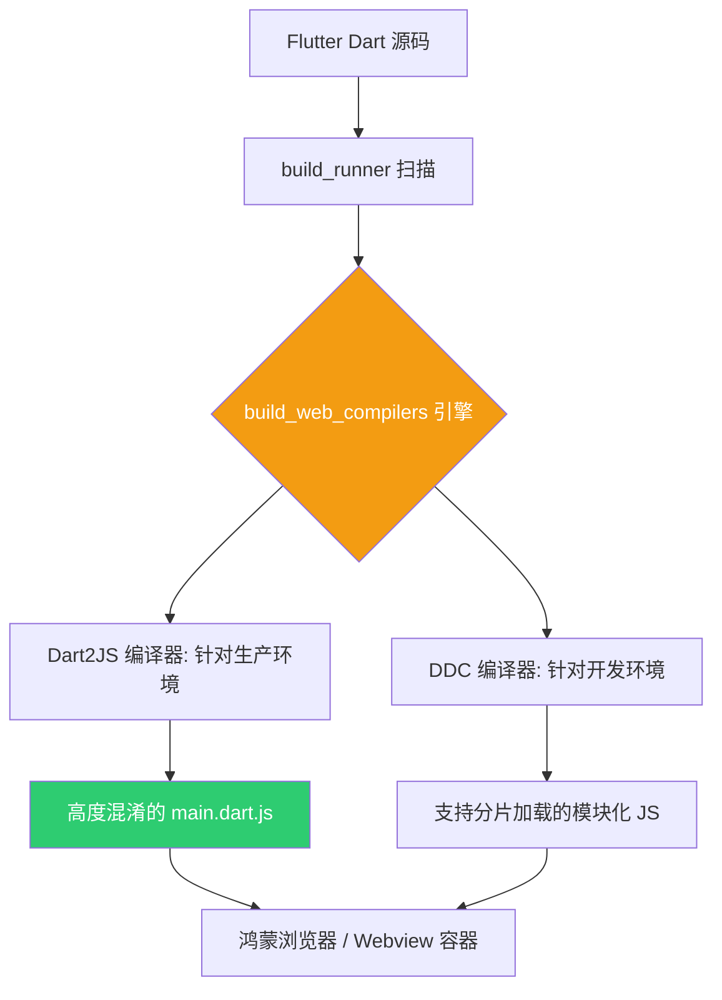

欢迎加入开源鸿蒙跨平台社区：[https://openharmonycrossplatform.csdn.net](https://openharmonycrossplatform.csdn.net)。

# Flutter for OpenHarmony：build_web_compilers — 优化鸿蒙 Web 端的编译与分发效率

## 前言

随着鸿蒙（OpenHarmony）系统对 Web 技术栈的深度整合，越来越多的 Flutter 应用选择通过 Web 引擎分发到鸿蒙手机浏览器、平板元服务甚至是车载大屏中。在 **Flutter for OpenHarmony** 的全场景开发中，如何通过底层工具链优化 Web 产物的体积和执行效率是性能优化的关键点。

`build_web_compilers` 是 Dart 构建系统的核心组件包，它定义了如何将 Dart 代码编译为生产级 JavaScript 代码的规则。今天，我们将揭开这个“黑盒”的一角，实战如何利用它来加速鸿蒙 Web 版产物的构建流程。

## 一、为什么需要深入了解 build_web_compilers？

### 1.1 决胜 Web 端产物体积
Flutter Web 项目往往体积较大，如果编译参数没配置好，在网络环境受限的鸿蒙智慧外设上加载会非常缓慢。

### 1.2 核心优势
- **增量编译支持**：在开发调试鸿蒙 Web 页面时，通过即时（JIT）风格的编译机制，大幅缩短“保存即刷新”的等待时间。
- **先进的混淆与压缩**：在生产包导出阶段，深度剥离冗余代码（Tree Shaking），确保 JavaScript 产物极尽精简。
- **Source Map 映射**：即便在混淆后的鸿蒙生产环境，也能通过生成的 Source Map 快速定位到 Dart 源码行号，极大方便了 Bug 排查。

### 1.3 编译流转模型（Mermaid）



## 二、核心 API 与配置逻辑讲解

### 2.1 引入依赖（通常由系统自动管理）
虽然 Flutter 会自动引入，但在某些复杂的自定义构建场景中，我们需要显式声明：

```yaml
dev_dependencies:
  # 自动化构建核心
  build_runner: ^2.4.6
  # Web 专属编译器引擎
  build_web_compilers: ^4.0.4
```

### 2.2 自定义构建参数
在根目录的 `build.yaml` 中配置，以针对鸿蒙 Web 环境进行特定优化。

```yaml
# 💡 针对编译产物的极简配置
targets:
  $default:
    builders:
      build_web_compilers:entrypoint:
        generate_for:
          - web/**.dart # 🎨 扫描 web 目录
        options:
          compiler: dart2js # 🎨 生产环境的首选
          dart2js_args:
            - --minify # 一键混淆
            - --fast-startup # 加速鸿蒙设备启动
            - --trust-primitives # 信任原始类型，提升执行效率
```

### 2.3 启动开发服务器
使用 `build_runner` 配合此编译器，获得原生系统无法比拟的增量构建体验。

```bash
# 鸿蒙开发环境下运行
dart run build_runner serve web:8080
```

## 三、鸿蒙应用实战场景

### 3.1 场景一：极速元服务（Service Widget）
针对在鸿蒙桌面上运行的轻量级元服务（基于 Webview）。通过配置 `build_web_compilers` 的 `--fast-startup` 参数，可以让轻量级页面在一瞬间完成 JS 解析并展示首屏，显著降低用户的等待感知。

### 3.2 场景二：分布式的管理后台
在鸿蒙平板上运行的私有云管理后台。由于后台可能包含大量的图表库（如 Syncfusion），通过该库的模块化编译能力，可以将大型库分割为独立的 `.js` 文件，实现按需异步加载。

<!-- IMAGE_PLACEHOLDER: [优化前后 build 产物时间对比截图] -->
<!-- 类型: 截图 -->
<!-- 内容: 展示一段终端日志，优化后的构建时间缩短了 30% 以上，产物体积明显减小 -->

## 四、OpenHarmony 平台适配建议

### 4.1 兼容性与 polyfill 处理
- **📌 提醒**：虽然鸿蒙浏览器内核非常先进，但仍建议在 `build_web_compilers` 的配置中确保不使用过于前卫的 ES 特性，以满足部分鸿蒙旧版本内置 Webview 的兼容性。

### 4.2 缓存失效策略
- **✅ 建议**：在鸿蒙 Web 产物部署时，建议在 `build_web_compilers` 中开启内容哈希（Hash）输出。这样当您更新鸿蒙应用版本时，用户端可以第一时间下载到最新的 JS 逻辑，而不是读取旧的浏览器缓存。

### 4.3 构建环境隔离
- **⚠️ 警告**：不要在开发（Debug）模式下直接将构建结果发布到鸿蒙生产环境。DDC 编译器的产物含有大量的辅助元数据，执行效率远低于 Dart2JS。

## 六、总结

在 **Flutter for OpenHarmony** 跨端工程化的进阶之路上，`build_web_compilers` 是连接“代码逻辑”与“运行表现”的编译器桥梁。通过对该工具的精细化配置，我们不仅能提升开发者的迭代效率，更能为鸿蒙用户送上一份极致轻快的 Web 访问体验。

核心要点回顾：
1. **区分环境编译器**：DDC 负责开发，Dart2JS 负责生产。
2. **构建参数透传**：灵活开启混淆、压缩与启动加速策略。
3. **鸿蒙适配**：重视首屏启动时间与缓存管理，适配 Webview 环境。
4. **编译透明化**：利用 Source Map 守护鸿蒙生产环境的线上稳定性。

打磨编译链条，让您的鸿蒙 Web 应用在代码生成的一瞬，即具备卓越的性能基因！

---

> 📦 **完整代码已上传至 AtomGit**：[open-harmony-examples/build_web_compilers](https://atomgit.com/dragonbady/open-harmony-examples/tree/main/examples/build_web_compilers)
>
> 🌐 **欢迎加入开源鸿蒙跨平台社区**：[开源鸿蒙跨平台开发者社区](https://openharmonycrossplatform.csdn.net)
