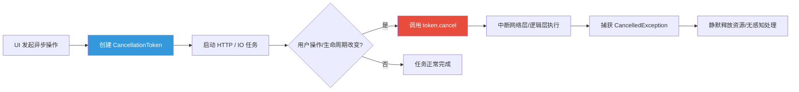

欢迎加入开源鸿蒙跨平台社区：[https://openharmonycrossplatform.csdn.net](https://openharmonycrossplatform.csdn.net)。

# Flutter for OpenHarmony：cancellation_token — 优雅掌控鸿蒙异步任务的生命周期

## 前言

在移动应用开发中，网络请求、文件 IO、甚至是复杂的 AI 运算通常都是异步执行的。然而，当用户在请求未完成时突然点击了“返回”按钮，或者快速切换了页面，这些仍在后台运行的“僵尸任务”不仅会浪费电量和网络资源，甚至可能在完成后尝试更新已销毁的 UI，导致应用崩溃。

在 **Flutter for OpenHarmony** 开发中，我们需要一种可靠且通用的方式来“掐断”这些不必要的任务。`cancellation_token` 库提供了一种极简且侵入性极小的方案，帮助我们在鸿蒙应用中实现精确的任务熔断。

## 一、为什么需要取消令牌？

### 1.1 资源的无效消耗
如果不处理任务取消，当用户在弱网环境下多次快速刷新页面，会导致多个 HTTP 连接同时尝试读写，加重了鸿蒙设备的网络负载分压。

### 1.2 异步任务的常见风险
- **内存泄漏**：匿名回调持有已销毁页面的 BuildContext。
- **状态不一致**：旧任务的结果覆盖了新任务的最新状态。

### 1.3 任务熔断模型（Mermaid）



## 二、核心 API 与功能讲解

### 2.1 引入依赖
在 `pubspec.yaml` 中引入：

```yaml
dependencies:
  # 异步任务取消库
  cancellation_token: ^0.1.0+2
```

### 2.2 创建与令牌传递
在业务逻辑层引入令牌的注入。

```dart
import 'package:cancellation_token/cancellation_token.dart';

Future<void> downloadSmallFile(CancellationToken token) async {
  // 💡 在任务开始前和中间关键节点，通过 token 进行检查
  if (token.isCancelled) return;
  
  // 模拟耗时操作，并将 token 传入支持取消的底层 API（如 Dio）
  await someLongRunningProcess(token: token);
}
```

### 2.3 执行取消操作
在鸿蒙页面的 `dispose` 或用户点击取消时触发：

```dart
late CancellationToken _token;

@override
void initState() {
  _token = CancellationToken();
  super.initState();
}

void _onUserCancel() {
  // 🎨 一键中止关联的所有异步任务
  _token.cancel('用户手动点击返回');
}
```

## 三、鸿蒙应用实战场景

### 3.1 场景一：搜索框实时搜索
在鸿蒙手机的搜索框中，当用户连续输入字符时，每一次新输入都会发起一个 API 请求。利用 `cancellation_token`，我们可以在新请求发起前，自动 cancel 掉上一个还没跑完的陈旧请求，确保只有最后的搜索结果才被渲染。

### 3.2 场景二：页面路由切换清理
在鸿蒙平板的应用中，用户从详情页快速退出。在 `StatefulWidget` 的 `dispose` 函数中直接调用令牌取消，防止后台网络库在页面不存在时继续下发通知，有效避免 `setstate() called after dispose()` 的经典低级错误。

<!-- IMAGE_PLACEHOLDER: [任务取消过程中的调试日志截图] -->
<!-- 类型: 截图 -->
<!-- 内容: 展示控制台输出“Request cancelled by token”，随后没有任何 UI 异常抛出 -->

## 四、OpenHarmony 平台适配建议

### 4.1 适配 Dio 等主流库
- **✅ 建议**：虽然 `dio` 等库自带 `CancelToken`，但 `cancellation_token` 库提供了一种跨架构的通用接口，可以适配更多非网络相关的耗时逻辑。建议在鸿蒙底层 Repository 层建立统一的令牌转换机制。

### 4.2 错误类型捕获
- **📌 提醒**：当任务被取消时，通常会抛出 `CancelledException`。在鸿蒙应用层捕获错误时，务必将“取消”导致的异常识别为“非致命错误”，不要弹出令人迷惑的报错 Toast。

### 4.3 内存阈值与并发
- **⚠️ 警告**：不要在一个令牌上绑定成千上万个微任务。大批量的取消操作如果集中在鸿蒙系统主线程处理，依然可能造成肉眼可见的瞬时掉帧。

## 五、完整示例代码

演示一个带模拟异步中断逻辑的鸿蒙计数器。

```dart
import 'package:flutter/material.dart';
import 'package:cancellation_token/cancellation_token.dart';

void main() => runApp(const MaterialApp(home: CancelLab()));

class CancelLab extends StatefulWidget {
  const CancelLab({super.key});

  @override
  State<CancelLab> createState() => _CancelLabState();
}

class _CancelLabState extends State<CancelLab> {
  CancellationToken? _token;
  String _status = '等待开始';

  void _startTask() async {
    _token = CancellationToken();
    setState(() => _status = '任务运行中，请尝试在 2s 内点击取消...');

    try {
      // ✅ 实战：模拟带令牌监控的任务
      await Future.delayed(const Duration(seconds: 2));
      
      if (_token!.isCancelled) {
        throw CancelledException('任务已熔断');
      }

      setState(() => _status = '任务完美运行结束！');
    } catch (e) {
      setState(() => _status = e.toString());
    }
  }

  @override
  void dispose() {
    _token?.cancel('组件销毁，强制取消');
    super.dispose();
  }

  @override
  Widget build(BuildContext context) {
    return Scaffold(
      appBar: AppBar(title: const Text('cancellation_token 鸿蒙熔断实验室')),
      body: Center(
        child: Column(
          children: [
            const Icon(Icons.timer, size: 80, color: Colors.blueAccent),
            const SizedBox(height: 20),
            Text(_status, style: const TextStyle(fontSize: 18)),
            const SizedBox(height: 30),
            Row(
              mainAxisAlignment: MainAxisAlignment.center,
              children: [
                ElevatedButton(onPressed: _startTask, child: const Text('运行测试任务')),
                const SizedBox(width: 10),
                ElevatedButton(
                  onPressed: () => _token?.cancel('用户手动断开'), 
                  style: ElevatedButton.styleFrom(backgroundColor: Colors.redAccent),
                  child: const Text('立即熔断'),
                ),
              ],
            ),
          ],
        ),
      ),
    );
  }
}
```

## 六、总结

在鸿蒙系统追求“极致流畅”的征途中，对异步任务的精细化管控是专业开发者的基本修养。`cancellation_token` 库不仅让我们学会了如何优雅地“开始”，更教会了我们如何负责任地“结束”。

核心要点回顾：
1. **防止僵尸任务**：有效避免在不必要的时刻消耗鸿蒙系统资源。
2. **通用的取消逻辑**：跨越网络与业务层的统一生命周期管理。
3. **静默失败处理**：平滑处理取消导致的异常，不干扰鸿蒙用户体验。
4. **鸿蒙适配**：在 dispose 阶段强制清理令牌，守护内存安全。

学会取消，是让您的鸿蒙应用跑得更稳、更久的关键。

---

> 📦 **完整代码已上传至 AtomGit**：[open-harmony-examples/cancellation_token](https://atomgit.com/dragonbady/open-harmony-examples/tree/main/examples/cancellation_token)
>
> 🌐 **欢迎加入开源鸿蒙跨平台社区**：[开源鸿蒙跨平台开发者社区](https://openharmonycrossplatform.csdn.net)
