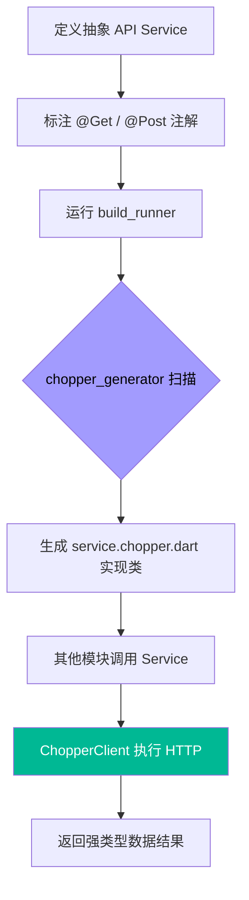

欢迎加入开源鸿蒙跨平台社区：[https://openharmonycrossplatform.csdn.net](https://openharmonycrossplatform.csdn.net)。

# Flutter for OpenHarmony：chopper_generator — 自动化构建鸿蒙端类型安全的 RESTful API

## 前言

在进行 **Flutter for OpenHarmony** 开发时，处理繁杂的网络请求是项基本但机械的工作。如果手动编写每一个 API 请求、解析回包然后再映射为 Model，不仅代码冗余，且在接口变更时极易遗漏。

受到 Android 中著名的 Retrofit 启发，`chopper` 为 Dart 世界带来了声明式的 HTTP 拦截逻辑。而 `chopper_generator` 则是其核心伴侣，它能通过解析注解，在编译期自动生成所有网络请求的模板代码。今天，我们将实战如何利用它，在鸿蒙平台上建立起工业级的网络请求中台。

## 一、为什么选用 Chopper 体系？

### 1.1 声明式定义的优雅
只需定义一个抽象类和请求路径注解，所有的 URL 拼接、Method 设置、参数映射都交由生成器完成。

### 1.2 核心优势
- **类型安全**：自动生成的代码能确保传入参数和返回类型的准确，减少因拼写错误导致的 Bug。
- **中间件扩展**：支持强大的请求和响应拦截器（Interceptors），可以统一注入鸿蒙端的认证 Token。
- **与 JSON 生成器联动**：完美契合 `json_serializable`，实现从 API 响应到 Dart 对象的一站式自动化。

### 1.3 网络请求生成流转模型（Mermaid）



## 二、核心 API 与集成流程

### 2.1 引入依赖
在 `pubspec.yaml` 中配置生成器全家桶：

```yaml
dependencies:
  # Chopper 运行时核心
  chopper: ^7.0.0

dev_dependencies:
  # 自动化构建核心
  build_runner: ^2.4.6
  # Chopper 代码生成器
  chopper_generator: ^7.0.0
```

### 2.2 定义 API 服务（Service）
创建一个描述鸿蒙后端接口的蓝图。

```dart
import 'package:chopper/chopper.dart';

// ✅ 准备关联生成的代码
part 'ohos_service.chopper.dart';

@ChopperApi(baseUrl: '/api/v1')
abstract class OhosService extends ChopperService {
  // 💡 定义获取用户信息的接口
  @Get(path: '/profile/{id}')
  Future<Response> getProfile(@Path('id') String userId);

  // 💡 定义提交日志的接口
  @Post(path: '/logs')
  Future<Response> uploadLog(@Body() Map<String, dynamic> body);

  static OhosService create([ChopperClient? client]) => _$OhosService(client);
}
```

### 2.3 生成代码
在终端执行指令，让生成器开始工作：

```bash
dart run build_runner build
```

## 三、鸿蒙应用实战场景

### 3.1 场景一：分布式任务同步 API
在鸿蒙的多终端协作中。通过 `chopper_generator` 定义一套标准的 REST 接口描述。开发者只需关注业务逻辑，所有的网络通信细节都被生成的 `_$OhosService` 封装得极其严密，确保了分布式请求的标准化。

### 3.2 场景二：带认证的全流程拦截
在鸿蒙应用的“设置”模块中。利用 Chopper 的拦截器功能，可以在所有生成的 API 请求中，自动在 Header 里加入鸿蒙系统当前的用户证书。即便底层 API 发生路径调整，由于使用了声明式定义，维护成本极低。

<!-- IMAGE_PLACEHOLDER: [生成的 Chopper 实现代码预览截图] -->
<!-- 类型: 截图 -->
<!-- 内容: 展示一段自动生成的 .chopper.dart 文件，包含了复杂的 URL 动态拼接逻辑 -->

## 四、OpenHarmony 平台适配建议

### 4.1 异步与取消令牌（CancelToken）。
- **✅ 建议**：在大批量的网络并发请求下，建议配合 `cancellation_token` 库。即便 Chopper 生成了逻辑，但合理控制任务的生命周期（防止组件销毁后仍在回调）是鸿蒙应用稳定性的关键。

### 4.2 适配自定义转换器（Converter）。
- **📌 提醒**：Chopper 默认返回的是 `Response` 原始对象。在鸿蒙应用中，建议自定义一个 `JsonConverter`。在代码生成完成后，确保转换器能将返回的 JSON 自动解析为您的鸿蒙版业务 Model。

### 4.3 编译体积建议。
- **⚠️ 警告**：每一个 API 接口都会生成若干辅助代码。在极其微型的鸿蒙元服务应用中，如果只有 1-2 个接口，建议手动编写以节省生成代码占用的包体积。对于中大型应用，Chopper 则是降本增效的核心。

## 五、完整示例：服务初始化

演示如何在鸿蒙端启动这套自动化的网络引擎。

```dart
import 'package:flutter/material.dart';
import 'package:chopper/chopper.dart';
import 'ohos_service.dart'; // 引入上面定义的蓝图

void main() => runApp(const MaterialApp(home: ChopperLab()));

class ChopperLab extends StatefulWidget {
  const ChopperLab({super.key});

  @override
  State<ChopperLab> createState() => _ChopperLabState();
}

class _ChopperLabState extends State<ChopperLab> {
  late final OhosService _service;

  @override
  void initState() {
    super.initState();
    // 1. 初始化客户端
    final client = ChopperClient(
      baseUrl: Uri.parse('https://ohos-api.example.com'),
      services: [OhosService.create()], // ✅ 挂载生成的服务类
      converter: const JsonConverter(), // 核心转换器
    );
    _service = client.getService<OhosService>();
  }

  void _callApi() async {
    // ✅ 实战：享受类型安全的调用
    final res = await _service.getProfile('ohos_admin');
    if (res.isSuccessful) {
      print('请求成功: ${res.body}');
    }
  }

  @override
  Widget build(BuildContext context) {
    return Scaffold(
      appBar: AppBar(title: const Text('chopper 鸿蒙工程化实验室')),
      body: Center(
        child: ElevatedButton(
          onPressed: _callApi, 
          child: const Text('调用自动化生成的接口'),
        ),
      ),
    );
  }
}
```

## 六、总结

在鸿蒙应用进入工业化精细开发的新阶段，`chopper_generator` 为我们提供了一套高效、严谨的网络层自动化方案。它不仅解放了开发者的双手，更通过编译期的代码生成，为应用的类型安全和健壮性筑起了一道防线。

核心要点回顾：
1. **声明式接口**：通过抽象类描述业务接口，极简易懂。
2. **构建期生成**：利用 build_runner 在编译前完成所有样板代码。
3. **鸿蒙适配**：注意与拦截器的深度绑定，统一处理鸿蒙端的认证与错误捕获。
4. **提升可维护性**：一处定义，全处引用，让网络层重构不再痛苦。

让自动化工具成为您的副手，在鸿蒙之巅构建效率之塔！

---

> 📦 **完整代码已上传至 AtomGit**：[open-harmony-examples/chopper_generator](https://atomgit.com/dragonbady/open-harmony-examples/tree/main/examples/chopper_generator)
>
> 🌐 **欢迎加入开源鸿蒙跨平台社区**：[开源鸿蒙跨平台开发者社区](https://openharmonycrossplatform.csdn.net)
