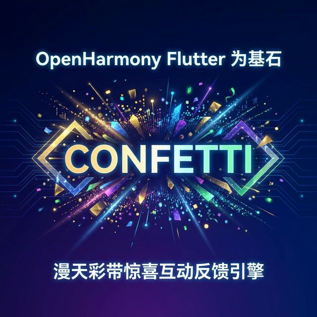
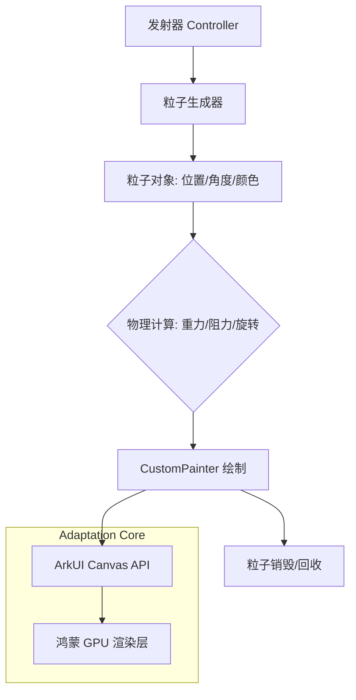

在电商大促夺魁、游戏升级或是任务达成时，一套精美的“彩带喷发”动画往往能让用户的多巴胺瞬间翻倍。`confetti` 库为 Flutter 开发者提供了一套高性能、可高度定制的物理粒子系统。在本文中，我们将探讨如何在 OpenHarmony 环境下部署这一“氛围大师”，让你的鸿蒙应用关键节点充满惊喜。

<!-- 封面图占位 -->


## 1. 为什么你的应用需要 confetti？

心理学研究表明，适时的正向视觉反馈能显著提高用户的留存率。`confetti` 的优势在于：
- **纯物理模拟**：每一片彩带的旋转、飘落和路径均符合物理重力公式，表现极其自然。
- **高性能粒子引擎**：即使在屏幕上同时渲染数百个碎片，依然能保持满帧运行。
- **全平台一致性**：不依赖原生动画库，确保在鸿蒙、安卓、桌面端效果完全对齐。

## 2. 架构设计：Confetti 的粒子全生命周期

`confetti` 内部实现了一套简易但高效的粒子系统：



## 3. 针对 OpenHarmony 的适配策略

### 3.1 粒子密度的平衡
虽然鸿蒙的高性能旗舰机（如 Mate 系列）能够轻松处理大量粒子，但为了兼容更广泛的鸿蒙生态设备（包括中低端手机和平板），建议将单次触发的 `numberOfParticles` 控制在 20-50 之间。

### 3.2 触摸与点击透明
彩带喷发时，画面上充满了大量的 CustomPainter。务必确保 `ConfettiWidget` 开启了合适的 `pointer-events`（在 Flutter 中默认为穿透），否则飞舞的彩带会拦截用户对下方业务按钮的点击。

## 4. 业务场景实战：鸿蒙商城“积分兑换成功”特效

下面我们来实现一个典型的兑换成功界面。

### 代码实现

```dart
import 'package:flutter/material.dart';
import 'package:confetti/confetti.dart';
import 'dart:math';

class OhosRewardSuccessPage extends StatefulWidget {
  const OhosRewardSuccessPage({super.key});

  @override
  State<OhosRewardSuccessPage> createState() => _OhosRewardSuccessPageState();
}

class _OhosRewardSuccessPageState extends State<OhosRewardSuccessPage> {
  late ConfettiController _controllerDisplay;

  @override
  void initState() {
    super.initState();
    _controllerDisplay = ConfettiController(duration: const Duration(seconds: 5));
  }

  @override
  void dispose() {
    _controllerDisplay.dispose();
    super.dispose();
  }

  @override
  Widget build(BuildContext context) {
    return Scaffold(
      appBar: AppBar(title: const Text('鸿蒙权益兑换')),
      body: Stack(
        children: [
          Align(
            alignment: Alignment.center,
            child: Column(
              mainAxisAlignment: MainAxisAlignment.center,
              children: [
                const Icon(Icons.stars, size: 80, color: Colors.amber),
                const SizedBox(height: 20),
                const Text('恭喜兑换成功！', style: TextStyle(fontSize: 24, fontWeight: FontWeight.bold)),
                const SizedBox(height: 40),
                ElevatedButton(
                  onPressed: () {
                    _controllerDisplay.play();
                  },
                  child: const Text('点火触发惊喜'),
                ),
              ],
            ),
          ),
          // 彩带组件：置于顶层
          Align(
            alignment: Alignment.topCenter,
            child: ConfettiWidget(
              confettiController: _controllerDisplay,
              blastDirection: pi / 2, // 向下喷射
              maxBlastForce: 5, 
              minBlastForce: 2, 
              emissionFrequency: 0.05,
              numberOfParticles: 20, 
              gravity: 0.1,
              shouldLoop: false,
              colors: const [
                Colors.green,
                Colors.blue,
                Colors.pink,
                Colors.orange,
                Colors.purple
              ],
            ),
          ),
        ],
      ),
    );
  }
}
```

## 5. 适配建议与避坑指南

1. **资源释放**：`ConfettiController` 使用完毕后必须显式调用 `dispose()`。在鸿蒙的高内存回收策略下，未关闭的可观察对象可能会被系统标记为泄露点。
2. **位置偏移**：在进行位置对齐时，请考虑到鸿蒙系统状态栏 and “挖孔屏”的适配，尽量将发射中心点设置在安全区域（SafeArea）内。
3. **结合震动反馈**：极致的鸿蒙体验应该是声、效、感合一。在触发彩带喷发的同时，调用鸿蒙原生的震动 API（Vibrator），交互感会瞬间拉满。

## 6. 总结

`confetti` 不仅仅是一个视觉库，它更是鸿蒙应用仪式感的“增效器”。通过极其轻巧的集成，它能极大提升用户在达成目标后的成就感。在构建充满活力的鸿蒙 Flutter 应用时，不妨给关键事件加一点“彩带”。

---
> 欢迎关注我的博客 [HappyPhper](https://blog.csdn.net/wangbaolong)，一同打造更有趣的鸿蒙应用。
