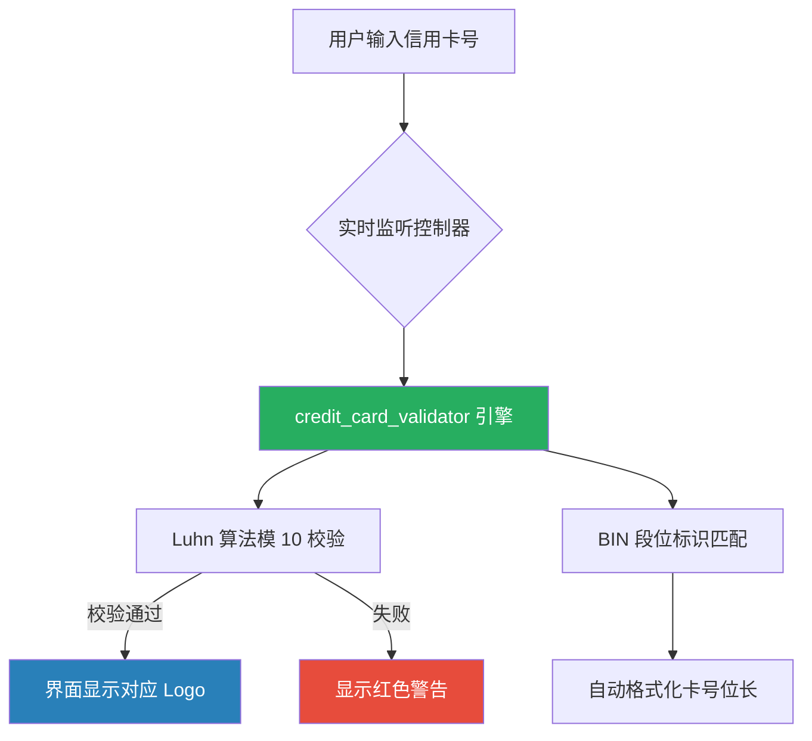

欢迎加入开源鸿蒙跨平台社区：[https://openharmonycrossplatform.csdn.net](https://openharmonycrossplatform.csdn.net)。

# Flutter for OpenHarmony：credit_card_validator — 提升鸿蒙金融应用的用户体验


## 前言

在涉及电商、支付及在线服务等场景的移动应用中，信用卡支付依旧是不可或缺的环节。用户输入信用卡信息时，如果能提供即时的格式确认、发卡机构识别以及精确的 Luhn 算法校验，不仅能极大提升支付点击率，还能有效阻断无效数据进入后端。

在 **Flutter for OpenHarmony** 开发中，我们需要一套轻量且专业的校验方案。`credit_card_validator` 正是为此设计的。它通过解析卡号段位和校验码，为鸿蒙金融级应用提供稳如泰山的校验能力。

## 一、为什么需要信用卡专用校验？

### 1.1 动态机构识别
不同的卡组织（如 Visa, Mastercard, American Express, 银联）具有不同的位长和前缀规则。传统的正则匹配难以完全覆盖所有的国际标准。

### 1.2 核心优势
- **内置 Luhn 算法**：自动排除因手误输入错误的卡号。
- **丰富的元数据**：自动识别出卡所属的品牌。
- **轻量无感知**：全 Dart 库，无特定终端 SDK 依赖，完美兼容鸿蒙系统的多样化算力。

### 1.3 校验流转逻辑（Mermaid）



## 二、核心 API 与功能讲解

### 2.1 引入依赖
在 `pubspec.yaml` 中配置：

```yaml
dependencies:
  # 信用卡专业校验库
  credit_card_validator: ^3.0.0
```

### 2.2 基础卡号校验
检测卡号是否有效并获取品牌信息。

```dart
import 'package:credit_card_validator/credit_card_validator.dart';

void validateCard(String ccNum) {
  final CreditCardValidator validator = CreditCardValidator();
  
  // 💡 执行校验
  var result = validator.validateCCNum(ccNum);
  
  if (result.isValid) {
    print('有效卡号！品牌: ${result.cardType.name}');
  } else {
    print('无效卡号理由: ${result.message}');
  }
}
```

### 2.3 CVC 与有效期校验
除了卡号，支付场景还需要验证背后三位码和过期时间。

```dart
void fullCheck() {
  final validator = CreditCardValidator();
  
  // 🎨 验证有效期（如 12/28）
  var expResult = validator.validateExpDate('12/28');
  print('有效期是否合规: ${expResult.isValid}');
  
  // 🎨 验证 CVV（针对不同卡组织长度要求不同）
  var cvvResult = validator.validateCVV('123', CardType.visa);
  print('CVV 是否正确: ${cvvResult.isValid}');
}
```

## 三、鸿蒙应用实战场景

### 3.1 场景一：支付界面 Logo 联动
在鸿蒙手机的“我的钱包”添加卡片界面，当用户输入前 4 位时，根据 `credit_card_validator` 返回的 `cardType`，动态展示 Visa/Master/UnionPay 的高清图标，给用户一种极强的反馈感。

### 3.2 场景二：表单自动截断与格式化
在鸿蒙折叠屏设备上，提供横向延展的信用卡输入框。利用校验器返回的卡类型约束，动态限制输入位长（如 Amex 是 15 位，Visa 是 16 位），并配合 `inputFormatters` 实现每 4 位一个空格的优雅排版。

<!-- IMAGE_PLACEHOLDER: [信用卡校验成功后的动态展示截图] -->
<!-- 类型: 截图 -->
<!-- 内容: 展示输入卡号时实时切换卡组织图标和有效期校验状态的 UI 反馈 -->

## 四、OpenHarmony 平台适配建议

### 4.1 安全键盘适配
信用卡信息属于敏感支付数据。
- **✅ 建议**：在鸿蒙系统上，建议开启“安全输入模式”。在使用 `TextField` 时，将键盘类型设为 `TextInputType.number`，并确保此时不产生剪贴板同步风险。

### 4.2 错误提示的国际化
- **📌 提醒**：`credit_card_validator` 返回的错误消息通常是英文。
- **🎨 最佳实践**：不要直接展示 `result.message`。在鸿蒙应用中，应根据 `result.isLuhnValid` 等标志位，自行映射为符合业务语境的中文提示，如“卡号输入有误，请核对”。

### 4.3 UI 响应性能
- **⚠️ 警告**：输入框的实时监控（`onChanged`）在低主频的鸿蒙智能外设上可能存在微小开销。虽然 Luhn 算法很快，但应避免在校验逻辑中执行复杂的 UI 联动动画。

## 五、完整示例代码

此示例演示了一个带卡组织识别功能的鸿蒙信用卡验证器。

```dart
import 'package:flutter/material.dart';
import 'package:credit_card_validator/credit_card_validator.dart';

void main() => runApp(const MaterialApp(home: CreditCardLab()));

class CreditCardLab extends StatefulWidget {
  const CreditCardLab({super.key});

  @override
  State<CreditCardLab> createState() => _CreditCardLabState();
}

class _CreditCardLabState extends State<CreditCardLab> {
  final _validator = CreditCardValidator();
  String _cardBrand = '未知卡组织';
  String _validStatus = '请输入 16 位卡号';

  void _onCCChanged(String val) {
    if (val.length < 4) return;
    
    // ✅ 实战：实时获取校验结果
    final result = _validator.validateCCNum(val);
    
    setState(() {
      if (result.isValid) {
        _cardBrand = '检测到品牌: ${result.cardType.name.toUpperCase()}';
        _validStatus = '卡号校验通过 ✅';
      } else {
        _cardBrand = '未知';
        _validStatus = '无效卡号 ❌';
      }
    });
  }

  @override
  Widget build(BuildContext context) {
    return Scaffold(
      appBar: AppBar(title: const Text('credit_card_validator 鸿蒙金融实验室')),
      body: Padding(
        padding: const EdgeInsets.all(20.0),
        child: Column(
          children: [
            const Icon(Icons.credit_card, size: 80, color: Colors.blueGrey),
            const SizedBox(height: 20),
            TextField(
              decoration: const InputDecoration(
                labelText: '输入测试卡号 (如 4111 1111...)',
                border: OutlineInputBorder(),
              ),
              keyboardType: TextInputType.number,
              onChanged: _onCCChanged,
            ),
            const SizedBox(height: 20),
            Text(_cardBrand, style: const TextStyle(fontSize: 18, fontWeight: FontWeight.bold)),
            Text(_validStatus, style: TextStyle(color: _validStatus.contains('✅') ? Colors.green : Colors.red)),
          ],
        ),
      ),
    );
  }
}
```

## 六、总结

在鸿蒙生态的构建中，支付安全和体验是核心竞争力。通过 `credit_card_validator`，我们能以极小的成本建立起一套国际标准的校验逻辑，为 **Flutter for OpenHarmony** 应用的金融交付能力添砖加瓦。

核心要点回顾：
1. **Luhn 算法集成**：底层数学校验，杜绝低级录入错误。
2. **BIN 库动态识别**：智能判断 Visa, Mastercard 等卡组织。
3. **流程完整性**：涵盖卡号、有效期及验证码的全栈校验。
4. **鸿蒙适配**：重视安全输入环境，并做好中文化提示包装。

希望您的鸿蒙金融应用，由于这些细节的打磨，而更受用户信赖！

---

> 📦 **完整代码已上传至 AtomGit**：[open-harmony-examples/credit_card_validator](https://atomgit.com/dragonbady/open-harmony-examples/tree/main/examples/credit_card_validator)
>
> 🌐 **欢迎加入开源鸿蒙跨平台社区**：[开源鸿蒙跨平台开发者社区](https://openharmonycrossplatform.csdn.net)
