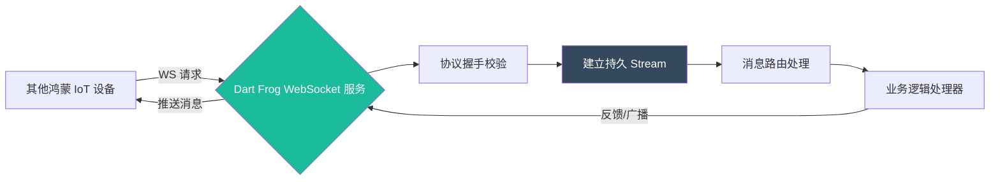

欢迎加入开源鸿蒙跨平台社区：[https://openharmonycrossplatform.csdn.net](https://openharmonycrossplatform.csdn.net)。

# Flutter for OpenHarmony：dart_frog_web_socket — 在鸿蒙端构建极简高性能 WebSocket 服务

## 前言

随着鸿蒙（OpenHarmony）系统不仅在移动端，更在智能家居、工业互联等领域的大放异彩，设备间的实时低延迟通信变得愈发关键。有时我们需要在鸿蒙设备上直接运行一个轻量级的服务端，来接收来自多个传感器的实时数据流。

`dart_frog_web_socket` 库结合了流行的 `dart_frog` 服务端框架，为开发者提供了一种在鸿蒙环境下构建 WebSocket 服务的极致体验。今天，我们将实战如何利用该库，在鸿蒙平台上搭建起一套高性能的实时数据分发中心。

## 一、为什么在鸿蒙端运行 WebSocket 服务？

### 1.1 设备中枢（Hub）角色的崛起
在鸿蒙分布式架构中，一个高性能的手机或平板往往作为分布式网关。通过 WebSocket，它可以与周围功耗较低的传感器设备保持常连接，实时汇聚并处理数据。

### 1.2 核心优势
- **极简路由**：采用 `dart_frog` 的文件系统路由模式，编写 WebSocket 逻辑像写普通的 HTML 路由一样直观。
- **协议自动升级**：内置处理从标准 HTTP 到双向 WebSocket 的握手协议转换。
- **异步原生支持**：基于 Dart 的 `Stream` 机制，完美压榨鸿蒙系统的并行处理潜力。

### 1.3 通信链路模型（Mermaid）



## 二、核心 API 与功能讲解

### 2.1 引入依赖
在 `pubspec.yaml` 中配置核心框架：

```yaml
dependencies:
  # 服务端基础框架
  dart_frog: ^1.1.0
  # WebSocket 扩展支持
  dart_frog_web_socket: ^1.0.0
```

### 2.2 定义 WebSocket 监听器
在 `dart_frog` 的路由目录下（如 `routes/ws.dart`）编写逻辑。

```dart
import 'package:dart_frog/dart_frog.dart';
import 'package:dart_frog_web_socket/dart_frog_web_socket.dart';

Handler get handler {
  return webSocketHandler((channel, protocol) {
    // 💡 当一个连接建立时的回调
    print('✅ 一台鸿蒙子设备已上线');

    // 🎨 监听来自设备的消息
    channel.stream.listen((message) {
      print('收到原始信号: $message');
      
      // 🎨 同步回显（或广播）
      channel.sink.add('消息已同步至鸿蒙核心节点: $message');
    });

    // 💡 监听连接关闭
    channel.stream.toList().then((_) => print('❌ 设备离线'));
  });
}
```

### 2.3 在鸿蒙上启动服务
启动服务并监听本地端口。

```bash
# 鸿蒙开发环境下运行
dart_frog dev
```

## 三、鸿蒙应用实战场景

### 3.1 场景一：分布式会议白板同步
将一台鸿蒙大屏作为 WebSocket 服务器。多台鸿蒙平板作为客户端接入。通过 `dart_frog_web_socket` 的广播能力，将每一位参与者在屏幕上的笔迹坐标，毫秒级地分发到所有终端，实现沉浸式的协作体验。

### 3.2 场景二：工业传感器实时看板
在工厂环境下的鸿蒙工控机上运行服务。通过 WebSocket 接收来自各条流水线的压力、温度信号。利用 Dart 的异步处理流，对海量信号进行本地去噪后，再统一推送给监控中心应用。

<!-- IMAGE_PLACEHOLDER: [WebSocket 服务端运行成功看板截图] -->
<!-- 类型: 截图 -->
<!-- 内容: 展示控制台输出“Serving at 0.0.0.0:8080”，并伴随有实时消息滚动的 Log -->

## 四、OpenHarmony 平台适配建议

### 4.1 网络安全性与 TLS
鸿蒙系统极其重视设备间的安全信任链。
- **✅ 建议**：在生产环境中，不要使用裸连接（ws://）。建议在 `dart_frog` 上层挂载一层反向代理（如 Nginx），或者在代码中配置自签名证书，实现加密的 `wss://` 通信。

### 4.2 功耗管理与保活
由于 WebSocket 需要维持长连接，对鸿蒙设备的无线射频（Radio）开销较大。
- **📌 提醒**：如果您在鸿蒙后台运行该服务，请确保已向系统申请了 `BackgroundService` 权限，并根据业务需求设置合理的 `heartbeat`（心跳包）频率，避免连接被鸿蒙系统自动休眠。

### 4.3 内存压力控制
- **⚠️ 警告**：每一个 WebSocket 连接都会分配一定的内存 Buffer。在需要承载成百上千个并发连接的大型鸿蒙枢纽上，请通过 `dart_frog` 中间件限制最大连接数，防止 OOM 导致鸿蒙系统崩溃。

## 五、完整示例：消息回显服务

展示一个最小化的、可在鸿蒙端运行的消息反射中心。

```dart
import 'package:dart_frog/dart_frog.dart';
import 'package:dart_frog_web_socket/dart_frog_web_socket.dart';

// ✅ 实战：构建 WebSocket 通讯逻辑
Handler get handler {
  return webSocketHandler(
    (channel, protocol) {
      // 1. 发送欢迎语
      channel.sink.add('这里是鸿蒙 WebSocket 数据中心，连通成功！');

      // 2. 建立业务管道
      channel.stream.listen(
        (message) {
          // 处理业务指令
          if (message == 'get_status') {
            channel.sink.add('{"status": "online", "system": "OpenHarmony"}');
          } else {
            channel.sink.add('回传: $message');
          }
        },
        onDone: () => print('连接正常结束'),
      );
    },
    // 可选：指定支持的子协议
    protocols: ['json-v1'],
  );
}
```

## 六、总结

`dart_frog_web_socket` 为 **Flutter for OpenHarmony** 开发者提供了一套在鸿蒙端构建“微型数据中心”的强力方案。它将原本复杂的 Socket 编程简化为几行直观的流处理逻辑，极大地赋能了鸿蒙生态下的万物互连场景。

核心要点回顾：
1. **轻量化原则**：代码量极少，适合嵌入式级鸿蒙硬件。
2. **响应式架构**：基于 Stream 模型，天然适配 Flutter 开发思维。
3. **鸿蒙适配**：重视后台保活策略与 TLS 安全链接配置。
4. **分布式潜力**：助力鸿蒙应用从“单一终端”走向“万物路由器”。

拿起 WebSocket 的力量，让您的鸿蒙应用在实时互通的海洋中乘风破浪！

---

> 📦 **完整代码已上传至 AtomGit**：[open-harmony-examples/dart_frog_web_socket](https://atomgit.com/dragonbady/open-harmony-examples/tree/main/examples/dart_frog_web_socket)
>
> 🌐 **欢迎加入开源鸿蒙跨平台社区**：[开源鸿蒙跨平台开发者社区](https://openharmonycrossplatform.csdn.net)
