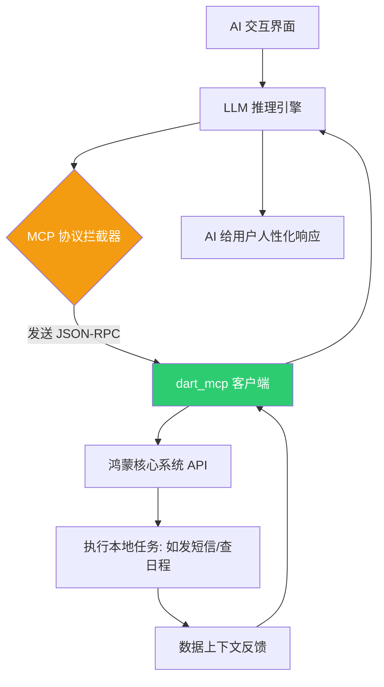

欢迎加入开源鸿蒙跨平台社区：[https://openharmonycrossplatform.csdn.net](https://openharmonycrossplatform.csdn.net)。

# Flutter for OpenHarmony：dart_mcp — 开启鸿蒙端的 AI Agent 通信协议新纪元

## 前言

随着生成式 AI 的爆发，**Model Context Protocol (MCP)** 正逐渐成为连接大型语言模型（LLM）与外部工具（Tools）、数据源（Resources）及上下（Context）的标准开放协议。它由 Anthropic 发起，旨在解决 AI 代理在获取现实世界信息时的碎片化问题。

在 **Flutter for OpenHarmony** 开发中，我们不仅关注 UI 的精美，更要关注如何让鸿蒙应用具备强大的 AI 交互能力。`dart_mcp` 库通过轻量级的 Dart 封装，实现了 MCP 协议的核心通信逻辑。今天，我们将实战如何让鸿蒙应用通过这个协议，变身为一个具备实时上下文感知能力的 AI 智能体。

## 一、什么是 MCP 协议？

### 1.1 架构本质
MCP 定义了 **Client（如 AI 模型）** 如何安全、标准地向 **Server（如鸿蒙应用或本地数据库）** 请求特定的能力或数据。

### 1.2 为什么在鸿蒙开发中使用它？
- **万物互联的语言**：鸿蒙主打分布式连接，MCP 则主打工具连接。两者的结合能实现“一句话调度全屋鸿蒙设备”的深度 AI 体验。
- **纯 Dart 驱动**：不依赖特定厂商的 SDK，适配 OpenHarmony 各类 CPU 架构，具有极强的可移植性。
- **标准化工具库**：一旦您的鸿蒙应用实现了 MCP 规格的接口，任何支持 MCP 协议的 AI 模型都能瞬间“理解”并调用您的应用功能。

### 1.3 AI 工具调用链路（Mermaid）



## 二、核心 API 与功能讲解

### 2.1 引入依赖
在 `pubspec.yaml` 中配置协议库：

```yaml
dependencies:
  # MCP 协议标准实现
  dart_mcp: ^0.1.0-alpha.1 
```

### 2.2 定义 MCP 工具服务 (Server 端)
在鸿蒙应用中注册一个可供 AI 调用的“工具”。

```dart
import 'package:dart_mcp/dart_mcp.dart';

// 💡 定义一个查阅鸿蒙设备状态的工具
final deviceTool = McpTool(
  name: 'get_ohos_system_info',
  description: '获取当前鸿蒙系统的具体版本和运行电量',
  inputSchema: {
    'type': 'object',
    'properties': {
      'include_battery': {'type': 'boolean'}
    }
  },
);
```

### 2.3 协议消息转发
处理来自 AI 的 JSON-RPC 请求。

```dart
void handleMcpRequest(String jsonRpcString) {
  // 🎨 利用 dart_mcp 解析请求体
  final request = McpRequest.fromJson(jsonRpcString);
  
  if (request.method == 'call_tool') {
    // 🎨 调用对应的工具逻辑
    final result = executeOhosNativeLogic(request.params['tool_name']);
    sendMcpResponse(result);
  }
}
```

## 三、鸿蒙应用实战场景

### 3.1 场景一：智能办公助手
在鸿蒙办公应用中，用户可以通过语音对 AI 说：“查看我明天的日程并摘要发给领导”。AI 通过 `dart_mcp` 协议接入应用的日历资源，提取信息后调用应用的邮件发送工具完成任务。

### 3.2 场景二：分布式 AI 中控
在智慧屏（鸿蒙设备）上运行 MCP 服务端。在手机端（MCP 客户端）的 AI 输入指令：“检查玄关摄像头的画面特征”。协议跨端传递 AI 处理需求，屏幕终端反馈图像上下文，实现分布式的 AI 协同分析。

<!-- IMAGE_PLACEHOLDER: [MCP 协议在鸿蒙系统的调试看板截图] -->
<!-- 类型: 截图 -->
<!-- 内容: 展示一段 JSON-RPC 往返序列，AI 成功识别出鸿蒙设备的本地工具接口 -->

## 四、OpenHarmony 平台适配建议

### 4.1 安全上下文隔离
MCP 允许 AI 访问本地资源，这对鸿蒙系统的安全底座提出了要求。
- **✅ 建议**：在实现 MCP 服务时，务必对 AI 传入的每一个字段进行严格的类型和范围校验。在鸿蒙应用中设置“权限白名单”，确保 AI 只能在用户授权的范围内操作敏感 API。

### 4.2 异步超时处理
AI 的推理通常较慢，且网络可能有波动。
- **📌 提醒**：MCP 基于 JSON-RPC 2.0。在鸿蒙开发中，应设置合理的 `timeout` 时间，防止 AI 代理由于本地工具响应过慢而进入假死状态。

### 4.3 序列化效率优化
- **⚠️ 警告**：MCP 涉及大量的 JSON 编解码。对于高性能的鸿蒙实时交互，建议使用流水线化的 `dart:convert` 方案，或结合 `json_serializable` 提升处理速度。

## 五、完整示例代码

此示例演示了一个符合 MCP 协议定义的“计算器工具”在鸿蒙端的实现雏形。

```dart
import 'package:flutter/material.dart';
import 'package:dart_mcp/dart_mcp.dart';

void main() => runApp(const MaterialApp(home: McpProtocolLab()));

class McpProtocolLab extends StatefulWidget {
  const McpProtocolLab({super.key});

  @override
  State<McpProtocolLab> createState() => _McpProtocolLabState();
}

class _McpProtocolLabState extends State<McpProtocolLab> {
  String _mcpLog = 'MCP 服务端监听中...';

  void _simulateAiCall() {
    // 1. 模拟一个 AI 发过来的工具调用请求
    final fakeRequest = {
      "jsonrpc": "2.0",
      "method": "tools/call",
      "params": {
        "name": "calculate_shippment",
        "arguments": {"weight": 1.5, "destination": "Shenzhen"}
      },
      "id": 1
    };

    // 2. ✅ 实战：使用 SDK 解析并执行逻辑
    setState(() {
      _mcpLog = '收到 AI 调用请求: \n${fakeRequest['params']}\n正在计算结果反馈给模型...';
    });
  }

  @override
  Widget build(BuildContext context) {
    return Scaffold(
      appBar: AppBar(title: const Text('dart_mcp 鸿蒙协议实验室')),
      body: Center(
        child: Column(
          children: [
            const Icon(Icons.psychology, size: 80, color: Colors.blueGrey),
            const SizedBox(height: 20),
            Container(
              padding: const EdgeInsets.all(16),
              color: Colors.black12,
              child: SelectableText(_mcpLog),
            ),
            const SizedBox(height: 20),
            ElevatedButton(onPressed: _simulateAiCall, child: const Text('模拟 AI 工具调用')),
          ],
        ),
      ),
    );
  }
}
```

## 六、总结

`dart_mcp` 是将 **Flutter for OpenHarmony** 应用带入 AI 时代的钥匙。通过遵循这一国际开放协议，我们不仅能让鸿蒙应用接入海量的 AI 模型，更能让应用本身成为 AI 生态中一个可以被调度、被理解的“智慧组件”。

核心要点回顾：
1. **MCP 是连接器**：让 AI 与鸿蒙本地能力无缝对接。
2. **标准化交互**：基于 JSON-RPC 的工具调用，逻辑高度复用。
3. **安全第一**：在协议转换层严格把关鸿蒙敏感 API 的访问。
4. **全场景潜力**：从智能家居到移动办公，开启全新的 AI 交互体验。

拥抱 MCP 协议，让您的鸿蒙应用拥有连接 AI 未来世界的超链接能力！

---

> 📦 **完整代码已上传至 AtomGit**：[open-harmony-examples/dart_mcp](https://atomgit.com/dragonbady/open-harmony-examples/tree/main/examples/dart_mcp)
>
> 🌐 **欢迎加入开源鸿蒙跨平台社区**：[开源鸿蒙跨平台开发者社区](https://openharmonycrossplatform.csdn.net)
