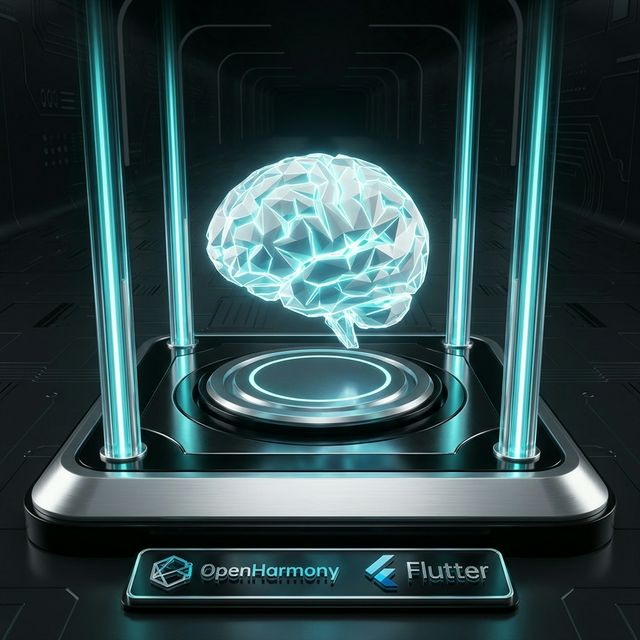
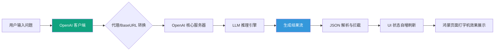

欢迎加入开源鸿蒙跨平台社区：[https://openharmonycrossplatform.csdn.net](https://openharmonycrossplatform.csdn.net)。

# Flutter for OpenHarmony：dart_openai — 激发鸿蒙应用的 AIGC 无限创意




## 前言

随着生成式 AI（AIGC）浪潮席卷全球，将大语言模型（LLM）的智慧集成到移动应用中已成为大势所趋。无论是智能对话、代码生成，还是图像创作，AI 正在重塑我们的交互方式。

在 **Flutter for OpenHarmony** 开发中，我们如何让鸿蒙应用直接对话全球顶尖的 AI 模型？`dart_openai` 库通过对 OpenAI API 的完美封装，为我们提供了从文本（GPT-4）到图片（DALL·E）的全栈 AI 能力。今天，我们将实战如何在鸿蒙设备上构建一个具备思考能力的智能体。

## 一、为什么集成 OpenAI 到鸿蒙生态？

### 1.1 万物互联的“大脑”
鸿蒙系统主打分布式协同，而 AI 能作为这些逻辑的中枢。比如用户在鸿蒙手机上说：“根据我现在的健康数据（来自手表），给我制定一份晚餐食谱”，AI 能即时生成人性化的建议。

### 1.2 为什么在鸿蒙上使用该库？
- **异步响应式流（Stream）**：天然支持 OpenAI 的流式输出（Streaming），让鸿蒙应用的聊天回显像打字机一样丝滑。
- **配置极简**：支持自定义 Base URL。这对于鸿蒙开发者在中国大陆环境下使用国内代理转发服务至关重要。
- **功能完备**：除了聊天，还涵盖了 Embedding、音频转文字、文件上传等所有官方能力。

### 1.3 AI 交互链路模型（Mermaid）



## 二、核心 API 与功能讲解

### 2.1 引入依赖
在 `pubspec.yaml` 中配置：

```yaml
dependencies:
  # OpenAI 官方协议封装
  dart_openai: ^5.1.0
```

### 2.2 初始化与代理配置（重点）
在鸿蒙应用入口处设置 API Key 和端点。

```dart
import 'package:dart_openai/dart_openai.dart';

void setupAI() {
  OpenAI.apiKey = "YOUR_API_KEY";
  
  // 💡 适配鸿蒙国内开发：设置代理基准地址
  OpenAI.baseUrl = "https://your-custom-proxy.com";
}
```

### 2.3 核心功能：流式聊天
让 AI 像人一样一个词一个词地蹦出来，拒绝等待长文时的“转圈圈”。

```dart
void chatWithAi(String prompt) {
  // 🎨 创建流式对话
  Stream<OpenAIStreamChatCompletionModel> chatStream = OpenAI.instance.chat.createStream(
    model: "gpt-4o",
    messages: [
      OpenAIChatCompletionChoiceMessageModel(
        content: [
          OpenAIChatCompletionChoiceMessageContentItemModel.text(prompt),
        ],
        role: OpenAIChatMessageRole.user,
      ),
    ],
  );

  chatStream.listen((event) {
    // ✅ 实战：获取当前片段并更新鸿蒙 UI
    final content = event.choices.first.delta.content;
    print(content?.first.text ?? "");
  });
}
```

## 三、鸿蒙应用实战场景

### 3.1 场景一：分布式智慧办公助手
在鸿蒙智慧屏（电视）上发起语音指令。通过 `dart_openai` 解析意图，AI 返回结构化的操作建议。随后应用通过鸿蒙的分布式总线，自动控制手机打开对应的文档。

### 3.2 场景二：个性化情感健康教练
结合鸿蒙穿戴设备捕获的压力指数。应用调用 OpenAI 的接口，让 AI 以“心理疏导员”的角色给用户发送安慰和呼吸训练建议。

<!-- IMAGE_PLACEHOLDER: [AI 流式对话在鸿蒙真机上的运行录屏截图] -->
<!-- 类型: 截图 -->
<!-- 内容: 展现类似 ChatGPT 的对话界面，文字正伴随着优美的动效逐字跳动 -->

## 四、OpenHarmony 平台适配建议

### 4.1 网络稳定性与超时重连
- **✅ 建议**：移动端网络环境复杂。在 listen `Stream` 时，务必包裹 `onError` 处理。在网络闪断后，利用 `dart_openai` 的断点续传思想或简单的重试机制，防止用户对话中断。

### 4.2 隐私合规与数据过滤
- **📌 提醒**：涉及到个人隐私（如身份证、家庭地址）时，在发送给 OpenAI 之前，建议在鸿蒙端利用本地正则库先进行脱敏处理。

### 4.3 UI 线程性能管控
- **⚠️ 警告**：Markdown 的实时解析是一项耗电操作。当 AI 快速输出带代码块的长文时，建议对 Markdown 刷新频率进行“节流”（Throttling），确保鸿蒙手机在 120Hz 下依然冰凉丝滑。

## 五、完整示例：简易 AI 问答器

演示如何在鸿蒙端快速建立一条 AI 对话逻辑。

```dart
import 'package:flutter/material.dart';
import 'package:dart_openai/dart_openai.dart';

void main() {
  OpenAI.apiKey = "YOUR_KEY"; // 此处替换真实 Key
  runApp(const MaterialApp(home: OpenAIQLab()));
}

class OpenAIQLab extends StatefulWidget {
  const OpenAIQLab({super.key});

  @override
  State<OpenAIQLab> createState() => _OpenAIQLabState();
}

class _OpenAIQLabState extends State<OpenAIQLab> {
  String _answer = '问问我任何关于鸿蒙开发的问题吧！';

  void _askAi() async {
    setState(() => _answer = 'AI 正在深度思考中...');

    try {
      // ✅ 实战：单次完整对话请求
      final completion = await OpenAI.instance.chat.create(
        model: "gpt-3.5-turbo",
        messages: [
          OpenAIChatCompletionChoiceMessageModel(
            content: [OpenAIChatCompletionChoiceMessageContentItemModel.text("解释什么是鸿蒙系统")],
            role: OpenAIChatMessageRole.user,
          ),
        ],
      );

      setState(() => _answer = completion.choices.first.message.content!.first.text!);
    } catch (e) {
      setState(() => _answer = '连接 AI 实验室失败：$e');
    }
  }

  @override
  Widget build(BuildContext context) {
    return Scaffold(
      appBar: AppBar(title: const Text('dart_openai 鸿蒙实验室')),
      body: Center(
        child: Padding(
          padding: const EdgeInsets.all(16.0),
          child: Column(
            mainAxisAlignment: MainAxisAlignment.center,
            children: [
              const Icon(Icons.auto_awesome, size: 80, color: Colors.teal),
              const SizedBox(height: 20),
              Text(_answer, textAlign: TextAlign.center, style: const TextStyle(fontSize: 16)),
              const SizedBox(height: 30),
              ElevatedButton(onPressed: _askAi, child: const Text('向 AI 提问')),
            ],
          ),
        ),
      ),
    );
  }
}
```

## 六、总结

在鸿蒙生态万物合一的构想中，AI 是点亮智慧的关键火种。通过 `dart_openai`，我们将世界顶尖的推理算力带到了 **Flutter for OpenHarmony** 开发者面前。从极简的对话到复杂的创意生成，AI 的加入让鸿蒙应用不再仅仅是单纯的工具，而是懂人、助人的智慧伙伴。

核心要点回顾：
1. **全协议覆盖**：从 Chat 到 Image，拥抱 OpenAI 全场景能力。
2. **鸿蒙代理支持**：灵活的 Base URL 配置，满足复杂网络环境。
3. **响应式体验**：利用 Stream 机制实现丝滑的打字机交互。
4. **安全合规**：重视数据预处理，守护鸿蒙用户隐私。

让 AI 的灵魂，赋予您的鸿蒙应用无限的可能！

---

> 📦 **完整代码已上传至 AtomGit**：[open-harmony-examples/dart_openai](https://atomgit.com/dragonbady/open-harmony-examples/tree/main/examples/dart_openai)
>
> 🌐 **欢迎加入开源鸿蒙跨平台社区**：[开源鸿蒙跨平台开发者社区](https://openharmonycrossplatform.csdn.net)
