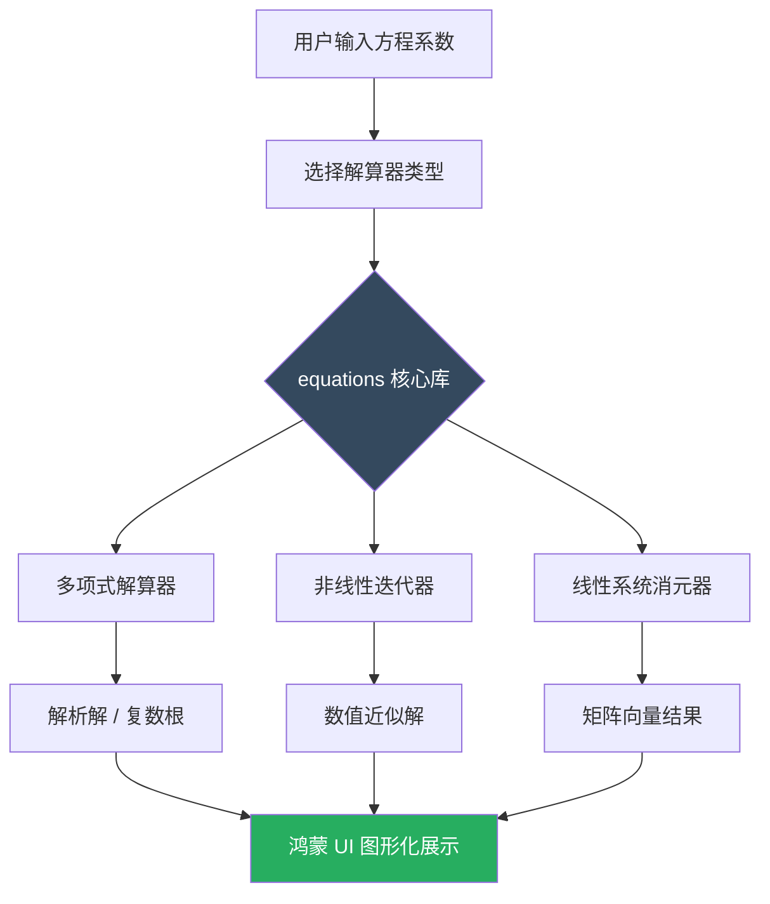

欢迎加入开源鸿蒙跨平台社区：[https://openharmonycrossplatform.csdn.net](https://openharmonycrossplatform.csdn.net)。

# Flutter for OpenHarmony：equations — 实现跨平台的高性能代数运算

## 前言

在工程、教育及科研类应用中，数学公式的解析与数值求解是核心功能。无论是求解一元二次方程、计算矩阵特征值，还是进行非线性方程的数值迭代，都需要一套严谨且高效的数学引擎。

在 **Flutter for OpenHarmony** 开发中，我们如何让鸿蒙应用具备顶尖的代数运算能力？`equations` 库是一个全能的数学解算器。它不仅能处理多项式求解，还支持复数运算和线性系统。今天，我们将实战如何利用它来赋权鸿蒙智慧计算场景。

## 一、为什么需要 equations 库？

### 1.1 数学计算的复杂性
手动编写牛顿迭代法或高斯消元法不仅容易出错，且在处理边界情况（如复数根）时异常麻烦。

### 1.2 核心优势
- **全能型选手**：支持线性代数、非线性方程（二分法、牛顿法、割线法）和多项式。
- **类型安全**：所有计算对象都具有良好的强类型定义，代码逻辑高度透明。
- **纯 Dart 支持**：无需链接底层 Fortran 或 Python 库，确保在鸿蒙各个形态架构上运行自如。

### 1.3 代数解算流程模型（Mermaid）



## 二、核心 API 与功能讲解

### 2.1 引入依赖
在 `pubspec.yaml` 中配置：

```yaml
dependencies:
  # 高性能方程解算器
  equations: ^6.1.0
```

### 2.2 二次方程求解（多项式）
快速解决形如 $ax^2 + bx + c = 0$ 的问题。

```dart
import 'package:equations/equations.dart';

void solveQuadratic() {
  // 💡 定义 x^2 - 5x + 6 = 0
  final p = Quadratic(
    a: Complex.fromReal(1),
    b: Complex.fromReal(-5),
    c: Complex.fromReal(6),
  );

  // 🎨 获取判别式与解
  print('判别式: ${p.discriminant()}');
  for (final root in p.solutions()) {
    print('实根: ${root.real}'); // 输出 2 和 3
  }
}
```

### 2.3 非线性方程数值解
使用牛顿迭代法寻找函数零点。

```dart
void solveNonLinear() {
  // 🎨 定义 f(x) = x^3 - 2
  final newton = Newton(
    function: "x^3 - 2",
    x0: 1.5, // 初始迭代点
  );

  final result = newton.solve();
  print('方程的近似根: ${result.guesses.last}');
}
```

## 三、鸿蒙应用实战场景

### 3.1 场景一：智能工程计算器
在鸿蒙手机的“多功能计算器”中，新增一个方程解算面板。通过 `equations` 的各种解算器，实时为工程师计算受力结构中的特征参数或电路阻抗中的复数分布。

### 3.2 场景二：图形可视化实验室
结合 `fl_chart` 或 `syncfusion` 图表，利用 `equations` 计算出多项式的极值点、拐点及根，在鸿蒙平板的大屏上绘制出精确的函数图像轨迹。

<!-- IMAGE_PLACEHOLDER: [基于 equations 的函数图像绘制截图] -->
<!-- 类型: 截图 -->
<!-- 设备: 鸿蒙平板 -->
<!-- 内容: 展现一个复杂的函数曲线，其关键的零点被精准地标示在图表上 -->

## 四、OpenHarmony 平台适配建议

### 4.1 精度与舍入误差
- **📌 提醒**：`equations` 使用的是 Dart 标准的 `double`（64位浮点）。在追求超高精度的物理仿真中，需注意舍入误差的累加。

### 4.2 计算性能隔离
代数求解（特别是高阶矩阵或多轮迭代）会短时间占用 CPU 资源。
- **✅ 建议**：虽然对于常见的二次/三次方程非常快，但如果是进行大规模线性方程组求解（如 $1000 \times 1000$ 矩阵），务必在 **Isolate** 中执行。

### 4.3 输入源校验
- **⚠️ 警告**：在使用 `Newton` 等需要解析字符串公式的类时，务必对输入进行合法性校验，避免因非法数学表达式导致的应用崩溃。

## 五、完整示例代码

演示一个功能直观的“一元二次方程解算实验室”。

```dart
import 'package:flutter/material.dart';
import 'package:equations/equations.dart';

void main() => runApp(const MaterialApp(home: MathLab()));

class MathLab extends StatefulWidget {
  const MathLab({super.key});

  @override
  State<MathLab> createState() => _MathLabState();
}

class _MathLabState extends State<MathLab> {
  String _result = '等待解算...';

  void _calculate() {
    // 💡 快速解算 1x^2 - 4x + 4 = 0 (重根场景)
    final quad = Quadratic(
      a: Complex.fromReal(1),
      b: Complex.fromReal(-4),
      c: Complex.fromReal(4),
    );

    final roots = quad.solutions();

    setState(() {
      _result = '方程: x² - 4x + 4 = 0\n解: ${roots.map((r) => r.toString()).join(', ')}';
    });
  }

  @override
  Widget build(BuildContext context) {
    return Scaffold(
      appBar: AppBar(title: const Text('equations 鸿蒙数学实验室')),
      body: Center(
        child: Column(
          mainAxisAlignment: MainAxisAlignment.center,
          children: [
            const Icon(Icons.functions, size: 80, color: Colors.indigo),
            const SizedBox(height: 20),
            Text(_result, textAlign: TextAlign.center, style: const TextStyle(fontSize: 18)),
            const SizedBox(height: 30),
            ElevatedButton(onPressed: _calculate, child: const Text('一键求解方程')),
          ],
        ),
      ),
    );
  }
}
```

## 六、总结

在鸿蒙系统向专业级领域迈进的过程中，数学运算能力是坚实的底座。通过 `equations` 库，我们将复杂的数值分析算法高度精炼为易用的 API，为 **Flutter for OpenHarmony** 开发者提供了数学科研层面的无限可能。

核心要点回顾：
1. **全链路覆盖**：从简单多项式到复杂线性方程组。
2. **纯粹的 Dart 实现**：高性能且无原生兼容烦恼。
3. **鸿蒙适配**：注意针对大计算量的 Isolate 隔离。
4. **可视化价值**：为鸿蒙端的图表展示提供精准的数据锚点。

让每一个鸿蒙应用，由于拥有了数学的智慧，而变得更加严谨卓越！

---

> 📦 **完整代码已上传至 AtomGit**：[open-harmony-examples/equations](https://atomgit.com/dragonbady/open-harmony-examples/tree/main/examples/equations)
>
> 🌐 **欢迎加入开源鸿蒙跨平台社区**：[开源鸿蒙跨平台开发者社区](https://openharmonycrossplatform.csdn.net)
