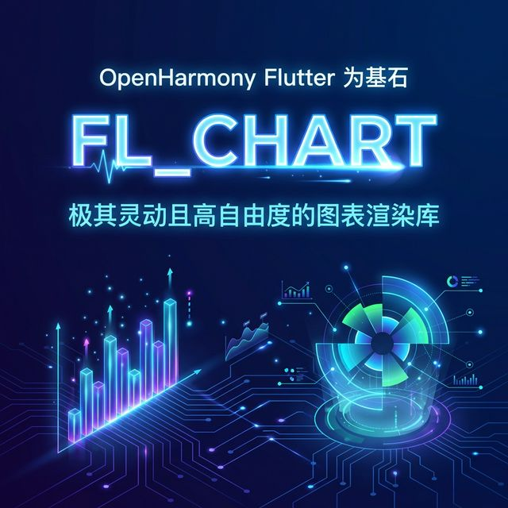
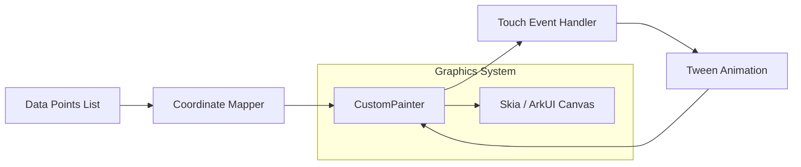

如果你正在寻找一款体积轻巧、动画流畅且设计高度自由的图表库，那么 `fl_chart` 绝对是 Flutter 生态中的不二之选。与大型商业库不同，`fl_chart` 以其极简的 API 设计和极其灵动的交互效果赢得了数十万开发者的青睐。在本文中，我们将探讨这款明星级图表库在 OpenHarmony 上的完美表现，并展示如何构建一个属于鸿蒙风格的分析报表。

<!-- 封面图占位 -->


## 1. 为什么 fl_chart 深受开发者喜爱？

`fl_chart` 的设计哲学是“为交互而生”：
- **纯 Flutter 实现**：不依赖任何原生控件，100% 渲染逻辑均在 Flutter 层完成，这也意味着它天生适配 OpenHarmony。
- **动感十足**：内置了非常精美的触碰反馈和状态切换动画。
- **极度轻量**：对应用包体积的影响微乎其微。
- **灵活性**：它允许你像拼积木一样组合所有的图表元素，非常适合追求极致 UI 体验的设计师项目。

## 2. 架构设计：fl_chart 的“点对点”映射逻辑

`fl_chart` 的核心在于坐标系与触摸事件的精准映射：



## 3. 针对 OpenHarmony 的优化策略

### 3.1 触摸反馈优化
由于鸿蒙系统的屏幕采样率和触控逻辑与原生 Android 略有不同，我们在使用 `fl_chart` 的 `TouchData` 时，建议适当增加 `touchTooltipData` 的偏移量（Offset），以防止手指遮挡住浮现的数据信息。

### 3.2 颜色系统适配
建议将 `fl_chart` 的背景与线条色值与鸿蒙的 `Digital Visual Design` 手册对齐。例如，使用 `Color(0xFF007DFF)` 作为鸿蒙蓝的主色调标记。

## 4. 业务场景实战：个人健康步数周报

我们将模拟一个鸿蒙版“运动健康”应用的周步数图表，使用折线图（LineChart）来展示。

### 代码实现

```dart
import 'package:flutter/material.dart';
import 'package:fl_chart/fl_chart.dart';

class OhosHealthChart extends StatelessWidget {
  const OhosHealthChart({super.key});

  @override
  Widget build(BuildContext context) {
    return Scaffold(
      appBar: AppBar(title: const Text('鸿蒙健康数据中心')),
      body: Container(
        height: 300,
        margin: const EdgeInsets.all(20),
        decoration: BoxDecoration(
          color: Colors.white,
          borderRadius: BorderRadius.circular(12),
          boxShadow: [
            BoxShadow(
              color: Colors.grey.withOpacity(0.1),
              blurRadius: 10,
              spreadRadius: 2,
            )
          ],
        ),
        child: Padding(
          padding: const EdgeInsets.all(16.0),
          child: LineChart(
            LineChartData(
              gridData: const FlGridData(show: false),
              titlesData: const FlTitlesData(show: true),
              borderData: FlBorderData(show: false),
              lineBarsData: [
                LineChartBarData(
                  spots: [
                    const FlSpot(0, 3000),
                    const FlSpot(1, 4500),
                    const FlSpot(2, 2800),
                    const FlSpot(3, 8000),
                    const FlSpot(4, 5500),
                    const FlSpot(5, 7800),
                    const FlSpot(6, 6000),
                  ],
                  isCurved: true,
                  color: const Color(0xFF007DFF), // 鸿蒙标准蓝
                  barWidth: 4,
                  belowBarData: BarAreaData(
                    show: true,
                    color: const Color(0xFF007DFF).withOpacity(0.1),
                  ),
                  dotData: const FlDotData(show: true),
                ),
              ],
            ),
          ),
        ),
      ),
    );
  }
}
```

## 5. 适配建议与避坑指南

1. **层级冲突**：如果你在 `ListView` 中嵌套 `fl_chart`，建议给图表容器明确的固定高度，并开启 `touchData: FlTouchData(enabled: true, allowTouchBarBackDraw: true)`，以确保滑动手势不被父容器拦截。
2. **性能提醒**：虽然 `fl_chart` 轻载，但在绘制包含成千上万个点的复杂曲线时，务必关闭辅助网格（gridData）以减少重绘压力。
3. **响应式适配**：`fl_chart` 的渲染非常依赖父容器的长宽比，在面对适配鸿蒙平板或折叠屏时，请使用 `AspectRatio` 组件进行包裹。

## 6. 总结

`fl_chart` 凭借其极高的颜值和灵活的配置，是快速在鸿蒙应用中实现数据展示的首选。它的动画平滑度和交互延迟表现都非常出色，能够完美承载轻中量级的业务统计分析需求。

---
> 欢迎关注我的博客 [HappyPhper](https://blog.csdn.net/wangbaolong)，一同探索 Flutter 适配鸿蒙的无限可能。
