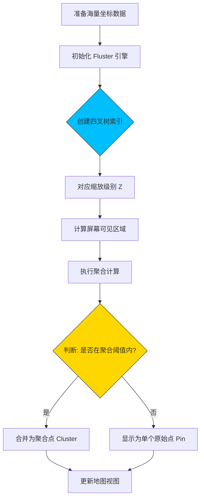

欢迎加入开源鸿蒙跨平台社区：[https://openharmonycrossplatform.csdn.net](https://openharmonycrossplatform.csdn.net)。

# Flutter for OpenHarmony：fluster — 亿级地理空间点聚合实战


## 前言

随着移动互联网进入“万物互联”时代，地理位置服务（LBS）在我们的日常应用中扮演着越来越重要的角色。无论是外卖配送、打车软件，还是房产中介、旅游攻略，都需要在地图上展示成千上万个位置点。

然而，当我们在 **OpenHarmony** 设备（如折叠屏手机、平板或车载系统）上尝试一次性渲染数千个标记点（Markers）时，地图往往会变得卡顿不堪，视觉上也极其混乱。为了解决这一痛点，**点聚合（Point Clustering）** 技术应运而生。今天我们要深度剖析的扩展库 —— `fluster`，正是解决海量地理点聚合的利器。

## 一、地理点聚合的核心挑战

### 1.1 性能杀手：盲目渲染
在地图缩放级别较低（如查看全国地图）时，如果强行渲染数万个坐标点，主 UI 线程会因为大量的绘图指令而挂起，导致应用无响应。

### 1.2 视觉重叠：信息过载
大量的标记点堆叠在一起，用户根本无法有效点击或识别具体位置，地图失去了原本的导向价值。

### 1.3 Fluster 的解决思路（Mermaid 原理图）

`fluster` 是一个基于 **Supercluster** 算法的 Dart 实现，其核心是通过 **Quadtree（四叉树）** 对地理空间进行分层索引。



## 二、Fluster 核心 API 详解

### 2.1 依赖引入
在鸿蒙 Flutter 项目的 `pubspec.yaml` 中添加依赖：

```yaml
dependencies:
  # 地理空间点聚合引擎
  fluster: ^1.1.0
  # 推荐搭配 map 数据结构使用
  latlong2: ^0.8.1
```

### 2.2 定义可聚类对象
所有的位置点必须实现 `Clusterable` 接口，以便引擎识别其坐标。

```dart
import 'package:fluster/fluster.dart';

class MapMarker extends Clusterable {
  final String id;
  final String name;

  MapMarker({
    required this.id,
    required this.name,
    double? latitude,
    double? longitude,
    bool? isCluster = false,
    int? clusterId,
    int? pointsSize,
    String? markerId,
  }) : super(
          latitude: latitude,
          longitude: longitude,
          isCluster: isCluster,
          clusterId: clusterId,
          pointsSize: pointsSize,
          markerId: markerId,
        );
}
```

### 2.3 初始化 Fluster 实例
初始化是性能最关键的一步，建议在后台线程或初始化阶段完成。

```dart
final Fluster<MapMarker> fluster = Fluster<MapMarker>(
  minZoom: 0,                // 最小缩放级别
  maxZoom: 20,               // 最大缩放级别
  radius: 150,               // 聚合半径（像素）
  extent: 512,               // 瓦片瓦片大小
  nodeSize: 64,              // 四叉树节点大小
  points: markers,           // 待聚合的点集合
  createCluster: (BaseCluster cluster, double longitude, double latitude) {
    return MapMarker(
      id: cluster.id.toString(),
      name: '聚合点',
      latitude: latitude,
      longitude: longitude,
      isCluster: true,
      clusterId: cluster.id,
      pointsSize: cluster.pointsSize,
    );
  },
);
```

<!-- IMAGE_PLACEHOLDER: [初始化代码在 IDE 中的展示] -->
<!-- 类型: 示例图 -->
<!-- 内容: 展示完整的类定义和初始化代码 -->

## 三、鸿蒙端地图实战场景

在鸿蒙系统（如搭载 HarmonyOS NEXT 的华为 Mate 系列）上，高性能的交互是核心体验。

### 3.1 场景一：基于缩放动态更新
当用户在鸿蒙平板上使用“双指捏合”手势缩放地图时，我们利用 `fluster` 快速获取当前级别的聚合状态。

```dart
// 💡 实时获取当前地图可见区域下的聚合结果
List<MapMarker> clusters = fluster.clusters(
  [-180.0, -85.0, 180.0, 85.0], // 当前屏幕边界 [西, 南, 东, 北]
  currentZoom.toInt(),
);
```

### 3.2 场景二：聚合点击钻取
点击一个聚合大点，地图平滑跳转到该区域的更深层级。

```dart
void onClusterTap(int clusterId) {
  // 🎨 获取该聚合点在下一层级的分散状态
  double childZoom = fluster.getClusterExpansionZoom(clusterId);
  // 执行地图控制器跳转操作
}
```

<!-- IMAGE_PLACEHOLDER: [鸿蒙地图点聚合运行截图] -->
<!-- 类型: 截图 -->
<!-- 设备: 鸿蒙手机 -->
<!-- 内容: 展示地图上大量的点被聚合成带有数字的蓝色圆圈 -->

## 四、OpenHarmony 平台适配指南

### 4.1 针对渲染管线的优化
鸿蒙系统采用的是 ArkUI 的渲染后端。虽然 Flutter 渲染是独立的，但大量的 Widget 树更新仍有开销。
- **✅ 推荐做法**：不要在地图上使用 `StatefulWidget` 包装每一个 Marker。使用 `CustomPainter` 或直接利用底层的渲染指令。
- **❌ 错误做法**：在每一帧 `onCameraMove` 中都全文重新执行聚合计算。建议使用防抖（Debounce）技术。

### 4.2 屏幕密度适配
鸿蒙设备拥有极高的屏幕 PPI。
- **📌 提醒**：`fluster` 的 `radius` 参数是基于像素的。在具有高 DPI 的鸿蒙设备上，建议根据 `MediaQuery.of(context).devicePixelRatio` 动态调整 `radius` 的数值，以保证在不同密度的屏幕上聚合密度看起来一致。

### 4.3 内存管理
由于 `fluster` 会在内存中构建四叉树索引。
- **⚠️ 警告**：对于超过 10 万个坐标点的情况，请监控鸿蒙系统的 `Memory` 占用。如果索引过大，应通过分片加载或在后台 Service 中处理索引搜索。

## 五、完整示例代码

下面是一个完整的模拟示例，演示了从数据创建到聚合点提取的全过程。

```dart
import 'package:flutter/material.dart';
import 'package:fluster/fluster.dart';

// 1. 定义实体
class MyLocation extends Clusterable {
  final String title;

  MyLocation({
    required this.title,
    double? latitude,
    double? longitude,
    bool? isCluster = false,
    int? clusterId,
    int? pointsSize,
    String? markerId,
  }) : super(
          latitude: latitude,
          longitude: longitude,
          isCluster: isCluster,
          clusterId: clusterId,
          pointsSize: pointsSize,
          markerId: markerId,
        );
}

void main() {
  runApp(const MaterialApp(home: FlusterMapDemo()));
}

class FlusterMapDemo extends StatefulWidget {
  const FlusterMapDemo({super.key});

  @override
  State<FlusterMapDemo> createState() => _FlusterMapDemoState();
}

class _FlusterMapDemoState extends State<FlusterMapDemo> {
  late Fluster<MyLocation> _fluster;
  double _currentZoom = 10.0;
  List<MyLocation> _currentClusters = [];

  @override
  void initState() {
    super.initState();
    _initData();
  }

  void _initData() {
    // 模拟 1000 个随机位置点
    List<MyLocation> points = List.generate(1000, (index) {
      return MyLocation(
        title: '点 $index',
        latitude: 31.0 + (index * 0.001),
        longitude: 121.0 + (index * 0.001),
      );
    });

    // 2. 初始化 Fluster
    _fluster = Fluster<MyLocation>(
      minZoom: 0,
      maxZoom: 20,
      radius: 150,
      extent: 2048,
      nodeSize: 64,
      points: points,
      createCluster: (BaseCluster cluster, double lng, double lat) {
        return MyLocation(
          title: '聚合组',
          isCluster: true,
          clusterId: cluster.id,
          pointsSize: cluster.pointsSize,
          latitude: lat,
          longitude: lng,
        );
      },
    );
    
    _refreshClusters();
  }

  void _refreshClusters() {
    setState(() {
      // 3. 提取当前视图下的聚合数据
      _currentClusters = _fluster.clusters(
        [-180.0, -85.0, 180.0, 85.0], 
        _currentZoom.toInt()
      );
    });
  }

  @override
  Widget build(BuildContext context) {
    return Scaffold(
      appBar: AppBar(title: const Text('Fluster 鸿蒙聚合实验室')),
      body: Column(
        children: [
          Padding(
            padding: const EdgeInsets.all(16.0),
            child: Row(
              children: [
                const Text('模拟地图缩放: '),
                Expanded(
                  child: Slider(
                    value: _currentZoom,
                    min: 0, max: 20,
                    onChanged: (v) {
                      _currentZoom = v;
                      _refreshClusters();
                    },
                  ),
                ),
                Text(_currentZoom.toStringAsFixed(1)),
              ],
            ),
          ),
          Expanded(
            child: ListView.builder(
              itemCount: _currentClusters.length,
              itemBuilder: (context, index) {
                final item = _currentClusters[index];
                return ListTile(
                  leading: Icon(item.isCluster! ? Icons.group_work : Icons.location_on),
                  title: Text(item.isCluster! ? '聚合大点 (内含 ${item.pointsSize} 个子点)' : '原始坐标点: ${item.title}'),
                  subtitle: Text('坐标: ${item.latitude?.toStringAsFixed(4)}, ${item.longitude?.toStringAsFixed(4)}'),
                );
              },
            ),
          ),
        ],
      ),
    );
  }
}
```

<!-- IMAGE_PLACEHOLDER: [完整示例在鸿蒙模拟器运行效果] -->
<!-- 类型: 截图 -->
<!-- 设备: 鸿蒙模拟器 -->
<!-- 内容: 列表展示不同缩放级别下，点聚合数量的动态变化 -->

## 六、总结

`fluster` 是目前 Flutter 开发中处理地图海量点位的非标组件中最稳健的选择之一。在 **OpenHarmony** 生态逐渐起步的今天，利用高性能的地理空间算法来构建丝滑的 LBS 应用，是提升国产系统应用竞争力的关键步。

重点回顾：
1. **基于四叉树**：Fluster 极快，因为它在内存中进行了分级索引。
2. **Clusterable 协议**：数据模型需继承此接口。
3. **动态聚合**：根据地图 `BBox` 和 `Zoom` 级实时提取。
4. **鸿蒙适配**：注意屏幕 PPI 带来的半径差异调整。

希望您的鸿蒙应用能够通过 Fluster 轻松驾驭“千山万水”！

---

> 📦 **完整代码已上传至 AtomGit**：[open-harmony-examples/fluster](https://atomgit.com/dragonbady/open-harmony-examples/tree/main/examples/fluster)
>
> 🌐 **欢迎加入开源鸿蒙跨平台社区**：[开源鸿蒙跨平台开发者社区](https://openharmonycrossplatform.csdn.net)
