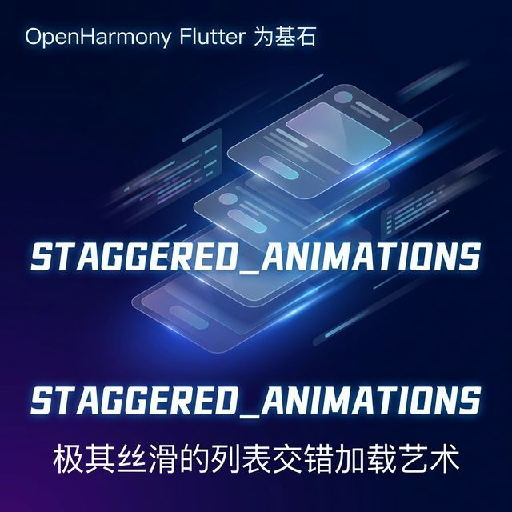
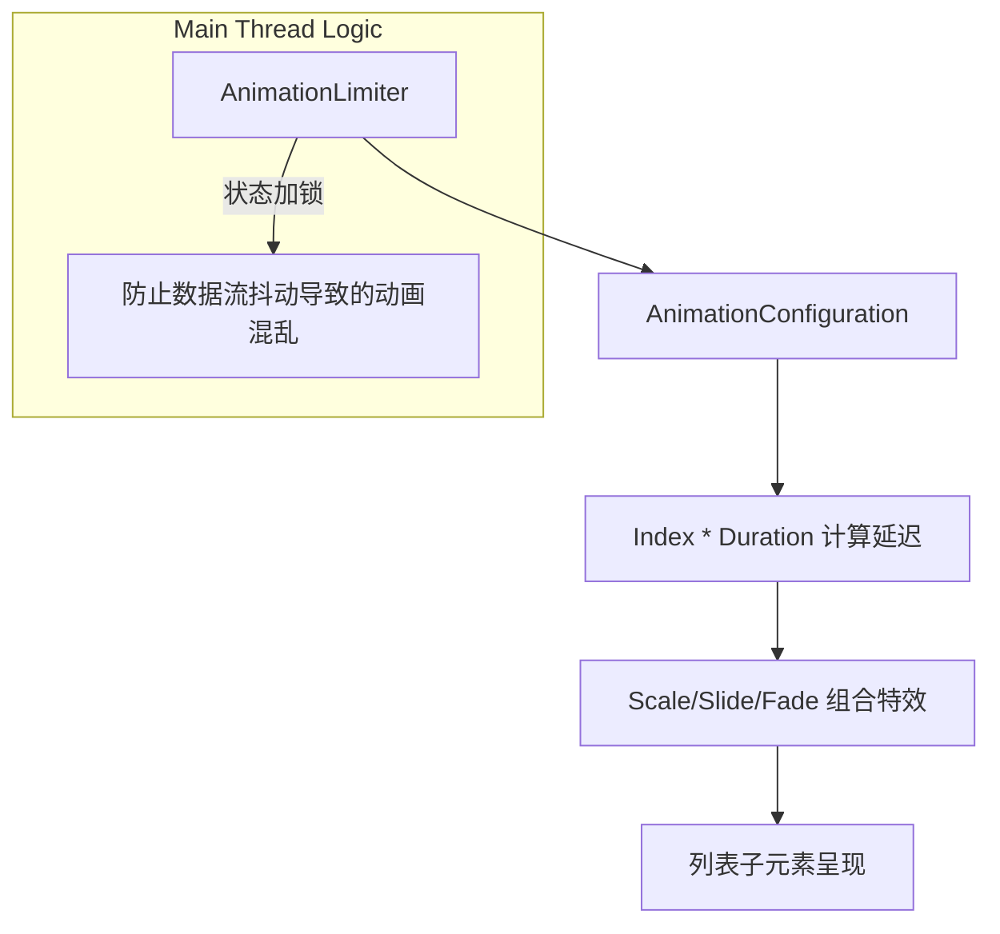

列表是 App 中最常见的展示形式，但静态的、瞬间跳出的列表往往显得生硬。优秀的 UI 设计通常会采用“交错式”（Staggered）动画，让元素一个接一个优雅地划入视野。`flutter_staggered_animations` 正是为此而生——它通过极简的 API 侵入，让你的鸿蒙应用列表瞬间焕发灵动力。

<!-- 封面图占位 -->


## 1. 为什么你的列表需要交错动画？

交错动画（Staggered Animation）的核心价值在于：
- **视觉引导**：引导用户的视线从第一个元素平滑移动到最后一个。
- **层次感**：打破平铺直叙的单调感，让界面显得有深度感。
- **情感度**：这种优雅的加载方式能传达出应用“精致、不躁动”的性格，深受鸿蒙系统追求的“平衡美”推崇。

## 2. 架构设计：AnimationLimiter 的锁频机制

该库巧妙地使用了一个 `AnimationLimiter` 组件来管理子元素的动画生命周期：



## 3. 针对 OpenHarmony 的适配策略

### 3.1 刷新率对齐（Refresh Rate）
鸿蒙设备广泛支持 90/120Hz 刷新率。在使用 `flutter_staggered_animations` 时，建议将基础持续时间设为 `375ms` 左右，这在超高刷屏上能呈现出最接近电影质感的残影效果，既不拖沓，也不突兀。

### 3.2 列表滚动的性能缓冲
在鸿蒙平台上处理长列表动画时，请确保 `ListView` 开启了分段加载。当列表非常长（例如超过 100 项）时，过度密集的交错动画可能会占用大量的 CPU 计算资源。此时可以通过 `AnimationConfiguration.staggeredList` 的 `position` 动态控制动画只在“首次可见”时触发。

## 4. 业务场景实战：构建一个鸿蒙风格的“智慧协同”任务列表

我们将开发一个任务清单，元素会从右侧淡入并伴随轻微缩放。

### 代码实现

```dart
import 'package:flutter/material.dart';
import 'package:flutter_staggered_animations/flutter_staggered_animations.dart';

class OhosTaskStaggeredList extends StatelessWidget {
  const OhosTaskStaggeredList({super.key});

  @override
  Widget build(BuildContext context) {
    // 模拟鸿蒙系统中的办公任务数据
    final tasks = List.generate(15, (i) => '协同任务 #$i: 正在进行深度适配中');

    return Scaffold(
      backgroundColor: const Color(0xFFF5F5F5),
      appBar: AppBar(title: const Text('智慧协同任务流')),
      body: AnimationLimiter(
        child: ListView.builder(
          itemCount: tasks.length,
          itemBuilder: (BuildContext context, int index) {
            return AnimationConfiguration.staggeredList(
              position: index,
              duration: const Duration(milliseconds: 375),
              child: SlideAnimation(
                verticalOffset: 50.0,
                child: FadeInAnimation(
                  child: Card(
                    margin: const EdgeInsets.symmetric(horizontal: 16, vertical: 8),
                    elevation: 1,
                    shape: RoundedRectangleBorder(borderRadius: BorderRadius.circular(12)),
                    child: ListTile(
                      leading: const CircleAvatar(backgroundColor: Colors.blueAccent, child: Icon(Icons.task, color: Colors.white)),
                      title: Text(tasks[index]),
                      subtitle: const Text('来自: 鸿蒙智慧助理'),
                      trailing: const Icon(Icons.chevron_right),
                    ),
                  ),
                ),
              ),
            );
          },
        ),
      ),
    );
  }
}
```

## 5. 适配建议与避坑指南

1. **不要过度嵌套**：虽然你可以同时叠加 Slide、Fade 和 Scale，但在鸿蒙折叠屏上，过多的变换层级可能会导致合成器压力增大。建议一个 `SlideAnimation` 配合一个 `FadeInAnimation` 即可达到最佳平衡。
2. **数据增量更新**：如果你的列表数据是分页加载的，每一页数据进入时都应被 `AnimationLimiter` 正确包裹，否则新加载的项会由于没有上下文而直接生硬跳出。
3. **配色兼容**：在鸿蒙的系统级主题切换时，博主建议使用 `Colors.transparent` 作为卡片的基础底色结合毛玻璃（BackdropFilter），配合交错动效，高级感会直接翻倍。

## 6. 总结

`flutter_staggered_animations` 库是让鸿蒙应用 UI 从“能用”跨越到“好用、耐看”的捷径。它通过极小的性能代价，为繁重的数据列表注入了呼吸感。在构建充满“鸿蒙味”的精致应用时，交错式加载是一个绝佳的切入点。

---
> 欢迎关注我的博客 [HappyPhper](https://blog.csdn.net/wangbaolong)，持续为您带来 Flutter 适配鸿蒙的第一线实战经验。
