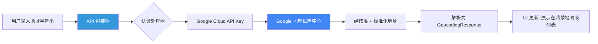

欢迎加入开源鸿蒙跨平台社区：[https://openharmonycrossplatform.csdn.net](https://openharmonycrossplatform.csdn.net)。

# Flutter for OpenHarmony：google_geocoding_api — 让鸿蒙应用掌握全球地理位置解析


## 前言

在现代移动应用中，基于位置的服务（LBS）是交互的核心之一。无论是根据经纬度显示当前街道名称（逆地理编码），还是将用户输入的地址转换为地图上的精确坐标（地理编码），都需要一个强大且稳定的后端服务支撑。

在 **Flutter for OpenHarmony** 开发中，虽然我们可以使用多种地图服务，但 **Google Geocoding API** 以其全球范围内的覆盖深度和数据准确性，成为了许多出海应用或国际化项目的首选。今天，我们将实战如何利用 `google_geocoding_api` 库，在鸿蒙平台上实现精准的位置解析能力。

## 一、为什么集成 Google Geocoding API？

### 1.1 全球化数据的权威性
对于需要支持多国语种地址解析的应用，Google 提供的数据在细节和容错性上具有显著优势。

### 1.2 为什么在鸿蒙上使用该库？
- **强类型响应**：自动解析繁琐的 JSON 回包，直接获取 `AddressComponent` 等专业对象。
- **纯 Dart 实现**：不依赖特定厂商的底图 SDK，可以根据需求灵活展示在任何 UI 媒介上。
- **高效异步**：原生支持 Future，与鸿蒙应用的异步加载逻辑完美契合。

### 1.3 地理编码工作流模型（Mermaid）



## 二、核心 API 与功能讲解

### 2.1 引入依赖
在 `pubspec.yaml` 中配置：

```yaml
dependencies:
  # Google 地理编码 API 封装
  google_geocoding_api: ^1.1.0
```

### 2.2 初始化 API 客户端
您需要前往 [Google Cloud Console](https://console.cloud.google.com/) 申请一个 API Key。

```dart
import 'package:google_geocoding_api/google_geocoding_api.dart';

const String googleApiKey = 'YOUR_API_KEY';
final api = GoogleGeocodingApi(googleApiKey, isLogged: true);
```

### 2.3 核心功能：逆地理编码
根据 GPS 坐标反查具体的门牌信息。

```dart
void searchAddress(double lat, double lng) async {
  // 💡 发起逆地理编码请求
  final response = await api.reverse(
    '$lat,$lng',
    language: 'zh-CN', // 🎨 设置返回语言为中文
  );

  if (response.results.isNotEmpty) {
    final firstResult = response.results.first;
    print('标准化地址: ${firstResult.formattedAddress}');
    print('所在城市: ${firstResult.addressComponents.where((c) => c.types.contains('locality')).first.longName}');
  }
}
```

## 三、鸿蒙应用实战场景

### 3.1 场景一：外卖/物流派送地址确认
在鸿蒙手机的地址填写页面，用户点击“定位当前位置”。应用获取经纬度后，通过 `google_geocoding_api` 自动填入详细街道和楼号，减少用户手动输入的麻烦，精准度极高。

### 3.2 场景二：出境旅游相册足迹
用户在鸿蒙平板上查看旅行相册。应用读取照片中的地理元数据（EXIF），通过该库批量解析出具体的景点名称，在地图上还原出精美的时间轴足迹。

<!-- IMAGE_PLACEHOLDER: [地理编码解析成功后的界面展示截图] -->
<!-- 类型: 截图 -->
<!-- 设备: 鸿蒙手机 -->
<!-- 内容: 展示输入地址后，下方列表实时显示出的经纬度及格式化后的标准地址 -->

## 四、OpenHarmony 平台适配建议

### 4.1 网络请求安全性
- **✅ 建议**：鸿蒙系统强调安全隐私。在调用 Google 接口时，务必在 Google Cloud 控制台对 API Key 进行“应用限制”（限制 Package Name），防止密钥泄露后被盗用滥用。

### 4.2 网络穿透与地区感知
- **📌 提醒**：Google 服务在不同网络环境下的连通性有所差异。在鸿蒙应用编写时，建议先通过 `connectivity_plus` 或域名探测判断网络环境，若无法连接，应提示用户或切换至本地的鸿蒙位置服务（OHOS Location Kit）。

### 4.3 零配置错误处理
- **⚠️ 警告**：Google API 有明确的调用频率和配额限制。当返回 `OVER_QUERY_LIMIT` 状态码时，应在鸿蒙 UI 侧进行优雅地降级展示，并缓存最近一次解析成功的记录。

## 五、完整示例代码

此示例演示了一个简单的“全球坐标转化器”。

```dart
import 'package:flutter/material.dart';
import 'package:google_geocoding_api/google_geocoding_api.dart';

void main() => runApp(const MaterialApp(home: GeocodingLab()));

class GeocodingLab extends StatefulWidget {
  const GeocodingLab({super.key});

  @override
  State<GeocodingLab> createState() => _GeocodingLabState();
}

class _GeocodingLabState extends State<GeocodingLab> {
  final _api = GoogleGeocodingApi('YOUR_KEY');
  String _address = '等待解析...';

  void _geocode() async {
    // ✅ 实战：正向地理编码解析（地址 -> 坐标）
    final response = await _api.search(
      '深圳市华为总部',
      language: 'zh-CN',
    );

    if (response.results.isNotEmpty) {
      final loc = response.results.first.geometry!.location;
      setState(() {
        _address = '查询结果: ${response.results.first.formattedAddress}\n坐标: ${loc.lat}, ${loc.lng}';
      });
    }
  }

  @override
  Widget build(BuildContext context) {
    return Scaffold(
      appBar: AppBar(title: const Text('google_geocoding_api 鸿蒙实验室')),
      body: Center(
        child: Padding(
          padding: const EdgeInsets.all(20.0),
          child: Column(
            mainAxisAlignment: MainAxisAlignment.center,
            children: [
              const Icon(Icons.location_on, size: 80, color: Colors.redAccent),
              const SizedBox(height: 20),
              Text(_address, textAlign: TextAlign.center, style: const TextStyle(fontSize: 16)),
              const SizedBox(height: 30),
              ElevatedButton(onPressed: _geocode, child: const Text('解析示例地址')),
            ],
          ),
        ),
      ),
    );
  }
}
```

## 六、总结

`google_geocoding_api` 为 **Flutter for OpenHarmony** 应用的全球部署提供了强有力的数据支撑。它将复杂的空间地理信息转化为了我们指尖触手可及的 Dart 对象，让位置服务不再是开发的难点。

核心要点回顾：
1. **全球覆盖**：基于 Google 地理数据库提供精准解析。
2. **逆向解析**：支持根据坐标识别具体建筑与街道细节。
3. **鸿蒙适配**：重视网络安全性与 API Key 保护策略。
4. **提升体验**：通过自动补全地址，极大地缩短了用户在鸿蒙 App 内的操作路径。

无论您的鸿蒙应用脚踏何处，地理编码服务都将为您精准“导航”！

---

> 📦 **完整代码已上传至 AtomGit**：[open-harmony-examples/google_geocoding_api](https://atomgit.com/dragonbady/open-harmony-examples/tree/main/examples/google_geocoding_api)
>
> 🌐 **欢迎加入开源鸿蒙跨平台社区**：[开源鸿蒙跨平台开发者社区](https://openharmonycrossplatform.csdn.net)
