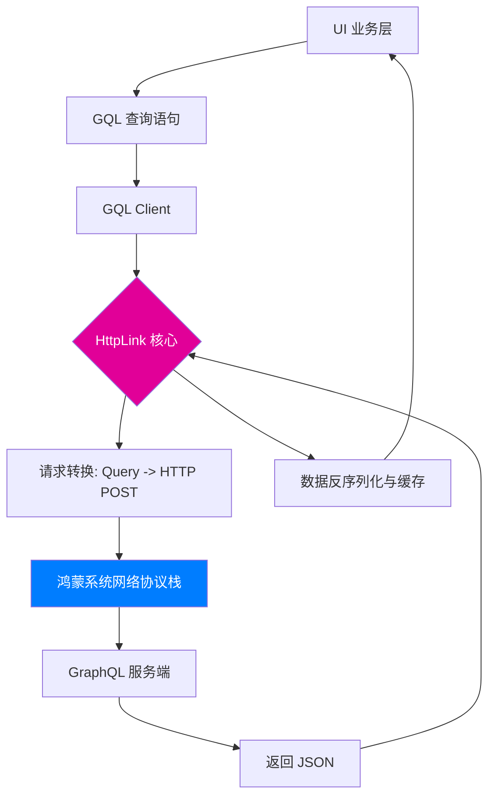

欢迎加入开源鸿蒙跨平台社区：[https://openharmonycrossplatform.csdn.net](https://openharmonycrossplatform.csdn.net)。

# Flutter for OpenHarmony：gql_http_link — 开启鸿蒙端的 GraphQL 高效请求链路


## 前言

在现代前端开发中，相比于传统的 RESTful API，**GraphQL** 以其精准的数据获取能力（Query exactly what you need）极大地提升了前后端数据交互的效率。尤其是在需要频繁对接复杂后端、减少网络负载的鸿蒙跨平台应用中，GraphQL 更是不可或缺。

在 **Flutter for OpenHarmony** 开发中，构建一条稳定、高效的请求链路是成功的基石。`gql_http_link` 库作为 `gql` 生态的核心组件，专门负责将 GraphQL 请求通过 HTTP 协议发送至服务端。今天，我们就来实战如何在鸿蒙设备上打通这条“数据直达”的高速公路。

## 一、为什么集成 GraphQL HTTP Link？

### 1.1 精准投喂数据
不再需要为了获取一个用户头像而拉取整个用户信息 JSON。这在对流量和处理效率敏感的鸿蒙移动终端上优势明显。

### 1.2 库的核心作用
- **标准适配**：完美遵循 GraphQL 规范中的 HTTP 传输协议。
- **中间件扩展**：支持自定义拦截、Header 注入（如 Token 认证）。
- **轻量透明**：作为底层链路，它不对业务逻辑做任何假设，只负责可靠的数据传输。

### 1.3 请求流转模型（Mermaid）



## 二、核心 API 与功能讲解

### 2.1 引入依赖
在 `pubspec.yaml` 中配置核心框架与链路：

```yaml
dependencies:
  # GraphQL 核心
  graphql: ^5.1.3
  # HTTP 传输链路
  gql_http_link: ^0.5.0
```

### 2.2 初始化 Link
配置后端服务器地址，并注入鸿蒙专用的认证信息。

```dart
import 'package:gql_http_link/gql_http_link.dart';
import 'package:graphql/client.dart';

Link createHttpLink() {
  // 💡 定义 HTTP 链路
  return HttpLink(
    'https://api.ohos-backend.com/graphql',
    defaultHeaders: {
      'Authorization': 'Bearer YOUR_OHOS_TOKEN',
      'X-Platform': 'OpenHarmony',
    },
  );
}
```

### 2.3 执行查询
利用构建好的 Link 发起数据请求。

```dart
final client = GraphQLClient(
  link: createHttpLink(),
  cache: GraphQLCache(), // 📌 配置缓存，减少鸿蒙设备请求频率
);

void fetchUserData() async {
  final options = QueryOptions(
    document: gql(r'''
      query GetUserProfile($id: ID!) {
        user(id: $id) {
          name
          avatarUrl
        }
      }
    '''),
    variables: {'id': '123'},
  );

  final result = await client.query(options);
  print('用户信息: ${result.data?['user']}');
}
```

## 三、鸿蒙应用实战场景

### 3.1 场景一：分布式内容社交应用
在鸿蒙设备的大屏平板上，我们需要同时加载推荐、动态、好友列表等多维度数据。通过 `gql_http_link` 合并请求，一次 HTTP 往返即可获取所有首屏分片数据。

### 3.2 场景二：极简元服务（Service Widget）
针对轻量级的鸿蒙元服务，我们利用 GraphQL 的精确查询特性节省流量，在微小的内存占用下，依然能获取最关键的动态业务信息。

<!-- IMAGE_PLACEHOLDER: [GraphQL 请求在鸿蒙设备上的分析截图] -->
<!-- 类型: 截图 -->
<!-- 内容: 展现抓包工具截取的请求体，清晰展示了按需查询的字段说明 -->

## 四、OpenHarmony 平台适配建议

### 4.1 网络安全性（HTTPS）
鸿蒙系统对网络安全等级要求极高。
- **✅ 建议**：务必使用 `https` 地址，并确保服务端部署了鸿蒙信任的正式 CA 证书。如果是自签名证书，请在 `HttpLink` 的 `httpPost` 拦截器中配置证书信任策略。

### 4.2 错误拦截
- **📌 提醒**：`gql_http_link` 抛出的网络错误（如 401, 502）需要进行分类。
- **🎨 最佳实践**：建议包装一层 `ErrorLink`。当检测到 `HttpLink` 返回特定网络错误时，在鸿蒙 UI 侧弹出对应的“网络连接异常”或“登录失效”对话框。

### 4.3 性能优化
- **⚠️ 警告**：由于 GraphQL 的响应通常包含大量层级数据。在鸿蒙低性能终端上，建议开启 `gql_http_link` 的 GZIP 压缩支持（如果后端允许），以缩短传输并降低内存解析峰值。

## 五、完整示例代码

此示例演示了如何建立一条基础的 GraphQL 通讯链路。

```dart
import 'package:flutter/material.dart';
import 'package:graphql/client.dart';
import 'package:gql_http_link/gql_http_link.dart';

void main() => runApp(const MaterialApp(home: GqlLinkLab()));

class GqlLinkLab extends StatefulWidget {
  const GqlLinkLab({super.key});

  @override
  State<GqlLinkLab> createState() => _GqlLinkLabState();
}

class _GqlLinkLabState extends State<GqlLinkLab> {
  String _response = '等待请求...';

  void _runQuery() async {
    // 1. 创建链路
    final link = HttpLink('https://countries.trevorblades.com/');
    
    // 2. 创建客户端
    final client = GraphQLClient(link: link, cache: GraphQLCache());

    setState(() => _response = '正在查询全球国家数据...');

    // 3. ✅ 实战：发起跨域查询
    final result = await client.query(QueryOptions(
      document: gql(r'''
        query {
          countries(filter: { code: { in: ["CN", "US"] } }) {
            name
            emoji
          }
        }
      '''),
    ));

    setState(() {
      if (result.hasException) {
        _response = '错误: ${result.exception}';
      } else {
        _response = '结果: ${result.data?['countries']}';
      }
    });
  }

  @override
  Widget build(BuildContext context) {
    return Scaffold(
      appBar: AppBar(title: const Text('gql_http_link 鸿蒙传输实验室')),
      body: Center(
        child: Column(
          children: [
            const Icon(Icons.hub, size: 60, color: Colors.pink),
            const SizedBox(height: 20),
            Text(_response, textAlign: TextAlign.center),
            const SizedBox(height: 30),
            ElevatedButton(onPressed: _runQuery, child: const Text('执行 GraphQL 查询')),
          ],
        ),
      ),
    );
  }
}
```

## 六、总结

`gql_http_link` 为 **Flutter for OpenHarmony** 提供了在现代 API 架构中高效穿梭的能力。它虽然处于“幕后”，但承载了鸿蒙应用与云端数据对话的最关键一环。

核心要点回顾：
1. **标准化封装**：完美契合 GraphQL 社区生态。
2. **连接稳定性**：支持自定义 Headers，适配鸿蒙认证协议。
3. **鸿蒙适配**：重视网络请求的 GZIP 优化与安全链路构建。
4. **按需加载**：通过 GQL 核心优势减少鸿蒙系统的整体网络功耗。

让我们在鸿蒙全场景中，用最精准的数据驱动最丝滑的体验！

---

> 📦 **完整代码已上传至 AtomGit**：[open-harmony-examples/gql_http_link](https://atomgit.com/dragonbady/open-harmony-examples/tree/main/examples/gql_http_link)
>
> 🌐 **欢迎加入开源鸿蒙跨平台社区**：[开源鸿蒙跨平台开发者社区](https://openharmonycrossplatform.csdn.net)
