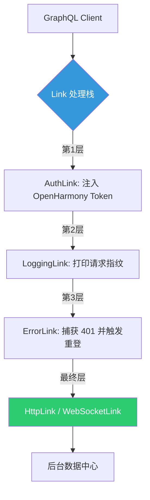

欢迎加入开源鸿蒙跨平台社区：[https://openharmonycrossplatform.csdn.net](https://openharmonycrossplatform.csdn.net)。

# Flutter for OpenHarmony：gql_link — 掌握鸿蒙端 GraphQL 请求拦截与扩展核心

## 前言

在现代 App 开发中，GraphQL 的灵活性让我们能精准获取数据。然而，一个健壮的 GraphQL 架构不仅需要发送请求，更需要对请求进行“手术刀”级的拦截、转换和链路编排。例如：统一注入身份 Token、自动日志记录、根据网络状况切换端点等。

在 **Flutter for OpenHarmony** 开发中，`gql_link` 库就是这套架构的灵魂所在。它定义了抽象的 `Link` 通信契约，让我们能像插拔积木一样组合不同的通信能力。今天，我们就来深入实战，看看如何利用 `gql_link` 构建起鸿蒙应用的通信中台。

## 一、为什么需要 gql_link 的组合能力？

### 1.1 链路解耦
如果不使用 Link 架构，认证逻辑、错误重试和网络请求会混杂在一起，导致后期难以维护。

### 1.2 核心优势
- **中间件模式**：可以在请求发出的前一秒修改 Header，或在响返回的一瞬间拦截特定错误。
- **灵活编排**：支持 `concat`（顺序执行）和 `split`（根据条件分发逻辑，如区分查询和订阅）。
- **完全透明**：上层业务层只需调用 `execute`，感知不到底层复杂的拦截链路。

### 1.3 链路编排模型（Mermaid）



## 二、核心 API 与功能讲解

### 2.1 引入依赖
在 `pubspec.yaml` 中配置：

```yaml
dependencies:
  # GraphQL 链路抽象核心
  gql_link: ^0.5.0
  # 常用拦截器
  gql_http_link: ^0.5.0
```

### 2.2 自定义拦截器（Middleware）
创建一个简单的日志拦截器，用于在鸿蒙调试时输出请求体。

```dart
import 'package:gql_link/gql_link.dart';

class OhosLoggingLink extends Link {
  @override
  Stream<Response> request(Request request, [NextLink? forward]) {
    // 💡 请求发出前的逻辑
    print('🚀 鸿蒙请求发起: ${request.operation.operationName}');
    
    // 🎨 调用 forward 执行后续链路并返回结果流
    return forward!(request).map((response) {
      print('✅ 鸿蒙请求返回: ${response.data}');
      return response;
    });
  }
}
```

### 2.3 链路组合与嵌套
将多个 Link 连接在一起。

```dart
void setupClient() {
  final link = Link.from([
    OhosLoggingLink(), // 层级 1
    HttpLink('https://api.ohos-example.com/graphql'), // 终点层
  ]);
}
```

## 三、鸿蒙应用实战场景

### 3.1 场景一：分布式多设备同步认证
在鸿蒙分布式应用中，不同设备间共享一套认证 Token。通过 `AuthLink` 实现自动的 Header 注入，即便 Token 在后台发生了变化，链路层也能动态读取最新的存储并发送，保证支付或私密数据的安全性。

### 3.2 场景二：查询与订阅（Subscription）自动分流
在鸿蒙应用的“实时行情”模块，查询操作需要走 HTTP，而实时推送需要走 WebSocket。利用 `Link.split`，逻辑可以根据文档类型自动分流到不同的物理链路上。

<!-- IMAGE_PLACEHOLDER: [组合 Link 后的网络请求流转图] -->
<!-- 类型: 截图 -->
<!-- 内容: 展示分步拦截后的日志输出，清晰显示 Token 注入后的 HTTP 报文主体 -->

## 四、OpenHarmony 平台适配建议

### 4.1 链路异常的弹性处理
- **✅ 建议**：当鸿蒙设备发生网络闪断时，底层 Link 层可以配合 `retry_link` 完成自动重连，避免让 UI 层承担过多的重试逻辑压力。

### 4.2 性能性能建议
- **📌 提醒**：Link 架构基于 `Stream`。在高性能精细化页面（如鸿蒙游戏列表），不要在 Link 层执行过于沉重的同步文本处理操作。

### 4.3 条件导出的适配
- **⚠️ 警告**：针对鸿蒙系统的 Web 端和 Native 端，如果网络请求策略不同（如 Web 端通过 Proxy 访问，Native 直接访问），应在 Link 初始化阶段通过平台探测进行条件分支。

## 五、完整示例代码

演示一个功能完备的“拦截器组合体”。

```dart
import 'package:flutter/material.dart';
import 'package:gql_link/gql_link.dart';
import 'package:gql_http_link/gql_http_link.dart';
import 'package:graphql/client.dart';

// 1. 实现一个 Token 注入 Link
class OhosAuthLink extends Link {
  @override
  Stream<Response> request(Request request, [NextLink? forward]) {
    // 模拟从鸿蒙安全存储获取 Token
    final token = 'OHOS_SECURE_TOKEN_888';
    
    final updatedRequest = request.updateContextEntry<HttpLinkResponseContext>(
      (entry) => HttpLinkResponseContext(
        headers: {
          ...entry?.headers ?? {},
          'Authorization': 'Bearer $token',
        },
      ),
    );
    
    return forward!(updatedRequest);
  }
}

void main() => runApp(const MaterialApp(home: GqlLinkLab()));

class GqlLinkLab extends StatelessWidget {
  const GqlLinkLab({super.key});

  @override
  Widget build(BuildContext context) {
    return Scaffold(
      appBar: AppBar(title: const Text('gql_link 鸿蒙中间件实验室')),
      body: Center(
        child: ElevatedButton(
          onPressed: () {
            // ✅ 实战：构建组合链路
            final link = Link.from([
              OhosAuthLink(),
              HttpLink('https://api.example.com/graphql'),
            ]);
            print('组合链路已就绪，所有请求将自动附带 Token');
          },
          child: const Text('初始化安全通信链路'),
        ),
      ),
    );
  }
}
```

## 六、总结

`gql_link` 是我们在 **Flutter for OpenHarmony** 开发中构建模块化通信层的不二之选。它通过优雅的函数式设计，将繁琐的中间件逻辑封装在透明的链条之中。

核心要点回顾：
1. **链式编排**：通过 concat/split 组合核心通信能力。
2. **中间件哲学**：在请求生命周期的任意点切入控制逻辑。
3. **鸿蒙适配**：注意多端网络策略的分流与全局 Token 的安全获取。
4. **提升健壮性**：让业务代码告别手动注入 Headers 的低效时代。

掌握链路组合，让您的鸿蒙应用通信体系既如铜墙铁壁般安全，又如积木般灵活！

---

> 📦 **完整代码已上传至 AtomGit**：[open-harmony-examples/gql_link](https://atomgit.com/dragonbady/open-harmony-examples/tree/main/examples/gql_link)
>
> 🌐 **欢迎加入开源鸿蒙跨平台社区**：[开源鸿蒙跨平台开发者社区](https://openharmonycrossplatform.csdn.net)
