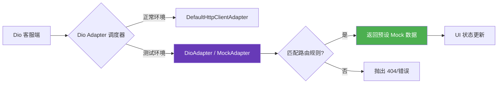

欢迎加入开源鸿蒙跨平台社区：[https://openharmonycrossplatform.csdn.net](https://openharmonycrossplatform.csdn.net)。

# Flutter for OpenHarmony：http_mock_adapter — 建立完美的鸿蒙网络单元测试堡垒


## 前言

在现代移动应用开发中，网络请求往往占据了业务逻辑的绝大部分。然而，在进行单元测试或集成测试时，真实的 API 环境往往充满了不可控因素：服务器宕机、网络延迟、甚至是在离线环境下无法进行测试。

在 **Flutter for OpenHarmony** 开发中，我们需要一种能够完全掌控网络响应的机制。`http_mock_adapter` 配合强大的 `dio` 库，为我们提供了一种极简且优雅的“挡板”服务，让我们能在鸿蒙平台上，无需后端配合即可完成闭环测试。

## 一、为什么需要 HTTP Mock？

### 1.1 环境隔离
测试代码不应依赖于外部网络状况。通过 Mock，我们可以确保测试在任何环境下都能一键通过。

### 1.2 异常模拟
很难让真实后端故意返回一个 `503 Service Unavailable` 或超时的响应。而通过 Mock 适配器，我们可以随心所欲地构造任何极端的异常场景，从而验证鸿蒙应用的错误处理逻辑是否健壮。

### 1.3 测试链路模型（Mermaid）



## 二、核心 API 与功能讲解

### 2.1 引入依赖
在 `pubspec.yaml` 中配置（主要用于开发与测试阶段）：

```yaml
dev_dependencies:
  # HTTP Mock 适配器
  http_mock_adapter: ^0.6.1
  # 必须配合 dio 使用
  dio: ^5.3.0
```

### 2.2 初始化 Mock 适配器
将适配器注入到 `Dio` 实例中。

```dart
import 'package:dio/dio.dart';
import 'package:http_mock_adapter/http_mock_adapter.dart';

final dio = Dio();
final dioAdapter = DioAdapter(dio: dio);
```

### 2.3 申明 Mock 规则
为特定的接口设置预期的行为。

```dart
void setupMocks() {
  // 💡 模拟一个获取用户信息的 GET 请求
  dioAdapter.onGet(
    '/api/ohos/profile',
    (server) => server.reply(200, {
      'name': '鸿蒙开发者',
      'id': 'OHOS_001',
    }),
    data: null, // 可选：匹配特定的请求体
    queryParameters: {}, // 可选：匹配查询参数
  );

  // 🎨 模拟一个 500 服务器错误
  dioAdapter.onPost(
    '/api/upload',
    (server) => server.reply(500, {'error': '服务器开小差了'}),
  );
}
```

## 三、鸿蒙应用实战场景

### 3.1 场景一：离线 Demo 演示
在展会或特定的演示环境中，如果鸿蒙设备无法连接外网，我们可以利用 `http_mock_adapter` 将整套业务流程“固化”。用户点击登录、获取数据、提交表单等操作都能得到完美的即时反馈。

### 3.2 场景二：极端网络延迟测试
在鸿蒙车载或户外平板应用中，模拟断断续续的网络状态。

```dart
// 💡 模拟延迟响应
dioAdapter.onGet(
  '/api/large_data',
  (server) => server.reply(200, {'data': '...'}, delay: Duration(seconds: 5)),
);
```

<!-- IMAGE_PLACEHOLDER: [Mock 数据注入成功后的运行截图] -->
<!-- 类型: 截图 -->
<!-- 内容: 展示鸿蒙应用在离线状态下依然能正确渲染出 Mock 的列表数据 -->

## 四、OpenHarmony 平台适配建议

### 4.1 环境切换策略
- **✅ 建议**：通过定义 `AppEnvironment` 类或使用 `--dart-define` 参数，在鸿蒙应用的入口处根据当前模式（Debug/Test/Release）决定是否启用 Mock 逻辑。避免将测试数据带到正式发布的鸿蒙版本中。

### 4.2 适配异步错误处理
- **📌 提醒**：Mock 适配器抛出的错误同样会通过 `DioError` 捕获。在鸿蒙应用层，应确保您的 `Toast` 或 `Dialog` 能够正确解析 Mock 返回的错误 JSON 内容。

### 4.3 团队协作规范
- **🎨 最佳实践**：建立一套统一的 `MockRegistry`，让 UI 开发人员和后端开发人员先基于 Mock 协议进行对接。这样在后端接口还没开发完时，鸿蒙前端的界面开发就能先跑起来。

## 五、完整示例代码

演示一个带错误重试逻辑的 Mock 实验。

```dart
import 'package:flutter/material.dart';
import 'package:dio/dio.dart';
import 'package:http_mock_adapter/http_mock_adapter.dart';

void main() => runApp(const MaterialApp(home: HttpMockLab()));

class HttpMockLab extends StatefulWidget {
  const HttpMockLab({super.key});

  @override
  State<HttpMockLab> createState() => _HttpMockLabState();
}

class _HttpMockLabState extends State<HttpMockLab> {
  final dio = Dio();
  late DioAdapter dioAdapter;
  String _message = '点击请求数据';

  @override
  void initState() {
    super.initState();
    // 1. 初始化适配器
    dioAdapter = DioAdapter(dio: dio);
  }

  void _requestData() async {
    // 2. ✅ 实战：配置规则
    dioAdapter.onGet(
      '/user',
      (server) => server.reply(200, {'msg': '来自模拟器的惊喜！'}),
    );

    try {
      final response = await dio.get('/user');
      setState(() => _message = response.data['msg']);
    } catch (e) {
      setState(() => _message = '请求失败');
    }
  }

  @override
  Widget build(BuildContext context) {
    return Scaffold(
      appBar: AppBar(title: const Text('http_mock_adapter 鸿蒙实验室')),
      body: Center(
        child: Column(
          mainAxisAlignment: MainAxisAlignment.center,
          children: [
            const Icon(Icons.cloud_off, size: 60, color: Colors.deepPurple),
            const SizedBox(height: 20),
            Text(_message, style: const TextStyle(fontSize: 18)),
            const SizedBox(height: 30),
            ElevatedButton(onPressed: _requestData, child: const Text('发起模拟请求')),
          ],
        ),
      ),
    );
  }
}
```

## 六、总结

`http_mock_adapter` 是保障鸿蒙应用可靠性的“防撞梁”。它让网络测试不再依赖于运气，而是变成了一种完全可控的工程化行为。在 **Flutter for OpenHarmony** 的专业开发流程中，掌握 Mock 技术是通往高质量应用的必修课。

核心要点回顾：
1. **注入式设计**：无缝挂载到 Dio 现有链路上。
2. **规则匹配**：支持路径、参数、请求体的精细化匹配。
3. **异常构造**：轻松模拟各种网络故障与服务端错误。
4. **鸿蒙适配**：通过环境隔离确保发布包的纯净。

现在，即使服务器在停机维护，您的鸿蒙开发工作也绝不会中断！

---

> 📦 **完整代码已上传至 AtomGit**：[open-harmony-examples/http_mock_adapter](https://atomgit.com/dragonbady/open-harmony-examples/tree/main/examples/http_mock_adapter)
>
> 🌐 **欢迎加入开源鸿蒙跨平台社区**：[开源鸿蒙跨平台开发者社区](https://openharmonycrossplatform.csdn.net)
