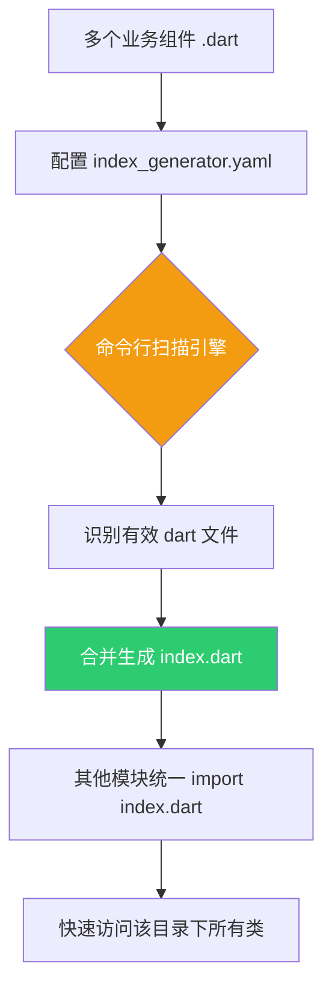

欢迎加入开源鸿蒙跨平台社区：[https://openharmonycrossplatform.csdn.net](https://openharmonycrossplatform.csdn.net)。

# Flutter for OpenHarmony：index_generator — 自动化构建鸿蒙组件库索引


## 前言

在进行 **Flutter for OpenHarmony** 中大型项目开发时，我们往往会创建大量的业务组件、服务类或工具函数。如果每一个文件都需要在外面手动进行 `export`，不仅容易被遗忘，且管理起来极其繁琐。

为了遵守良好的“Barrel 文件”（桶文件）设计模式，即通过一个 `index.dart` 统一暴露目录下的内容，`index_generator` 应运而生。它能通过全自动的代码扫描，为您的鸿蒙项目构建起整洁、一致的导出索引。今天，我们就来看看如何利用它来优化项目的工程化结构。

## 一、为什么需要自动化生成索引？

### 1.1 手动导出的烦恼
在一个拥有 50 个 UI 组件的目录下，每次新增一个文件都得去修改 `index.dart`。这不仅是无谓的重复劳动，一旦漏写，其他页面就无法引用到新组件。

### 1.2 核心优势
- **全自动扫描**：只需运行指令，自动发现目录下的所有 `.dart` 文件。
- **自定义过滤**：可以配置忽略私有文件或特定的测试文件。
- **一致性保障**：确保所有的导出路径都是正确的，避免因拼写错误导致的构建失败。

### 1.3 索引生成流程模型（Mermaid）



## 二、核心 API 与集成流程

### 2.1 引入依赖
在 `pubspec.yaml` 中作为开发依赖添加：

```yaml
dev_dependencies:
  # 自动化索引生成器
  index_generator: ^0.1.0
```

### 2.2 配置规则
在项目根目录创建或编辑 `index_generator.yaml`。

```yaml
# 💡 示例配置
index_generator:
  indices:
    - path: lib/widgets # 🎨 需要生成索引的目录
      name: widgets_index.dart # 🎨 生成的索引文件名
      include:
        - "**/*.dart"
      exclude:
        - "**/*.g.dart" # 过滤掉其他生成器生成的文件
```

### 2.3 执行生成
在鸿蒙开发终端中运行以下指令：

```bash
dart run index_generator
```

生成的 `widgets_index.dart` 内容通常如下：
```dart
// ✅ 自动化生成的导出代码
export 'button.dart';
export 'card.dart';
export 'input_field.dart';
```

## 三、鸿蒙应用实战场景

### 3.1 场景一：大型组件库封装
在维护一个鸿蒙专用的“通用组件库”项目时。开发者只需要关注组件本身的逻辑编写，利用 `index_generator` 自动刷新外部引用的统一出口，确保组件库的易用性。

### 3.2 场景二：Domain 领域模型管理
在鸿蒙应用的数据层中，将所有的实体类（Entities）放入同一文件夹。通过生成的索引文件，在 Service 层只需一行 `import 'package:app/domain/index.dart';` 就能调用全量模型，代码极其清爽。

<!-- IMAGE_PLACEHOLDER: [批量生成索引后的目录结构截图] -->
<!-- 类型: 截图 -->
<!-- 内容: 展示整齐的目录结构，每个文件夹下都有一个醒目的 index.dart 文件 -->

## 四、OpenHarmony 平台适配建议

### 4.1 结合 build_runner 流程
- **✅ 建议**：虽然 `index_generator` 是独立运行的，但建议将其与 `build_runner watch` 命令配合在开发脚本中，实现“新增文件即自动导出”的极致体验。

### 4.2 命名冲突预警
- **📌 提醒**：在使用“桶文件”时，不同文件中的类名如果重复，由于是统一导出，会导致编译器报 `Ambiguous import` 错误。在鸿蒙项目大规模协作时，务必制定好类名的前缀规范（如 `OhosUser`, `OhosButton`）。

### 4.3 条件编译的导出
- **⚠️ 警告**：如果您针对鸿蒙 Native 和 Web 端分别写了同名的实现，并放在同一目录下，`index_generator` 会全部导出导致冲突。此时建议在配置文件中将特定文件进行 `exclude` 排除。

## 五、完整示例：工程目录对比

使用了 `index_generator` 后的引用方式转变：

```dart
// ❌ 传统方式：凌乱且难维护
import 'package:app/common/widgets/button.dart';
import 'package:app/common/widgets/card.dart';
import 'package:app/common/widgets/dialog.dart';

// ✅ 优雅方式：通过生成的索引一键搞定
import 'package:app/common/widgets/index.dart';

void buildUI() {
  return Column(
    children: [
      MyButton(),
      MyCard(), // 直接访问
    ],
  );
}
```

## 六、总结

在追求高效的 **Flutter for OpenHarmony** 开发流程中，`index_generator` 是一个极具“工程化审美”的小工具。它通过自动化填补了手动管理的疏漏，让项目的结构层次更清晰，同时也让开发者的注意力能更集中于核心业务逻辑的构建。

核心要点回顾：
1. ** Barrel 模式自动化**：一键生成统一导出出口。
2. **规则灵活**：通过 YAML 配置包含与排除规则。
3. **提升可重用性**：非常适合中大型组件库的对外输出。
4. **鸿蒙适配**：注意命名规范，避免统一导出后的命名空间冲突。

工欲善其事，必先利其器。让索引生成器成为您鸿蒙开发工作流中的得力副手！

---

> 📦 **完整代码已上传至 AtomGit**：[open-harmony-examples/index_generator](https://atomgit.com/dragonbady/open-harmony-examples/tree/main/examples/index_generator)
>
> 🌐 **欢迎加入开源鸿蒙跨平台社区**：[开源鸿蒙跨平台开发者社区](https://openharmonycrossplatform.csdn.net)
