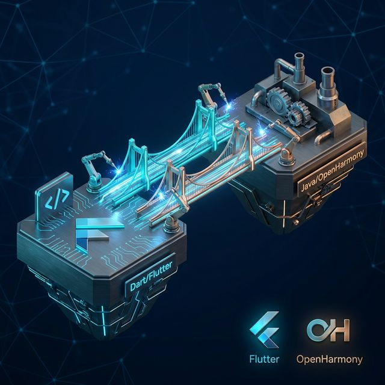
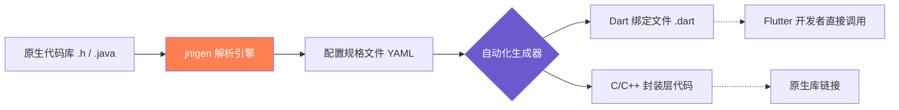

欢迎加入开源鸿蒙跨平台社区：[https://openharmonycrossplatform.csdn.net](https://openharmonycrossplatform.csdn.net)。

# Flutter for OpenHarmony：jnigen — 自动化打通 Flutter 与原生代码的通信壁垒




## 前言

在进行 **Flutter for OpenHarmony** 开发时，我们经常会面临这样的尴尬境地：Flutter 侧提供了完美的 UI 体验，但某些核心能力（如硬件传感器驱动、系统级加密、高性能图像算法等）却隐藏在原生的 C++ 或 Java（针对早期鸿蒙版本/兼容层）逻辑中。

传统的 **MethodChannel** 虽然能解决问题，但手写大量的双端映射代码不仅效率低下，且极易出错。今天，我们将探讨一个能让原生交互进入“自动化时代”的利器 —— `jnigen`。它通过分析源代码或字节码，自动生成 Flutter 与 Native 之间的绑定代码，为鸿蒙跨平台开发提供了一种更高效的通信范式。

## 一、JNI 绑定的痛点与 jnigen 方案

### 1.1 手动绑定的代价
在没有 `jnigen` 之前，开发者需要：
1. 在原生侧编写 JNI 入口并注册。
2. 在 Dart 侧手写 MethodChannel 字符串。
3. 手动进行参数的序列化与反序列化。
4. 维护两端代码的一致性。

### 1.2 jnigen 的破局之道
`jnigen`（JNI Generator）利用 Dart 的 `ffigen` 基础，通过解析 C 头文件或 Java 类文件，直接生成：
- **Dart 装饰类**：直接映射原生类。
- **C 粘合代码**：自动处理跨端类型转换（如 String、List 等）。

### 1.3 自动化流程示意图（Mermaid）



## 二、核心配置与使用详解

### 2.1 安装与依赖
在鸿蒙 Flutter 项目的 `pubspec.yaml` 中，`jnigen` 通常作为开发依赖（dev_dependencies）：

```yaml
dev_dependencies:
  # 代码生成工具
  jnigen: ^0.9.0
  # 运行时基础支持
  jni: ^0.9.0
```

### 2.2 YAML 配置文件编写
在项目根目录创建 `jnigen.yaml`，指定需要绑定的原生路径。

```yaml
# 💡 jnigen.yaml 示例配置
output:
  dart: lib/generated/native_api.dart
  cpp: src/native_bridge.cpp

source_path:
  # 指向鸿蒙工程中的原生源码路径
  - 'ohos/entry/src/main/cpp/include/'

classes:
  # 需要映射的具体类名或方法前缀
  - 'com.ohos.system.NativeHardwareManager'
  - 'com.ohos.utils.CryptoEngine'
```

### 2.3 生成绑定代码
打开鸿蒙开发终端，执行以下指令：

```bash
dart run jnigen --config jnigen.yaml
```

生成的代码会把原生的复杂逻辑包装成一个个 Dart 函数，调用起来就像调用普通的 Flutter 方法一样自然。

<!-- IMAGE_PLACEHOLDER: [jnigen 生成的代码对比展示] -->
<!-- 类型: 示例图 -->
<!-- 内容: 展示左侧是复杂的 C 代码，右侧是简洁的 Dart 调用代码 -->

## 三、鸿蒙环境下的实战应用

### 3.1 场景一：复用已有的高性能 C++ 库
很多鸿蒙应用继承自原有的嵌入式项目，含有大量的 C++ 算法映射。通过 `jnigen`，我们可以直接在 Dart 里操作这些二进制数据流，无需经过 MethodChannel 的多次内存拷贝，性能提升显著。

### 3.2 场景二：系统级深度交互
当我们需要调用鸿蒙系统底层的 N-API（Node-API）能力时，可以通过 `jnigen` 建立一层通用的 C 包装层，随后映射给 Flutter 使用，实现真正的“原生手感”。

<!-- IMAGE_PLACEHOLDER: [成功连接原生算法库后的运行效果] -->
<!-- 类型: 截图 -->
<!-- 设备: 鸿蒙手机 -->
<!-- 内容: 展现一个实时生成的分形图形，其复杂的计算由底层 C++ 驱动 -->

## 四、OpenHarmony 平台适配建议

### 4.1 符号导出限制
鸿蒙系统的原生库通常受安全策略保护。
- **✅ 建议**：在 `CMakeLists.txt` 中确保需要绑定的函数被声明为 `extern "C"` 且可见性设定为 `default`，否则 `jnigen` 生成的代码在链接阶段会报 `Symbol not found` 错误。

### 4.2 内存对齐与数据类型
鸿蒙设备的 CPU 架构（如 ARM64）对内存对齐有严格要求。
- **📌 提醒**：在使用 `jnigen` 映射 Struct（结构体）时，务必检查 C 端与 Dart 端的对齐属性（Padding），避免因偏移量错误导致的应用崩溃。

### 4.3 编译链匹配
- **⚠️ 警告**：请确保宿主机的编译器版本与 DevEco Studio 配置的鸿蒙 NDK 版本一致。不配套的 NDK 可能会导致生成的 JNI 头文件语法不兼容。

## 五、简化版示例代码

本示例演示了生成的 Dart 绑定层是如何让调用变简单的。

```dart
import 'package:jni/jni.dart';
import 'lib/generated/native_api.dart'; // 假设生成的代码

void triggerNativeAction() {
  // 1. 初始化 JNI 运行时（仅需一次）
  if (!Jni.isInitialized) {
    Jni.initialize();
  }

  // 2. 像操作普通 Dart 对象一样操作原生类
  // ✅ 这是 jnigen 生成的代理类
  final hardwareManager = NativeHardwareManager.new1();
  
  // 3. 实现高效调用
  final temp = hardwareManager.getCurrentTemperature();
  print('来自鸿蒙原生的数据: $temp 摄氏度');
}
```

<!-- IMAGE_PLACEHOLDER: [代码在鸿蒙真机控制台的输出] -->
<!-- 类型: 截图 -->
<!-- 内容: 展示成功获取并打印出底层硬件传感器的实时数据 -->

## 六、总结

在 **Flutter for OpenHarmony** 走向深水区的过程中，`jnigen` 绝对是专业开发者避不开的黑科技。它将繁杂的“体力活”交给了算法，让开发者能够腾出精力去打磨 UI 与交互。

核心要点回顾：
1. **自动化映射**：再也不用手写字符串 MethodChannel。
2. **零拷贝优化**：基于 FFI 的底层调用比传统 Channel 更快。
3. **强类型检查**：在编译期间就能发现 C/Dart 端参数不匹配的问题。
4. **适配要点**：关注鸿蒙 NDK 版本与符号导出策略。

熟练掌握 `jnigen`，您将拥有在鸿蒙平台上“随心所欲”调度原生资源的超级能力！

---

> 📦 **完整代码已上传至 AtomGit**：[open-harmony-examples/jnigen](https://atomgit.com/dragonbady/open-harmony-examples/tree/main/examples/jnigen)
>
> 🌐 **欢迎加入开源鸿蒙跨平台社区**：[开源鸿蒙跨平台开发者社区](https://openharmonycrossplatform.csdn.net)
