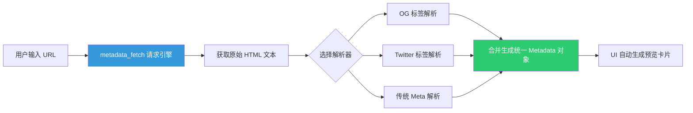

欢迎加入开源鸿蒙跨平台社区：[https://openharmonycrossplatform.csdn.net](https://openharmonycrossplatform.csdn.net)。

# Flutter for OpenHarmony：metadata_fetch — 赋予鸿蒙应用极速抓取网页元信息的能力


在进行社交分享、书签管理或者内容聚合类应用开发时，我们经常需要实现一个功能：当用户输入一个 URL 网址，应用能自动展示该网页的标题、描述、首图甚至是图标。这种“网页快读”功能极大地提升了应用的信息密度与视觉美感。

在 **Flutter for OpenHarmony** 开发里，我们如何快速解析出隐藏在 HTML 标签背后的信息？`metadata_fetch` 库提供了一套高度自动化的映射方案。今天，我们将实战如何利用它让鸿蒙应用具备洞察任何网页的能力。

## 一、为什么集成元数据抓取能力？

### 1.1 提升分享质感
与其只显示一段晦涩的链接，不如展示一个精美的“链接卡片”。

### 1.2 核心优势
- **多标准兼容**：不仅支持标准 HTML `<title>`, `<meta>`, 还能完美解析 Open Graph (og:)、Twitter Cards 等各种主流元数据标准。
- **内置 HTTP 执行器**：自动处理网页抓取逻辑，开发者只需关注最终的 `Metadata` 对象。
- **纯 Dart 实现**：无需调用鸿蒙原生的 Webview 预加载，执行效率高，极其轻量。

### 1.3 元数据提取工作流模型（Mermaid）



## 二、核心 API 与功能讲解

### 2.1 引入依赖
在 `pubspec.yaml` 中配置：

```yaml
dependencies:
  # 网页元数据提取专家
  metadata_fetch: ^0.6.0
```

### 2.2 基础提取操作
根据网址直接获取经过整合的元信息。

```dart
import 'package:metadata_fetch/metadata_fetch.dart';

void fetchWebInfo(String url) async {
  // 💡 一键抓取并解析
  var data = await MetadataFetch.extract(url);
  
  if (data != null) {
    print('网页标题: ${data.title}');
    print('网页摘要: ${data.description}');
    print('封面图 URL: ${data.image}');
  }
}
```

### 2.3 进阶：针对本地 HTML 源码解析
有时您已经通过其他渠道获取了 HTML 文本。

```dart
void parseLocalHtml(String htmlString) {
  final document = MetadataFetch.responseToDocument(htmlString);
  final data = MetadataParser.parse(document);
  
  print('本地解析结果: ${data.title}');
}
```

## 三、鸿蒙应用实战场景

### 3.1 场景一：分布式收藏夹实时同步
在鸿蒙手机上收藏的一个网页。应用通过 `metadata_fetch` 实时提取标题和封面，跨端同步到鸿蒙大屏上展示。由于是纯逻辑抓取，不会在后台弹出浏览器窗口，体验极其安静。

### 3.2 场景二：内容辅助创作助手
在鸿蒙平板的写作应用中。当作者粘贴参考资料链接时，右侧边栏自动弹出该链接的预览卡片，帮助作者快速确认引用内容的真实性。

<!-- IMAGE_PLACEHOLDER: [抓取后的精美预览卡片截图] -->
<!-- 类型: 截图 -->
<!-- 内容: 展示一个类似于微信朋友圈分享链接的精美矩形卡片，左图右文，信息丰富 -->

## 四、OpenHarmony 平台适配建议

### 4.1 网络安全性与证书。
- **✅ 建议**：鸿蒙系统强调 HTTPS 访问。在抓取一些配置了特殊 TLS 的网站时，确保 `module.json5` 已经申请了网络权限。

### 4.2 反爬虫机制处理
- **📌 提醒**：某些网站（如大型电商平台）会对非浏览器 User-Agent 进行拦截。在鸿蒙开发中，建议在发起请求时自定义一个合理的 User-Agent 头（如模拟鸿蒙平板浏览器）。

### 4.3 图片加载优化
- **⚠️ 警告**：抓取到的 `image` URL 可能非常巨大。在鸿蒙 UI 展示时，务必使用 `CachedNetworkImage` 配合裁剪策略，不要直接全尺寸拉取，以防撑爆鸿蒙应用的内存空间。

## 五、完整示例：网址快速探测器

演示一个可在鸿蒙端运行的“链接预览实验台”。

```dart
import 'package:flutter/material.dart';
import 'package:metadata_fetch/metadata_fetch.dart';

void main() => runApp(const MaterialApp(home: MetadataLab()));

class MetadataLab extends StatefulWidget {
  const MetadataLab({super.key});

  @override
  State<MetadataLab> createState() => _MetadataLabState();
}

class _MetadataLabState extends State<MetadataLab> {
  String _title = '点击按钮探测网址';
  String? _imgUrl;

  void _runFetch() async {
    const targetUrl = "https://csdn.net";
    // ✅ 实战：执行核心抓取渲染
    final data = await MetadataFetch.extract(targetUrl);

    setState(() {
      _title = data?.title ?? '暂无标题';
      _imgUrl = data?.image;
    });
  }

  @override
  Widget build(BuildContext context) {
    return Scaffold(
      appBar: AppBar(title: const Text('metadata_fetch 鸿蒙实验室')),
      body: Center(
        child: Column(
          children: [
            const SizedBox(height: 40),
            if (_imgUrl != null) Image.network(_imgUrl!, height: 150),
            const SizedBox(height: 20),
            Text(_title, style: const TextStyle(fontSize: 18, fontWeight: FontWeight.bold)),
            const SizedBox(height: 30),
            ElevatedButton(onPressed: _runFetch, child: const Text('探测 CSDN 元信息')),
          ],
        ),
      ),
    );
  }
}
```

## 六、总结

在鸿蒙系统的信息互联海洋中，`metadata_fetch` 扮演了智慧引航员的角色。它将冰冷的 URL 解析为富有表现力的业务对象，为 **Flutter for OpenHarmony** 应用的内容外延提供了无限可能。

核心要点回顾：
1. **统一标准的封装**：完美适配 OG/Twitter 等多种元数据协议。
2. **轻量非侵入**：纯逻辑解析，无需弹出原生 Webview。
3. **鸿蒙适配**：注意 User-Agent 伪装，并合理控制图片分发消耗。
4. **提升信息价值**：让分享不再只是链接，而是具备视觉冲击力的卡片。

让您的鸿蒙应用，具备看透万千网页的能力！

---

> 📦 **完整代码已上传至 AtomGit**：[open-harmony-examples/metadata_fetch](https://atomgit.com/dragonbady/open-harmony-examples/tree/main/examples/metadata_fetch)
>
> 🌐 **欢迎加入开源鸿蒙跨平台社区**：[开源鸿蒙跨平台开发者社区](https://openharmonycrossplatform.csdn.net)
