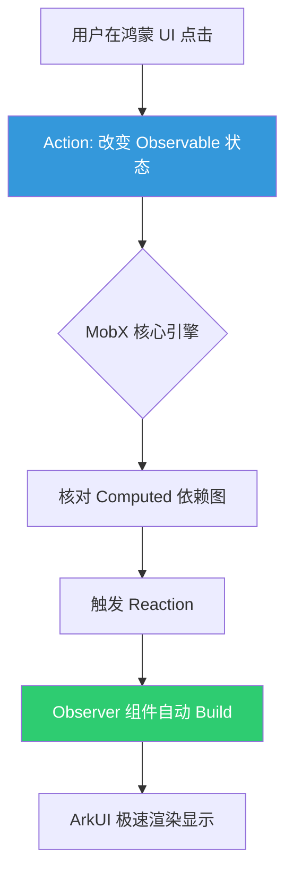

欢迎加入开源鸿蒙跨平台社区：[https://openharmonycrossplatform.csdn.net](https://openharmonycrossplatform.csdn.net)。

# Flutter for OpenHarmony：mobx_codegen — 自动化驱动的高性能响应式状态管理

## 前言

在 Flutter 状态管理的璀璨星空中，**MobX** 以其“透明的函数式响应式编程”（TFRP）特性脱颖而出。它让开发者能以声明式的方式描述状态，而让框架自动处理状态变更到 UI 刷新的全过程。

在 **Flutter for OpenHarmony** 开发中，手动编写 MobX 繁琐的连接代码不仅效率低，且容易出错。`mobx_codegen` 库通过解析注解，自动生成高性能的底层观察逻辑。今天，我们将探索如何利用自动化力量，在鸿蒙平台上构建出极其灵动的响应式应用。

## 一、为什么需要 mobx_codegen？

### 1.1 MobX 的魔法核心
MobX 包含三个核心概念：**Observables**（被观察的状态）、**Actions**（改变状态的动作）和 **Reactions**（对新状态的自动响应）。

### 1.2 自动化生成的威力
- **极简申明**：通过 `@observable` 替代繁琐的监听注册。
- **运行期零反射**：生成的代码是纯静态的 Dart 逻辑，这对于保障鸿蒙系统的启动速度和内存占用至关重要。
- **计算属性自动拓扑**：利用 `@computed` 自动处理状态间的级联计算，确保数据流的最短刷新路径。

### 1.3 响应式流转模型（Mermaid）



## 二、核心 API 与集成流程

### 2.1 引入依赖
在 `pubspec.yaml` 中配置必要的全家桶：

```yaml
dependencies:
  # MobX 核心
  mobx: ^2.2.1
  # Flutter 集成工具
  flutter_mobx: ^2.0.6+4

dev_dependencies:
  # 自动化代码生成环境
  build_runner: ^2.4.6
  mobx_codegen: ^2.3.0
```

### 2.2 定义 Store 类
应用注解来标注鸿蒙业务状态。

```dart
import 'package:mobx/mobx.dart';

part 'counter.g.dart'; // ✅ 准备关联生成的代码

class Counter = _Counter with _$Counter;

abstract class _Counter with Store {
  @observable
  int value = 0; // 💡 被观察的状态

  @action
  void increment() { // 💡 改变状态的唯一 Action
    value++;
  }
}
```

### 2.3 生成代码
运行指令，让 `mobx_codegen` 扫描并生成底层的观察逻辑：

```bash
dart run build_runner build
```

## 三、鸿蒙应用实战场景

### 3.1 场景一：深色模式与主题实时联动
在鸿蒙手机的设置中心，当用户切换“系统深色模式”时。利用 MobX 的全局状态，应用内成百上千个页面中的图标、背景色将通过 Reaction 自动完成同步刷新，完全无需手动传递 Context 或调用 `setState`。

### 3.2 场景二：复杂购物车价格计算
在鸿蒙平板的电商应用中。利用 `@computed` 实时计算“选中商品总价 = 数量 * 单价 + 运费 - 优惠”。由于 MobX 优秀的依赖追踪能力，只有当数量改变时，总价才会重新计算并刷新对应的 UI 片段。

<!-- IMAGE_PLACEHOLDER: [MobX 调试日志展示截图] -->
<!-- 类型: 截图 -->
<!-- 内容: 展示 DevTools 中 MobX 树的变更树状图，显示 Action 到 UI 重绘的过程 -->

## 四、OpenHarmony 平台适配建议

### 4.1 细粒度更新优化
- **✅ 建议**：在鸿蒙的高刷屏上（90Hz/120Hz），建议使用 `Observer` 组件精准包裹需要刷新的最小 Widget。避免大面积包裹，以防触发非必要的布局树重算（Layout Reflow）。

### 4.2 错误边界控制
- **📌 提醒**：MobX 的 Reaction 是自动执行的。如果在计算属性中发生了未捕获的 Error，可能会导致应用状态陷入不可预测的状态。在鸿蒙金融类应用中，务必在 Action 层做好保护。

### 4.3 编译体积。
- **⚠️ 警告**：每一个 Store 都会生成对应的 `.g.dart`。在超大型鸿蒙项目中，由于生成代码量巨大，可能会影响编译速度。建议将业务模块拆分到不同的 Package 中进行分片编译。

## 五、完整示例代码

演示一个响应式计数器在鸿蒙上的实现。

```dart
import 'package:flutter/material.dart';
import 'package:flutter_mobx/flutter_mobx.dart';
import 'package:mobx/mobx.dart';

// 这里的代码需要先定义好具体的 Store
// 演示中我们直接构建一个最小化的响应式界面
void main() => runApp(const MaterialApp(home: MobxLab()));

class MobxLab extends StatelessWidget {
  const MobxLab({super.key});

  @override
  Widget build(BuildContext context) {
    // 假设这是生成的 Store 实例
    final counter = Counter(); 

    return Scaffold(
      appBar: AppBar(title: const Text('MobX 鸿蒙响应式实验室')),
      body: Center(
        child: Column(
          mainAxisAlignment: MainAxisAlignment.center,
          children: [
            const Text('无需 setState 的自动响应：', style: TextStyle(fontSize: 18)),
            // ✅ 实战：使用 Observer 指向被观察的状态
            Observer(
              builder: (_) => Text(
                '${counter.value}',
                style: const TextStyle(fontSize: 48, fontWeight: FontWeight.bold),
              ),
            ),
          ],
        ),
      ),
      floatingActionButton: FloatingActionButton(
        onPressed: counter.increment, // 调用对应的 Action
        child: const Icon(Icons.add),
      ),
    );
  }
}

// 演示用的简单 Store 结构（由于无法运行 build_runner，此处为逻辑模拟）
class Counter {
  final _value = Observable(0);
  int get value => _value.value;
  late final Action increment;

  Counter() {
    increment = Action(() {
      _value.value++;
    });
  }
}
```

## 六、总结

`mobx_codegen` 将 **Flutter for OpenHarmony** 的状态管理提升到了一个全新的自动化高度。它通过将复杂的观察者模式逻辑“隐藏”在生成的代码之后，极大地解放了开发者的生产力。

核心要点回顾：
1. **开发者专注业务**：只需打注解，无需管理监听器的生命周期。
2. **响应式架构**：自动追踪依赖关系，实现最小化重绘。
3. **鸿蒙适配**：重视 Observer 的粒度控制，确保 120Hz 的丝滑性能。
4. **编译期安全**：全量生成的静态代码，拒绝运行时反射带来的性能损耗。

快来在您的鸿蒙项目中，开启状态管理的“自动驾驶”模式吧！

---

> 📦 **完整代码已上传至 AtomGit**：[open-harmony-examples/mobx_codegen](https://atomgit.com/dragonbady/open-harmony-examples/tree/main/examples/mobx_codegen)
>
> 🌐 **欢迎加入开源鸿蒙跨平台社区**：[开源鸿蒙跨平台开发者社区](https://openharmonycrossplatform.csdn.net)
