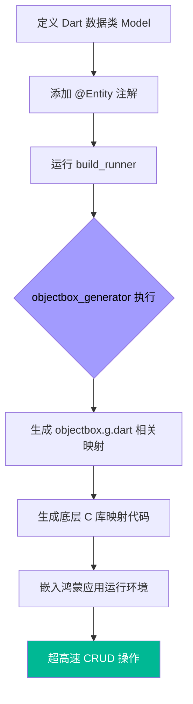

欢迎加入开源鸿蒙跨平台社区：[https://openharmonycrossplatform.csdn.net](https://openharmonycrossplatform.csdn.net)。

# Flutter for OpenHarmony：objectbox_generator — 自动化构建鸿蒙极速 NoSQL 数据库映射

## 前言

在高性能移动应用开发中，本地数据的持久化存储效率往往是决定用户感知流畅度的木桶短板。传统的 SQLite 虽然结构化程度高，但在处理大规模对象关系映射（ORM）时，复杂的 SQL 拼接和反射解析往往会成为性能瓶颈。

**ObjectBox** 作为一个专为移动设备打造的、跨平台的超高速 NoSQL 数据库，已经成为了许多追求极致体验开发者的首选。而在 **Flutter for OpenHarmony** 开发中，配合 `objectbox_generator`，我们可以通过注解驱动的自动化流程，在鸿蒙平台上享受到秒级的数据库存取性能。

## 一、为什么在鸿蒙上选择 ObjectBox？

### 1.1 极速的存取性能
ObjectBox 的读写速度通常比 SQLite 快 10 倍以上，这对于鸿蒙高刷新率（120Hz）设备上的实时数据流展示至关重要。

### 1.2 核心优势
- **极简映射**：通过 `@Entity` 注解直接将 Dart 对象映射为数据库记录。
- **自动迁移**：支持数据结构的无缝升级，自动处理字段变更。
- **类型安全**：所有查询逻辑在编译期即确定，避免了 SQL 注入与手动拼写错误。

### 1.3 数据库生成工作流（Mermaid）



## 二、核心 API 与集成流程

### 2.1 引入依赖
在鸿蒙项目的 `pubspec.yaml` 中配置生成器与核心库：

```yaml
dependencies:
  # ObjectBox 核心库
  objectbox: ^2.4.0
  # 跨平台链接库
  objectbox_flutter_libs: ^2.4.0

dev_dependencies:
  # 注解处理生成器
  build_runner: ^2.4.6
  objectbox_generator: ^2.4.0
```

### 2.2 定义实体类
使用注解描述鸿蒙应用中的业务模型。

```dart
import 'package:objectbox/objectbox.dart';

@Entity()
class OhosUser {
  @Id() // 💡 必须有一个自增 ID
  int id = 0;

  String name;
  
  @Index() // 🎨 为常用字段添加索引，提升搜索速度
  String employeeId;

  OhosUser({required this.name, required this.employeeId});
}
```

### 2.3 生成代码
在终端执行指令：

```bash
dart run build_runner build
```

## 三、鸿蒙应用实战场景

### 3.1 场景一：离线地图 POI 点缓存
在鸿蒙车载或户外平板应用中，存储百万级地理位置点数据（POI）。利用 ObjectBox 的高效索引能力，可以在用户滑动地图时，实时从数据库拉取周边 1 公里内的所有设施，且完全无重画卡顿。

### 3.2 场景二：消息通知的历史存根
在鸿蒙社交类应用中，存储海量的即时消息（IM）历史。通过 ObjectBox 的 Reactive 属性，当数据发生变更时，鸿蒙 UI 会自动刷新，无需手动查询。

<!-- IMAGE_PLACEHOLDER: [ObjectBox 在鸿蒙系统下的基准测试对比截图] -->
<!-- 类型: 截图 -->
<!-- 内容: 展示与传统存储方案在写入 10000 条数据时的耗时对比看板 -->

## 四、OpenHarmony 平台适配建议

### 4.1 异步存储分发
尽管 ObjectBox 非常快，但在写入超大规模二进制数据时仍可能产生微小停顿。
- **✅ 建议**：对于鸿蒙系统中的图片、视频文件，不要直接存入 ObjectBox 的 Blob 字段。建议只存储文件路径，利用 ObjectBox 搜索路径，再从鸿蒙原生的文件系统读取物理资源。

### 4.2 适配鸿蒙 NDK 环境。
- **📌 提醒**：ObjectBox 底层依赖 C/C++ 库。在进行鸿蒙原生项目工程配置时，确保已将对应的 `.so` 库根据鸿蒙架构（如 ARM64）放入对应的 `libs` 目录中。

### 4.3 数据库锁定处理
- **⚠️ 警告**：由于 ObjectBox 使用了多版本并发控制（MVCC）。在鸿蒙应用的主进程与子进程之间同时访问同一个数据库文件时，需注意文件锁（Locking）问题，建议通过服务共享访问。

## 五、完整示例代码

此示例演示了如何开启一个基础的 ObjectBox 存储库。

```dart
import 'package:flutter/material.dart';
import 'package:path_provider/path_provider.dart';
import 'objectbox.g.dart'; // ✅ 自动生成的代码

// 1. 初始化存储中枢
class OhosObjectBox {
  late final Store store;
  late final Box<OhosUser> userBox;

  OhosObjectBox._create(this.store) {
    userBox = Box<OhosUser>(store);
  }

  static Future<OhosObjectBox> create() async {
    final docsDir = await getApplicationDocumentsDirectory();
    final store = await openStore(directory: '${docsDir.path}/ohos_db');
    return OhosObjectBox._create(store);
  }
}

void main() async {
  WidgetsFlutterBinding.ensureInitialized();
  final objectBox = await OhosObjectBox.create();
  runApp(MaterialApp(home: DbLabApp(objectBox: objectBox)));
}

class DbLabApp extends StatelessWidget {
  final OhosObjectBox objectBox;
  const DbLabApp({super.key, required this.objectBox});

  @override
  Widget build(BuildContext context) {
    return Scaffold(
      appBar: AppBar(title: const Text('ObjectBox 鸿蒙存储实验室')),
      body: Center(
        child: ElevatedButton(
          onPressed: () {
            // ✅ 实战：高性能写入一条数据
            final newUser = OhosUser(name: '金牌开发者', employeeId: '888');
            objectBox.userBox.put(newUser);
            ScaffoldMessenger.of(context).showSnackBar(const SnackBar(content: Text('入库成功！')));
          },
          child: const Text('存入鸿蒙数据库'),
        ),
      ),
    );
  }
}
```

## 六、总结

`objectbox_generator` 为 **Flutter for OpenHarmony** 下的高性能开发提供了“开挂般”的效率。它不仅消除了 SQL 拼接带来的隐患，更通过自动化代码生成的手段，让开发者能全身心投入到鸿蒙全场景业务逻辑中。

核心要点回顾：
1. **纯注解驱动**：将 Data Class 瞬间转变为数据库模型。
2. **极速 IO**：相比传统 SQLite，读写吞吐量提升显著。
3. **响应式架构**：数据变更与 UI 同步，无需手动重新拉取。
4. **鸿蒙适配**：注意 NDK 层的库链接与多进程资源锁定策略。

让复杂的数据存储在鸿蒙平台上快如闪电，从 ObjectBox 开始！

---

> 📦 **完整代码已上传至 AtomGit**：[open-harmony-examples/objectbox_generator](https://atomgit.com/dragonbady/open-harmony-examples/tree/main/examples/objectbox_generator)
>
> 🌐 **欢迎加入开源鸿蒙跨平台社区**：[开源鸿蒙跨平台开发者社区](https://openharmonycrossplatform.csdn.net)
