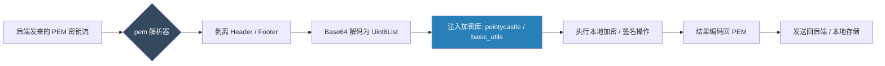

欢迎加入开源鸿蒙跨平台社区：[https://openharmonycrossplatform.csdn.net](https://openharmonycrossplatform.csdn.net)。

# Flutter for OpenHarmony：pem — 在鸿蒙应用中优雅处理加密证书与密钥


在现代移动应用的网络安全、数字签名及加密传输中，证书的管理是基石。无论是对接 HTTPS 的私有根证书，还是在进行 RSA 加密时加载私钥，我们通常会接触到 **PEM (Privacy-Enhanced Mail)** 格式的文件——即那些以 `-----BEGIN CERTIFICATE-----` 开头的文本块。

在 **Flutter for OpenHarmony** 开发中，如何高效地解析和编码这些 Base64 文本数据？`pem` 库提供了一套标准的、纯 Dart 的工具包。今天，我们将实战如何利用它在鸿蒙项目里完成安全底座的构建。

## 一、为什么需要处理 PEM 格式？

### 1.1 加密规范的一致性
PEM 是加密算法领域最通用的交换格式。后端服务（如 Node.js, Go 或 OpenSSL）生成的密钥通常都是 PEM 格式。

### 1.2 核心优势
- **解析与编码双向支持**：轻松将 PEM 字符串还原为字节数组，或将密钥字节按规范打包。
- **纯 Dart 实现**：不依赖特定操作系统的 NDK 加密库，确保在鸿蒙各个形态（手机、平板、穿戴设备）上的一致表现。
- **极简 API**：通过简单的正则表达式和格式化逻辑，抹平了手动处理 Base64 文本时的各种“空格、换行”带来的错误。

### 1.3 证书处理流程模型（Mermaid）



## 二、核心 API 与功能讲解

### 2.1 引入依赖
在 `pubspec.yaml` 中配置：

```yaml
dependencies:
  # PEM 证书处理核心
  pem: ^1.1.0
```

### 2.2 解析 PEM 文本
将本地文件或网络请求获取的 PEM 块转换为可操作二进制。

```dart
import 'package:pem/pem.dart';
import 'dart:typed_data';

void decodeKey(String pemString) {
  // 💡 直接获取 PEM 内部的 Base64 载荷数据
  // 它会自动忽略 Header、Footer 以及所有的换行符
  List<int> decodedData = PemCodec.defaultCodec.decode(pemString);
  
  Uint8List keyBytes = Uint8List.fromList(decodedData);
  print('解析出的密钥字节长度: ${keyBytes.length}');
}
```

### 2.3 生成符合规范的 PEM 编码
将二进制密钥封装为标准 PEM 格式，方便鸿蒙应用与服务端交互。

```dart
String generatePem(Uint8List rawData) {
  // 🎨 指定标签并进行标准格式对齐（每 64 字符自动换行）
  return PemCodec.defaultCodec.encode(
    rawData, 
    label: 'RSA PRIVATE KEY'
  );
}
```

## 三、鸿蒙应用实战场景

### 3.1 场景一：私有云盘数据加密
在鸿蒙手机的“安全私有云”应用中。用户在首次激活时生成一对 RSA 密钥。通过 `pem` 库将私钥按照标准格式进行持久化存储到鸿蒙的安全沙箱中。当需要上传文件时，提取 PEM 私钥进行签名，确保数据的不可篡改性。

### 3.2 场景二：企业级自签名证书直连
在鸿蒙内网办公应用中，服务端使用自签名的 SSL 证书。应用启动时，通过 `pem` 库解析打包在 Assets 里的 `.pem` 根证书文件，并将其注入到 `Dio` 或 `HttpClient` 的安全上下文中，保障内网环境的 HTTPS 连通性。

<!-- IMAGE_PLACEHOLDER: [PEM 格式化前后的对比截图] -->
<!-- 类型: 截图 -->
<!-- 内容: 展示一段散乱的 Base64 文本经过 pem 库处理后，变成了整齐带头尾描述的证书块 -->

## 四、OpenHarmony 平台适配建议

### 4.1 数据的安全性（隐私守护）
- **✅ 建议**：PEM 文本本身不加密。在鸿蒙应用中存储这些字符串时，切勿明文写入 Preferences。建议将其存储在鸿蒙系统的“用户首选项”并配合鸿蒙底层的 `HUKS（鸿蒙通用密钥库）` 进行外层加密。

### 4.2 适配大块证书的解析性能
- **📌 提醒**：虽然解析小型私钥很快，但如果是解析包含完整证书链的超大型 PEM 集（几百 KB），解析过程中会产生大量的临时字符串。
- **🎨 最佳实践**：建议启用一个 **Isolate**（鸿蒙侧称为 Worker）来处理证书的解析与加解密操作，确保 120Hz 的鸿蒙系统主界面绝对不产生掉帧。

### 4.3 字符集兼容性
- **⚠️ 警告**：解析 PEM 时，确保输入的编码是标准的 UTF-8。有些旧系统的 PEM 文件可能在行尾包含不规范的 `\r\n`。`pem` 库通常能很好地处理，但在边缘情况下建议先手动清除非打印字符。

## 五、完整示例：PEM 格式化生成器

演示如何在鸿蒙端快速封装一个合规的密钥块。

```dart
import 'dart:typed_data';
import 'package:flutter/material.dart';
import 'package:pem/pem.dart';

void main() => runApp(const MaterialApp(home: PemLab()));

class PemLab extends StatelessWidget {
  const PemLab({super.key});

  @override
  Widget build(BuildContext context) {
    // 💡 模拟一个随机生成的密钥二进制
    final rawKey = Uint8List.fromList([0x12, 0x34, 0x56, 0x78, 0x90, 0xAB, 0xCD, 0xEF]);

    // ✅ 实战：生成标准的 PEM 证书块
    final pemOutput = PemCodec.defaultCodec.encode(
      rawKey, 
      label: 'OHOS TEST CERTIFICATE'
    );

    return Scaffold(
      appBar: AppBar(title: const Text('pem 鸿蒙安全证书实验室')),
      body: Padding(
        padding: const EdgeInsets.all(16.0),
        child: Column(
          children: [
            const Icon(Icons.verified_user, size: 60, color: Colors.green),
            const SizedBox(height: 20),
            const Text('生成的 PEM 格式结果：'),
            const SizedBox(height: 10),
            Container(
              padding: const EdgeInsets.all(12),
              color: Colors.grey[200],
              child: SelectableText(
                pemOutput,
                style: const TextStyle(fontFamily: 'monospace', fontSize: 13),
              ),
            ),
          ],
        ),
      ),
    );
  }
}
```

## 六、总结

在鸿蒙系统向全场景、企业级进军的道路上，安全是第一准则。通过 `pem` 库，我们将原本凌乱的加密密钥管理变得标准化、可观察化，为 **Flutter for OpenHarmony** 应用打造了一个坚实的安全堡垒基石。

核心要点回顾：
1. **标准化解编码**：完美支持 RFC 1421/7468 规范。
2. **轻量纯 Dart**：无平台依赖，适配鸿蒙全家桶设备。
3. **鸿蒙适配**：注意结合 HUKS 加强本地存储安全性，处理大证书时使用异步线程。
4. **提升专业度**：告别简陋的 `split` 文本操作，拥抱标准的 Codec 方案。

掌握 PEM 证书处理，让您的鸿蒙应用加密逻辑从此走向专业化道路！

---

> 📦 **完整代码已上传至 AtomGit**：[open-harmony-examples/pem](https://atomgit.com/dragonbady/open-harmony-examples/tree/main/examples/pem)
>
> 🌐 **欢迎加入开源鸿蒙跨平台社区**：[开源鸿蒙跨平台开发者社区](https://openharmonycrossplatform.csdn.net)
