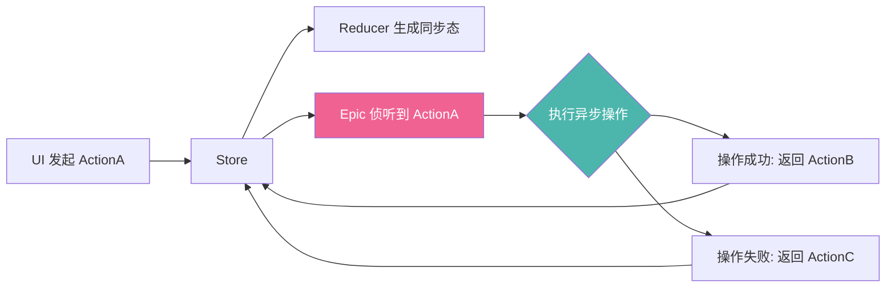

欢迎加入开源鸿蒙跨平台社区：[https://openharmonycrossplatform.csdn.net](https://openharmonycrossplatform.csdn.net)。

# Flutter for OpenHarmony：redux_epics — 优雅管理鸿蒙状态管理中的异步副作用

## 前言

在构建大型跨平台应用时，状态管理的严谨性直接决定了项目的可维护性。`Redux` 以其单向数据流和不可变状态锁定了许多开发者的心。然而，纯粹的 Redux 加速器（Reducer）必须是同步且无副作用的函数，这给处理异步网络请求、文件读写等副作用带来了挑战。

在 **Flutter for OpenHarmony** 开发中，`redux_epics` 结合 `RxDart` 的强大处理能力，为我们提供了一个基于“流”的副作用管理方案。今天，我们将实战如何利用 Epics 在鸿蒙应用中优雅地编排复杂的异步生命周期。

## 一、为什么需要 Epics？

### 1.1 Reducers 的局限
Reducer 负责计算新状态，它不能发起网络请求。如果将异步逻辑混入其中，会破坏 Redux 的预测性。

### 1.2 Epics 的破局之道
- **响应式驱动**：Epic 监视传入的 Action“流”，并根据规则发射新的 Action。
- **无缝取消**：利用 RxDart 的操作符，可以轻松实现“当用户发起新搜索时自动取消上一次未完成的请求”。
- **链式组合**：可以将多个异步操作顺序或并行地组合在一起，逻辑清晰。

### 1.3 副作用流转模型（Mermaid）



## 二、核心 API 与功能讲解

### 2.1 引入依赖
在 `pubspec.yaml` 中引入：

```yaml
dependencies:
  # 状态管理核心
  redux: ^5.0.0
  # 副作用管理
  redux_epics: ^0.16.0
  # 流处理基础
  rxdart: ^0.27.7
```

### 2.2 定义 Epic
监听登录请求，并映射为成功或失败。

```dart
import 'package:redux_epics/redux_epics.dart';
import 'package:rxdart/rxdart.dart';

// 💡 Epic 是一个将 Actions 流转换为更多 Actions 的函数
Stream<dynamic> loginEpic(Stream<dynamic> actions, EpicStore<AppState> store) {
  return actions
    .whereType<LoginRequestAction>() // 📌 只关注登录请求
    .switchMap((action) => Stream.fromFuture(_apiService.login(action.name))
      .map((user) => LoginSuccessAction(user))
      .onErrorReturn(LoginFailureAction('登录失败')));
}
```

### 2.3 Store 的集成
将 Epic 中间件挂载到鸿蒙应用的主仓库中。

```dart
final epicMiddleware = EpicMiddleware(loginEpic);

final store = Store<AppState>(
  reducer,
  initialState: AppState.initial(),
  middleware: [epicMiddleware], // ✅ 将 Epic 作为中间件注入
);
```

## 三、鸿蒙应用实战场景

### 3.1 场景一：分布式任务自动重试
在鸿蒙分布式应用中，网络环境可能由于设备移动而在 4G 与 Wi-Fi 间频繁切换。利用 Epic 的 `retry` 操作符，可以在请求失败时进行指数避退重试，无需在 UI 层写复杂的重连逻辑。

### 3.2 场景二：全局性的即时消息解析
在后台静默接收鸿蒙系统的即时推送 Action，通过 Epic 进行复杂的 JSON 解析和本地数据库存储，最后发射一个前端刷新 Action，保持 UI 的纯净。

<!-- IMAGE_PLACEHOLDER: [Redux Epic 触发过程看板截图] -->
<!-- 类型: 截图 -->
<!-- 内容: 展示开发者工具中 Actions 的时序图，清晰标注了 Epic 发射新 Action 的时机 -->

## 四、OpenHarmony 平台适配建议

### 4.1 高频率 Action 过滤
鸿蒙设备往往具有极高的交互灵敏度。
- **✅ 建议**：利用 RxDart 的 `debounceTime` 操作符在 Epic 侧过滤掉重复的触发（如快速连点按钮产生的异步请求），以此减轻鸿蒙系统的 CPU 负载和网络瞬间突发。

### 4.2 路由与异常隔离
- **📌 提醒**：Epic 内部发生的未捕获异常会导致整个 Stream 崩溃。
- **🎨 最佳实践**：在每一个 Epic 的链条最末端务必添加 `catchError` 处理，确保鸿蒙应用在异常情况下依然能发射一个“错误状态” Action，让 UI 正确显示。

### 4.3 编译时混淆
- **⚠️ 警告**：在使用 `whereType<MyAction>()` 这种基于类型的过滤时，确保鸿蒙构建工具在混淆（Obfuscation）阶段不会重命名 Action 类名，否则类型匹配可能失效。

## 五、完整示例代码

演示一个带自动限流功能的异步搜索。

```dart
import 'package:flutter/material.dart';
import 'package:redux/redux.dart';
import 'package:redux_epics/redux_epics.dart';
import 'package:rxdart/rxdart.dart';

// --- 定义 ---
class SearchRequest { final String query; SearchRequest(this.query); }
class SearchSuccess { final String data; SearchSuccess(this.data); }

// 1. Epic 逻辑
Stream<dynamic> searchEpic(Stream<dynamic> actions, EpicStore<int> store) {
  return actions
    .whereType<SearchRequest>()
    .debounceTime(const Duration(milliseconds: 500)) // ✅ 鸿蒙限流适配
    .switchMap((action) => Stream.value('结果: ${action.query}')
      .delay(const Duration(seconds: 1))
      .map((data) => SearchSuccess(data)));
}

// 2. Reducer
int counterReducer(int state, dynamic action) => state; // 示例简化

void main() {
  final epicMiddleware = EpicMiddleware(searchEpic);
  final store = Store<int>(counterReducer, initialState: 0, middleware: [epicMiddleware]);
  runApp(MaterialApp(home: ReduxEpicLab(store: store)));
}

class ReduxEpicLab extends StatelessWidget {
  final Store<int> store;
  const ReduxEpicLab({super.key, required this.store});

  @override
  Widget build(BuildContext context) {
    return Scaffold(
      appBar: AppBar(title: const Text('redux_epics 鸿蒙副作用实验室')),
      body: Center(
        child: Column(
          children: [
            TextField(onChanged: (v) => store.dispatch(SearchRequest(v))),
            const SizedBox(height: 20),
            const Text('请查看后台输出，异步结果将在 1s 后通过 Action 自动返回'),
          ],
        ),
      ),
    );
  }
}
```

## 六、总结

`redux_epics` 为 **Flutter for OpenHarmony** 应用架构引入了流式治理的概念。它将原本散布在 UI 层的异步回调集中管理，让代码不仅具备“函数式”的美感，更具备极高的可靠性。

核心要点回顾：
1. **Action-In Action-Out**：将副作用视为一种数据的转换。
2. **RxDart 赋能**：利用流操作符应对复杂的业务时序。
3. **架构解耦**：Reducer 负责同步，Epic 负责异步。
4. **鸿蒙适配**：注意限流与全局异常捕获，确保应用的高稳定性。

掌握 Epic，让您的红蒙应用逻辑在万物互联的流中自由舞动！

---

> 📦 **完整代码已上传至 AtomGit**：[open-harmony-examples/redux_epics](https://atomgit.com/dragonbady/open-harmony-examples/tree/main/examples/redux_epics)
>
> 🌐 **欢迎加入开源鸿蒙跨平台社区**：[开源鸿蒙跨平台开发者社区](https://openharmonycrossplatform.csdn.net)
