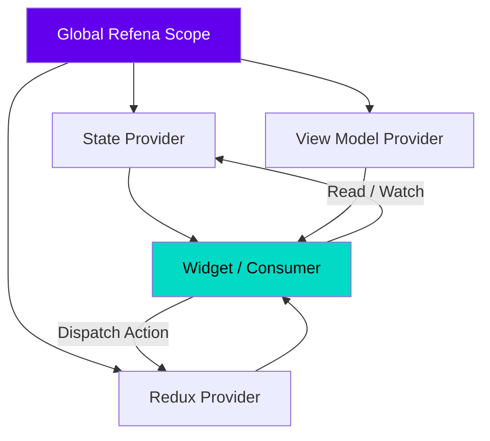

欢迎加入开源鸿蒙跨平台社区：[https://openharmonycrossplatform.csdn.net](https://openharmonycrossplatform.csdn.net)。

# Flutter for OpenHarmony：refena — 新一代响应式状态管理框架在鸿蒙的应用

## 前言

状态管理一直是 Flutter 开发中讨论最激烈的话题。从 `Provider` 的简洁、`Bloc` 的严谨到 `Riverpod` 的优雅，每一种方案都在试图解决逻辑复用与状态追踪的问题。而在 **Flutter for OpenHarmony** 生态中，为了追求更极致的性能与代码可读性，**Refena** 作为一个轻量级、功能完备且具有响应式原生属性的框架，正在受到越来越多资深开发者的关注。

本文将带您领略 `refena` 的独特魅力，并探讨如何利用它来构建一个健壮的鸿蒙应用架构。

## 一、为什么在鸿蒙上选择 Refena？

### 1.1 精准的重绘控制
`refena` 内部采用高效的图逻辑来跟踪依赖关系，仅在状态真正发生变化时才通知监听的组件，这对于注重功耗表现的鸿蒙设备（如智能穿戴、入门级手机）尤为重要。

### 1.2 核心优势
- **类型安全**：编译期捕获所有 Providers 的访问错误。
- **全局单例支持**：无需显式的 BuildContext 即可在 Service 层操作状态。
- **调试友好**：内置追踪（Tracing）功能，能清晰地打印出每一个状态变更的链路。

### 1.3 核心依赖图架构（Mermaid）



## 二、核心 API 与功能讲解

### 2.1 引入依赖
在 `pubspec.yaml` 中配置：

```yaml
dependencies:
  # Refena 核心库
  refena: ^1.4.0
  # Flutter 集成库
  refena_flutter: ^1.4.0
```

### 2.2 定义简单状态 (Simple Provider)
在鸿蒙应用中管理如“夜间模式”切换等简单状态。

```dart
import 'package:refena_flutter/refena_flutter.dart';

// 💡 定义一个主题模式 Provider
final themeProvider = StateProvider<ThemeMode>((ref) => ThemeMode.light);

// 🎨 修改状态
void toggleTheme(Ref ref) {
  ref.notifier(themeProvider).setState(
    (prev) => prev == ThemeMode.light ? ThemeMode.dark : ThemeMode.light
  );
}
```

### 2.3 复杂逻辑 (Redux 模式)
对于涉及鸿蒙分布式数据的同步等较重逻辑，推荐使用 Redux 模式。

```dart
class AppAction extends ReduxAction<AppState, String> {
  @override
  AppState reduce() {
    // 💡 业务逻辑处理并返回新状态
    return state.copyWith(data: action);
  }
}
```

## 三、鸿蒙应用实战场景

### 3.1 场景一：分布式数据观察者
利用 `refena` 的观察者（Observer）模式，在鸿蒙应用的 Service 系统中全局监控数据流向，当收到其他鸿蒙设备同步的信号时，自动触发 UI 响应。

### 3.2 场景二：跨页面逻辑管理
在复杂的鸿蒙应用主界面（如带有多个导航抽屉和分段视图的界面），通过 `watch` 机制，让各个独立的子组件保持状态的实时同步。

<!-- IMAGE_PLACEHOLDER: [Refena Tracing 调试输出截图] -->
<!-- 类型: 截图 -->
<!-- 内容: 展示每一个 Action 触发后状态变更的树状图日志 -->

## 四、OpenHarmony 平台适配建议

### 4.1 性能优化
- **✅ 建议**：使用 `watch` 方法监听频繁变更的状态时，尽量将监听范围缩小到最小的 Widget 中。鸿蒙设备的刷新率通常较高（90Hz/120Hz），避免大面积的不必要重绘。

### 4.2 路由集成
- **📌 提醒**：`refena` 支持在非 Widget 环境（如业务逻辑层）通过全局容器获取 Ref。在处理鸿蒙的原生路由回调时，这种能力能极大地简化代码。

### 4.3 状态持久化
- **⚠️ 警告**：对于鸿蒙系统的持久化数据（如通过 `SharedPreferences` 读取），建议在 App 启动时的 `RefenaScope` 初始化阶段进行异步注入。

## 五、完整示例代码

此示例演示了一个经典的计数器加全局日志监控。

```dart
import 'package:flutter/material.dart';
import 'package:refena_flutter/refena_flutter.dart';

// 1. 定义 Provider
final counterProvider = StateProvider((ref) => 0);

void main() {
  runApp(
    // 2. 包装全局 Scope
    RefenaScope(
      child: const MaterialApp(home: RefenaLab()),
    ),
  );
}

class RefenaLab extends StatelessWidget {
  const RefenaLab({super.key});

  @override
  Widget build(BuildContext context) {
    // 3. 使用 context.watch 获取响应式状态
    final count = context.watch(counterProvider);

    return Scaffold(
      appBar: AppBar(title: const Text('Refena 鸿蒙响应式状态实验室')),
      body: Center(
        child: Column(
          mainAxisAlignment: MainAxisAlignment.center,
          children: [
            const Text('当前计数（高性能重绘）：', style: TextStyle(fontSize: 18)),
            Text('$count', style: const TextStyle(fontSize: 48, fontWeight: FontWeight.bold)),
          ],
        ),
      ),
      floatingActionButton: FloatingActionButton(
        onPressed: () {
          // 4. 通过 context.notifier 获取控制器进行修改
          context.notifier(counterProvider).setState((s) => s + 1);
        },
        child: const Icon(Icons.add),
      ),
    );
  }
}
```

## 六、总结

`refena` 通过其简洁且直观的 API，为 **Flutter for OpenHarmony** 开发者提供了一种高效组织代码的方式。它在性能与开发体验之间找到了一个极佳的平衡点，尤其适合对代码质量有高追求的中大型鸿蒙应用。

核心要点回顾：
1. **依赖图驱动**：精准重绘，降低鸿蒙设备功耗。
2. **多模式支持**：简单状态与 Redux 复杂逻辑通吃。
3. **全局访问**：摆脱 Context 的束缚，增强 Service 层能力。
4. **鸿蒙适配**：重视 Observer 机制，处理分布式数据流。

希望您的鸿蒙应用能够通过 `refena` 的加持，变得更加稳健与灵动！

---

> 📦 **完整代码已上传至 AtomGit**：[open-harmony-examples/refena](https://atomgit.com/dragonbady/open-harmony-examples/tree/main/examples/refena)
>
> 🌐 **欢迎加入开源鸿蒙跨平台社区**：[开源鸿蒙跨平台开发者社区](https://openharmonycrossplatform.csdn.net)
