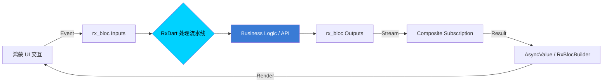

欢迎加入开源鸿蒙跨平台社区：[https://openharmonycrossplatform.csdn.net](https://openharmonycrossplatform.csdn.net)。

# Flutter for OpenHarmony：rx_bloc — 结合响应式编程管理鸿蒙状态


在 Flutter 应用中，状态管理一直是架构设计的核心资产。虽然 `Bloc` 模式已经通过 `flutter_bloc` 获得了广泛认同，但在处理复杂的异步数据流、输入验证和资源释放时，单纯的命令式逻辑往往会变得捉襟见肘。

`rx_bloc` 结合了 **BloC** 的严谨架构与 **RxDart** 的响应式原生能量。在 **Flutter for OpenHarmony** 开发中，它可以帮助我们构建出极其健壮、可测试且高性能的数据流转体系。今天，我们将实战如何利用 `rx_bloc` 在鸿蒙应用中优雅地掌控每一个流。

## 一、为什么选择 rx_bloc？

### 1.1 真正的流式隔离
`rx_bloc` 强制要求将逻辑分为 **Inputs**（输入事件）和 **Outputs**（输出流）。这种完全的契约式设计让 UI 与业务逻辑彻底解耦。

### 1.2 核心优势
- **内置 RxDart 深度集成**：由于底层基于 `BehaviorSubject`，你可以随意使用 `debounceTime`、`switchMap` 等高级操作符。
- **高性能重绘**：响应式流能确保只有当数据真正发生语义上的改变时，鸿蒙 UI 才会被通知刷新。
- **配套工具完善**：拥有强大的代码生成器（rx_bloc_generator），极大减少了样板代码。

### 1.3 状态流转架构（Mermaid）



## 二、核心 API 与功能讲解

### 2.1 引入依赖
在 `pubspec.yaml` 中配置核心库：

```yaml
dependencies:
  # 响应式 Bloc 核心
  rx_bloc: ^3.0.0
  # Flutter 集成工具
  flutter_rx_bloc: ^3.0.0
  # 推荐配合使用
  rxdart: ^0.27.7
```

### 2.2 定义 Bloc 协议 (Contract)
这是 `rx_bloc` 最具特色的地方，通过 `abstract class` 定义沟通契约。

```dart
import 'package:rx_bloc/rx_bloc.dart';
import 'package:rxdart/rxdart.dart';

// 💡 定义输入和输出接口
abstract class CounterBlocEvents {
  void increment();
}

abstract class CounterBlocStates {
  Stream<int> get count;
}

// 🎨 利用注解自动生成实现代码（需要 build_runner）
@RxBloc()
class CounterBloc extends $CounterBloc {
  @override
  Stream<int> _mapToCountState() => _$incrementEvent // 监听输入
      .scan<int>((accumulated, _, __) => accumulated + 1, 0) // 执行计算
      .startWith(0) // 初始值
      .shareReplay(maxSize: 1); // 分享流
}
```

### 2.3 在 UI 中使用 Bloc
利用 `RxBlocBuilder` 实现鸿蒙组件的高效刷新。

```dart
RxBlocBuilder<CounterBloc, int>(
  state: (bloc) => bloc.states.count,
  builder: (context, snapshot, bloc) => Text(
    '当前数值: ${snapshot.data ?? 0}',
    style: const TextStyle(fontSize: 24),
  ),
);
```

## 三、鸿蒙应用实战场景

### 3.1 场景一：带防抖的云搜索
在鸿蒙手机的设置搜索或商城搜索中。通过 `rx_bloc` 的输入流直接串联 `debounceTime` 操作符，实现用户停止输入 300ms 后才自动发起网络请求，极大节省鸿蒙设备电量与流量。

### 3.2 场景二：多态任务加载器
利用 `rx_bloc` 的 `Result` 封装，在鸿蒙端的分布式协作页面中，一行代码处理加载中（Loading）、成功（Success）与报错（Error）三种 UI 状态。

<!-- IMAGE_PLACEHOLDER: [rx_bloc 调试工具分析截图] -->
<!-- 类型: 截图 -->
<!-- 内容: 展示每一个 Stream 的实时分发情况，包含时间戳和数据载荷 -->

## 四、OpenHarmony 平台适配建议

### 4.1 资源管理与释放
鸿蒙系统的内存管理对后台常驻资源有严格审计。
- **✅ 建议**：`rx_bloc` 极度依赖流。在鸿蒙 Page 销毁时，务必通过 `CompositeSubscription` 将 Bloc 中的所有流订阅进行 `dispose()`，防止由于流未关闭导致的内存泄漏。

### 4.2 错误边界处理
- **📌 提醒**：Rx 链条中如果有未捕获的 Error 可能会导致整个 Bloc 停止响应。
- **🎨 最佳实践**：在获取网络数据的流中，始终链入 `onErrorResume` 操作符，确保鸿蒙应用在遇到 API 失败时依然能返回一个友好的错误状态流。

### 4.3 渲染频率管控
- **⚠️ 警告**：对于极高频刷新的流（如加速度传感器的原始数据映射为 UI），务必在输出流末端添加 `sampleTime` 限制，确保在 90Hz/120Hz 刷新率的鸿蒙屏上不会因频繁重绘导致发热。

## 五、完整示例代码

此示例演示了一个简单的响应式计数器。

```dart
import 'package:flutter/material.dart';
import 'package:flutter_rx_bloc/flutter_rx_bloc.dart';
import 'package:rx_bloc/rx_bloc.dart';
import 'package:rxdart/rxdart.dart';

// --- 契约层 ---
abstract class SimpleEvents { void increment(); }
abstract class SimpleStates { Stream<int> get count; }

// --- 逻辑层 ---
class SimpleBloc extends RxBlocBase implements SimpleEvents, SimpleStates {
  final _incrementSubject = PublishSubject<void>();

  @override
  void increment() => _incrementSubject.add(null);

  @override
  late final Stream<int> count = _incrementSubject
      .scan<int>((acc, _, __) => acc + 1, 0)
      .startWith(0)
      .shareReplay(maxSize: 1);

  @override
  void dispose() { _incrementSubject.close(); super.dispose(); }
}

void main() => runApp(const MaterialApp(home: RxBlocLab()));

class RxBlocLab extends StatelessWidget {
  const RxBlocLab({super.key});

  @override
  Widget build(BuildContext context) {
    return RxBlocProvider<SimpleBloc>(
      create: (context) => SimpleBloc(),
      child: Scaffold(
        appBar: AppBar(title: const Text('rx_bloc 鸿蒙响应式实验室')),
        body: Center(
          child: RxBlocBuilder<SimpleBloc, int>(
            state: (bloc) => bloc.count,
            builder: (context, snapshot, bloc) => Text(
              '当前点击次数: ${snapshot.data}',
              style: const TextStyle(fontSize: 32, fontWeight: FontWeight.bold),
            ),
          ),
        ),
        floatingActionButton: RxBlocBuilder<SimpleBloc, int>(
          state: (bloc) => bloc.count, // 仅做状态占位，不重绘此按钮
          builder: (context, snapshot, bloc) => FloatingActionButton(
            onPressed: bloc.increment, // ✅ 调用 Inputs
            child: const Icon(Icons.add),
          ),
        ),
      ),
    );
  }
}
```

## 六、总结

`rx_bloc` 为 **Flutter for OpenHarmony** 应用带来了极具表达力的流式管理模型。它将 RxDart 的复杂性包装在了简洁的 Inputs/Outputs 契约下，让开发者既能享受响应式编程的灵活性，又能保持清晰的架构分层。

核心要点回顾：
1. **契约式设计**：Inputs 定义动作，Outputs 定义数据结果。
2. **深度集成 RxDart**：轻松处理并发、节流与组合流操作。
3. **资源自清理**：严格的生命周期管理适配鸿蒙系统审核。
4. **性能极致**：精准的流分发，减少主线程冗余 build。

拿起响应式的武器，让您的鸿蒙应用在数据流的世界中舞出新高度！

---

> 📦 **完整代码已上传至 AtomGit**：[open-harmony-examples/rx_bloc](https://atomgit.com/dragonbady/open-harmony-examples/tree/main/examples/rx_bloc)
>
> 🌐 **欢迎加入开源鸿蒙跨平台社区**：[开源鸿蒙跨平台开发者社区](https://openharmonycrossplatform.csdn.net)
