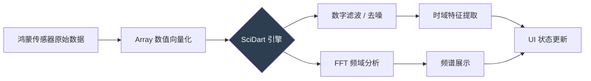

欢迎加入开源鸿蒙跨平台社区：[https://openharmonycrossplatform.csdn.net](https://openharmonycrossplatform.csdn.net)。

# Flutter for OpenHarmony：scidart — 释放鸿蒙设备的科学计算与信号处理潜力

## 前言

随着移动芯片性能的飞速迭代，鸿蒙设备（OpenHarmony）不再仅仅是收发信息的通讯工具，更是强大的移动计算终端。在医疗监测、音频分析、传感器数据挖掘等专业领域，开发者往往需要在移动端进行实时且复杂的数学运算。

在 **Flutter for OpenHarmony** 实战中，如何高效地执行科学计算？`scidart` 库作为 Dart 语言下的“NumPy / SciPy”替代者，为我们提供了从向量矩阵运算到快速傅里叶变换（FFT）的全面支持。今天，我们将探索如何在鸿蒙平台上构建专业级的数值分析应用。

## 一、为什么在鸿蒙上需要科学计算？

### 1.1 边缘计算的需求
许多传感器数据（如鸿蒙穿戴设备的心率、步频信号）如果全部传回云端处理，会造成严重的延迟和隐私暴露。在本地进行实时的信号平滑和特征提取是最佳选择。

### 1.2 scidart 的核心优势
- **高性能数值库**：纯 Dart 实现，针对列表操作进行了大量的算法优化。
- **数学功能全**：涵盖线性代数、数值积分、微分方程、信号处理（DSP）等。
- **无缝集成**：不依赖任何底层的 Fortran 或 C++ 库，确保在鸿蒙各个版本上表现一致。

### 1.3 信号处理流程模型（Mermaid）



## 二、核心 API 与功能讲解

### 2.1 引入依赖
在 `pubspec.yaml` 中配置：

```yaml
dependencies:
  # 科学计算核心库
  scidart: ^0.0.2-dev.9
```

### 2.2 矩阵计算（线性代数）
在处理鸿蒙 3D 图形变换或复杂物理模型时，矩阵运算必不可少。

```dart
import 'package:scidart/numdart.dart';

void runMath() {
  // 💡 创建矩阵
  var matrix = Array2d([
    Array([1.0, 2.0]),
    Array([3.0, 4.0])
  ]);
  
  // 💡 矩阵转置与求和
  var result = matrix + matrix.transpose();
  print('计算结果: $result');
}
```

### 2.3 信号处理（FFT）
这是 `scidart` 的看家本领，适用于鸿蒙音频应用的频谱动态显示。

```dart
import 'package:scidart/scidart.dart';

void analyzeSignal(Array signal) {
  // 🎨 执行快速傅里叶变换
  var fftResult = fft(signal.castToComplex());
  
  // 🎨 获取幅度谱
  var magnitude = absComplexArray(fftResult);
  print('频域分量: $magnitude');
}
```

## 三、鸿蒙应用实战场景

### 3.1 场景一：智能运动姿态识别
通过捕获鸿蒙手机加速度计的高频数据，利用 `scidart` 进行滤波，提取出运动特征（如峰值检测、过零率），在本地实时判断用户是在跑步还是在举铁。

### 3.2 场景二：环境噪音实时监控
在鸿蒙应用的“工具箱”中添加噪音计。通过录音数据流的 FFT 分析，不仅能显示分贝值，还能绘制出实时的频谱图，展现不同频段的能量分布。

<!-- IMAGE_PLACEHOLDER: [基于 scidart 的实时频谱分析截图] -->
<!-- 类型: 截图 -->
<!-- 设备: 鸿蒙手机 -->
<!-- 内容: 展现一个带有动感线条的音频频谱分析界面 -->

## 四、OpenHarmony 平台适配建议

### 4.1 针对大量计算的并发优化
科学计算往往是计算密集型的（CPU Intensive）。
- **✅ 建议**：对于超过 1024 点的 FFT 或大型矩阵求逆，务必在 **Isolate** 中执行。鸿蒙的多核调度机制能确保在进行后台运算时，主 UI 交互依然保持 120Hz 的丝滑。

### 4.2 浮点精度与功耗
- **📌 提醒**：`scidart` 默认使用 64 位浮点数。在较低性能的鸿蒙穿戴设备上，如果对精度要求不高，可以考虑对数据进行预缩放或降采样，以平衡计算耗时与电池开销。

### 4.3 内存使用预警
- **⚠️ 警告**：大规模数据的 `Array` 和 `ComplexArray` 会占用大量连续的堆内存。在处理千万级数据点之前，请检查鸿蒙应用的内存限额。

## 五、完整示例代码

此示例演示了如何通过 `scidart` 建立一个简单的“波形分析器”。

```dart
import 'package:flutter/material.dart';
import 'package:scidart/numdart.dart';
import 'package:scidart/scidart.dart';

void main() => runApp(const MaterialApp(home: ScidartLab()));

class ScidartLab extends StatefulWidget {
  const ScidartLab({super.key});

  @override
  State<ScidartLab> createState() => _ScidartLabState();
}

class _ScidartLabState extends State<ScidartLab> {
  String _stats = '等待计算...';

  void _runAnalysis() {
    // 1. 模拟生成一个混合正弦波信号
    final samplerate = 100.0;
    final time = linspace(0, 1, num: samplerate.toInt());
    final signal = arraySin(time * 2 * pi * 5) + arraySin(time * 2 * pi * 10);

    // 2. ✅ 实战：计算信号的基本统计特征
    final meanVal = mean(signal);
    final stdVal = standardDeviation(signal);
    
    // 3. 执行卷积平滑
    final kernel = Array([0.2, 0.2, 0.2, 0.2, 0.2]);
    final smoothed = convolution(signal, kernel);

    setState(() {
      _stats = '''
信号均值: ${meanVal.toStringAsFixed(2)}
标准差: ${stdVal.toStringAsFixed(2)}
平滑后前 3 点: ${smoothed.getRange(0, 3).toList()}
      ''';
    });
  }

  @override
  Widget build(BuildContext context) {
    return Scaffold(
      appBar: AppBar(title: const Text('scidart 鸿蒙科学计算实验室')),
      body: Center(
        child: Column(
          mainAxisAlignment: MainAxisAlignment.center,
          children: [
            const Icon(Icons.calculate, size: 60, color: Colors.indigo),
            const SizedBox(height: 20),
            Text(_stats, textAlign: TextAlign.center, style: const TextStyle(fontSize: 16)),
            const SizedBox(height: 30),
            ElevatedButton(onPressed: _runAnalysis, child: const Text('运行信号分析')),
          ],
        ),
      ),
    );
  }
}
```

## 六、总结

`scidart` 的出现，极大地拓宽了 **Flutter for OpenHarmony** 应用的疆界。它证明了在不写任何原生代码的情况下，我们依然能在鸿蒙平台上实现极高水准的数学分析功能。

核心要点回顾：
1. **纯 Dart 矩阵运算**：免去繁琐的 NDK 跨平台配置。
2. **信号处理引擎**：内置高性能 FFT，助力多媒体应用开发。
3. **鸿蒙适配**：严格利用多线程（Isolate）隔离大负载计算。
4. **广泛场景**：从运动健康到工业监控，皆可大显身身手。

让科技不仅仅是外在的华丽 UI，更是内在如磐石般的计算力量！

---

> 📦 **完整代码已上传至 AtomGit**：[open-harmony-examples/scidart](https://atomgit.com/dragonbady/open-harmony-examples/tree/main/examples/scidart)
>
> 🌐 **欢迎加入开源鸿蒙跨平台社区**：[开源鸿蒙跨平台开发者社区](https://openharmonycrossplatform.csdn.net)
