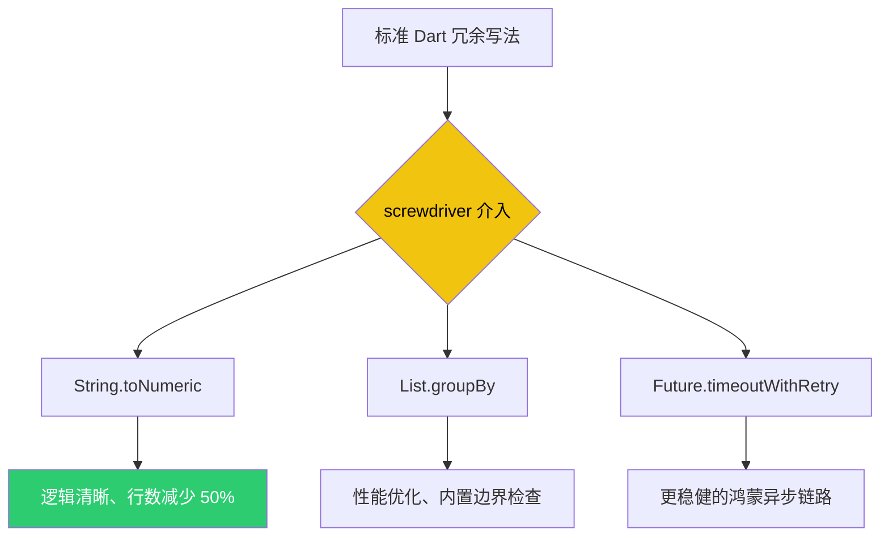

欢迎加入开源鸿蒙跨平台社区：[https://openharmonycrossplatform.csdn.net](https://openharmonycrossplatform.csdn.net)。

# Flutter for OpenHarmony：screwdriver — 助力鸿蒙开发的百宝袋工具库

## 前言

在进行 **Flutter for OpenHarmony** 开发时，我们经常会遇到一些微小但繁琐的逻辑处理。比如：判断一个字符串是否为有效的 JSON、对列表进行优雅地去重、或者是快速获取当前日期的凌晨时间。如果每个项目都手写这些“实用函数”（Utils），不仅浪费时间，还会导致项目中散落着各种风格不一的小工具。

`screwdriver` 正如其名，是一把多功能的“螺丝刀”。它通过一系列极致精简的 Dart 扩展（Extensions）和辅助方法，为我们的代码注入了大量便捷操作。今天，我们就来看看如何用这把螺丝刀来“拧”紧我们的鸿蒙代码架构。

## 一、为什么需要 screwdriver 库？

### 1.1 让代码更接近自然语言
相比于 `if (str != null && str.isNotEmpty && str.trim().length > 0)`，使用 `str.isNotNullOrBlank` 显然更具可读性。

### 1.2 核心优势
- **全方位扩展**：涵盖了 String, Iterable, Map, DateTime, Future 等几乎所有核心类。
- **类型无关的便捷性**：提供了诸如 `fastCopy` 或者是 `toYaml` 等在调试阶段极其好用的功能。
- **轻量无感知**：这只是一个纯 Dart 的实用函数集，不会对鸿蒙应用产生任何包体积层面的负担。

### 1.3 代码优化对比（Mermaid）



## 二、核心 API 与功能讲解

### 2.1 引入依赖
在 `pubspec.yaml` 中配置：

```yaml
dependencies:
  # 极致便携工具箱
  screwdriver: ^0.1.0+9
```

### 2.2 字符串与列表的“魔法”操作
在鸿蒙 UI 逻辑中快速处理展示数据。

```dart
import 'package:screwdriver/screwdriver.dart';

void runUtils() {
  // 💡 字符串扩展
  String? nullName;
  print(nullName.or('鸿蒙默认用户')); // 输出默认值
  
  // 🎨 列表去重与筛选
  final list = [1, 2, 2, 3, 4, 4];
  print(list.distinct()); // [1, 2, 3, 4]

  // 🎨 随机获取元素（非常适合鸿蒙的推荐算法展示）
  print(list.random); 
}
```

### 2.3 异步（Future）任务的增强
在处理鸿蒙网络请求或 IO 时提供超时重试。

```dart
void fetchWithRetry() async {
  // 🎨 优雅地重试 3 次，每次间隔 1s
  final data = await someAsyncWork().retry(
    retries: 3,
    delay: const Duration(seconds: 1),
  );
}
```

## 三、鸿蒙应用实战场景

### 3.1 场景一：深色模式颜色计算
在鸿蒙手机的界面定制中，需要根据主题色自动计算出一个更亮的或更暗的色值。使用 `screwdriver` 的颜色扩展方法，可以一行代码完成亮度微调。

### 3.2 场景二：分布式的配置合并
在鸿蒙分布式协同中，多台设备会发来不同的片段配置。利用 `Map.deepMerge` 扩展，可以极其方便地将多来源的 JSON/Map 字典合并为一个完整的应用配置对象。

<!-- IMAGE_PLACEHOLDER: [使用 screwdriver 缩减后的代码行数对比截图] -->
<!-- 类型: 截图 -->
<!-- 内容: 展示左侧标准的 20 行解析逻辑，右侧使用扩展后缩写为 5 行的清爽对比 -->

## 四、OpenHarmony 平台适配建议

### 4.1 命名空间冲突预警
- **📌 提醒**：`screwdriver` 提供了大量的扩展。如果您引用的其他库（如 `dartx`）也提供了同名扩展，可能会导致编译时选择冲突。在鸿蒙项目中，建议通过 `import ... hide ...` 来解决。

### 4.2 结合鸿蒙 I18n 逻辑
- **✅ 建议**：虽然该库提供了日期格式化扩展，但在鸿蒙应用中展示日期时，仍建议优先使用鸿蒙原生的 `intl` 或者是鸿蒙系统的 `i18n` 接口，以确保符合不同国家用户的习惯。

### 4.3 编译体积优化
- **⚠️ 警告**：不要因为方便就将 `screwdriver` 用于生成极其复杂的正则匹配。虽然方便，但性能敏感的鸿蒙主界面刷新逻辑中，简单的硬编码逻辑往往比复杂的封装扩展执行更快。

## 五、完整示例：高效数据处理

演示如何在鸿蒙端快速清理和转换数据。

```dart
import 'package:flutter/material.dart';
import 'package:screwdriver/screwdriver.dart';

void main() => runApp(const MaterialApp(home: ScrewdriverLab()));

class ScrewdriverLab extends StatelessWidget {
  const ScrewdriverLab({super.key});

  @override
  Widget build(BuildContext context) {
    // 💡 实战：快速处理展示文字
    final String rawMessage = "   welcome TO harmonyOS   ";
    final styledMessage = rawMessage.trim().toLowerCase().capitalize();

    return Scaffold(
      appBar: AppBar(title: const Text('screwdriver 鸿蒙实验室')),
      body: Center(
        child: Column(
          mainAxisAlignment: MainAxisAlignment.center,
          children: [
            const Icon(Icons.build, size: 60, color: Colors.orange),
            const SizedBox(height: 20),
            Text('原始: "$rawMessage"'),
            const SizedBox(height: 10),
            Text('处理后: "$styledMessage"', style: const TextStyle(fontWeight: FontWeight.bold, color: Colors.blue)),
            const SizedBox(height: 30),
            Text('随机幸运数字: ${[10, 20, 30, 40].random}'),
          ],
        ),
      ),
    );
  }
}
```

## 六、总结

`screwdriver` 是我们在 **Flutter for OpenHarmony** 开发中保持代码整洁（Clean Code）的“秘密武器”。它通过对 Dart 原生类的二次进化，让原本繁杂的低级逻辑变得极具语义化。

核心要点回顾：
1. **语义化扩展**：让代码不仅是逻辑，更是易读的文档。
2. **异步强化**：为鸿蒙端的网络请求注入重试与超时韧性。
3. **极速清洗**：轻松处理 String/List/Map 的边界与转换。
4. **鸿蒙适配**：注意与同类扩展库的冲突管理，合理利用其深拷贝能力。

拧好每一行代码的“螺丝”，让您的鸿蒙应用运行得更加稳健！

---

> 📦 **完整代码已上传至 AtomGit**：[open-harmony-examples/screwdriver](https://atomgit.com/dragonbady/open-harmony-examples/tree/main/examples/screwdriver)
>
> 🌐 **欢迎加入开源鸿蒙跨平台社区**：[开源鸿蒙跨平台开发者社区](https://openharmonycrossplatform.csdn.net)
