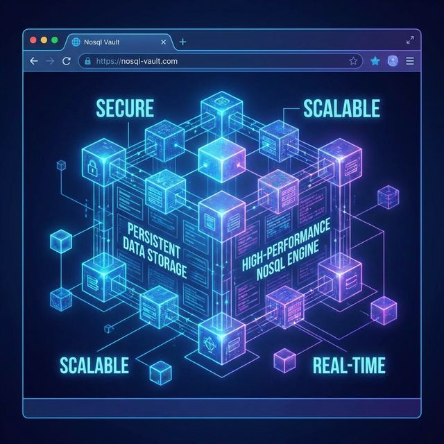
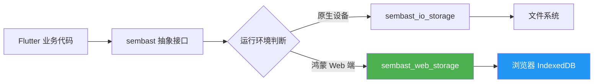

欢迎加入开源鸿蒙跨平台社区：[https://openharmonycrossplatform.csdn.net](https://openharmonycrossplatform.csdn.net)。

# Flutter for OpenHarmony：sembast_web — 赋能鸿蒙 Web 端的无缝 NoSQL 持久化




随着 **OpenHarmony** 生态的蓬勃发展，越来越多的应用需要同时支撑 Native（原生）和 Web（网页）两种运行形态。在鸿蒙跨平台开发中，数据持久化始终是一个核心话题。对于习惯了使用 SQLite 等关系型数据库的开发者来说，NoSQL 数据库以其灵活的模型和极简的 API 正逐渐成为首选。

`sembast` 作为一个高性能的 Dart NoSQL 数据库，深受社区喜爱。而今天我们要重点介绍的 `sembast_web`，则是它的核心插件，专门负责在 **OpenHarmony Web 环境**（如鸿蒙浏览器、元服务 WebContainer）中实现可靠的数据持久化。

## 一、什么是 sembast_web？

### 1.1 核心定义
`sembast_web` 是 `sembast` 数据库在 Web 平台的实现封装。它利用浏览器的 **IndexedDB** 接口，将复杂的 NoSQL 操作映射到浏览器底层的键值存储中。

### 1.2 为什么在鸿蒙开发中使用它？
1. **代码复用**：您的数据库操作代码在原生鸿蒙应用和 Web 应用中完全一致，无需编写两套逻辑。
2. **零配置**：在 Web 环境下不需要配置像 SQLite 那样的原生动态库，开箱即用。
3. **事务支持**：即使在 Web 端，它依然提供完整的 ACID 事务能力。

### 1.3 数据流动模型（Mermaid）



## 二、核心 API 与集成步骤

### 2.1 引入依赖
在 `pubspec.yaml` 中添加，注意版本兼容性：

```yaml
dependencies:
  # 核心 NoSQL 引擎
  sembast: ^3.4.0+1
  # Web 环境存储适配器
  sembast_web: ^2.1.0+2
```

### 2.2 数据库初始化
在鸿蒙 Flutter 应用中，我们需要根据平台动态选择数据库工厂。

```dart
import 'package:sembast/sembast.dart';
import 'package:sembast_web/sembast_web.dart';
import 'package:flutter/foundation.dart';

Future<Database> openMyDatabase() async {
  DatabaseFactory factory;
  String path;

  if (kIsWeb) {
    // 📌 在鸿蒙 Web 环境下使用集成 IndexedDB 的工厂
    factory = databaseFactoryWeb;
    path = 'my_ohos_app.db'; // Web 端通常是一个虚拟名称
  } else {
    // 这里可以处理原生鸿蒙或其他平台的 IO 逻辑
    throw UnimplementedError('原生存储需使用 sembast io 适配器');
  }

  return await factory.openDatabase(path);
}
```

### 2.3 数据读写实战
`sembast` 的语法非常接近 JSON，非常适合处理鸿蒙元服务中的轻量级配置。

```dart
final store = intMapStoreFactory.store('user_settings');

// 💡 写入数据
await store.add(db, {
  'theme': 'dark',
  'language': 'zh_CN',
  'notif_enabled': true
});

// 💡 条件查询
final finder = Finder(filter: Filter.equals('theme', 'dark'));
final records = await store.find(db, finder: finder);
```

<!-- IMAGE_PLACEHOLDER: [数据库操作在鸿蒙调试控制台的日志] -->
<!-- 类型: 截图 -->
<!-- 内容: 展示数据成功保存到 IndexedDB 的控制台输出 -->

## 三、鸿蒙 Web 端应用场景

### 3.1 场景一：离线元服务
在鸿蒙元服务（Atomic Service）中，有些页面是以 Web 形式展示的。利用 `sembast_web` 可以将用户扫描记录或临时填写的表单保存在本地，即使断网也能恢复。

### 3.2 场景二：复杂对象缓存
由于它支持存储嵌套的 Map 和 List，非常适合缓存复杂的 API 响应结果，比传统的 `SharedPreferences` 更强大。

<!-- IMAGE_PLACEHOLDER: [基于 sembast_web 的待办事项列表应用] -->
<!-- 类型: 截图 -->
<!-- 设备: 鸿蒙平板浏览器 -->
<!-- 内容: 一个界面精美的 Todo 应用，展示从数据库加载的任务 -->

## 四、OpenHarmony 平台适配建议

### 4.1 存储限额
鸿蒙浏览器或 Web 运行时对 IndexedDB 的配额有一定限制。
- **✅ 建议**：不要存储海量二进制文件（如原始大图）。对于图片，应存储其 URL 或经过缩略处理的 Base64 字符串。
- **📌 检查**：定期清理过期缓存，避免触发鸿蒙系统的磁盘清理机制。

### 4.2 性能对比
在鸿蒙高性能设备上：
- **IndexedDB 操作是异步的**。虽然 `sembast_web` 进行了很好的封装，但在极高频率写操作时，建议采用批处理（Transaction）合并写入。

### 4.3 浏览器兼容性
鸿蒙系统内置的 WebView 内核更新较快，对 IndexedDB 的支持非常完善。但在开发过程中，仍需注意跨页面（Cross-Tab）数据同步的问题，`sembast` 本身在单页面下表现最佳。

## 五、完整示例代码

此示例演示了如何在 Web 环境下建立一个属性存储桶。

```dart
import 'package:flutter/material.dart';
import 'package:sembast/sembast.dart';
import 'package:sembast_web/sembast_web.dart';

void main() {
  runApp(const MaterialApp(home: SembastWebPage()));
}

class SembastWebPage extends StatefulWidget {
  const SembastWebPage({super.key});

  @override
  State<SembastWebPage> createState() => _SembastWebPageState();
}

class _SembastWebPageState extends State<SembastWebPage> {
  Database? _db;
  final _store = stringMapStoreFactory.store('data_bucket');
  List<RecordSnapshot<String, Map<String, Object?>>> _data = [];

  @override
  void initState() {
    super.initState();
    _initDb();
  }

  Future<void> _initDb() async {
    // 1. 打开数据库（鸿蒙 Web 环境）
    final db = await databaseFactoryWeb.openDatabase('ohos_demo.db');
    setState(() {
      _db = db;
    });
    _loadData();
  }

  Future<void> _loadData() async {
    if (_db == null) return;
    final data = await _store.find(_db!);
    setState(() {
      _data = data;
    });
  }

  Future<void> _addItem() async {
    await _store.add(_db!, {'time': DateTime.now().toString(), 'system': 'OpenHarmony'});
    _loadData();
  }

  @override
  Widget build(BuildContext context) {
    return Scaffold(
      appBar: AppBar(title: const Text('鸿蒙 Web 数据实验室')),
      body: _db == null 
        ? const Center(child: CircularProgressIndicator()) 
        : ListView.builder(
            itemCount: _data.length,
            itemBuilder: (context, index) {
              return ListTile(
                title: Text('数据项 ${index + 1}'),
                subtitle: Text(_data[index].value['time'].toString()),
                trailing: const Icon(Icons.storage, color: Colors.green),
              );
            },
          ),
      floatingActionButton: FloatingActionButton(
        onPressed: _addItem,
        child: const Icon(Icons.add),
      ),
    );
  }
}
```

<!-- IMAGE_PLACEHOLDER: [完整示例运行效果] -->
<!-- 类型: 截图 -->
<!-- 内容: 展现添加点击后，数据即时刷新的列表界面 -->

## 六、总结

`sembast_web` 填补了鸿蒙 Web 开发中复杂数据持久化的空白。它以最符合 Flutter 习惯的方式，利用了浏览器底层最强大的存储能力。在构建需要高度一致性和跨平台复用逻辑的项目时，它绝对是您的不二之选。

核心要点回顾：
1. **IndexedDB 后端**：在 Web 端提供类似原生数据库的持久化体验。
2. **跨平台兼容**：一套逻辑，适配鸿蒙 Native 与 Web。
3. **API 简洁**：基于 Store 和 Finder 的查询方式，比 SQL 更现代。
4. **适配建议**：关注鸿蒙设备的存储配额与事务优化。

---

> 📦 **完整代码已上传至 AtomGit**：[open-harmony-examples/sembast_web](https://atomgit.com/dragonbady/open-harmony-examples/tree/main/examples/sembast_web)
>
> 🌐 **欢迎加入开源鸿蒙跨平台社区**：[开源鸿蒙跨平台开发者社区](https://openharmonycrossplatform.csdn.net)
