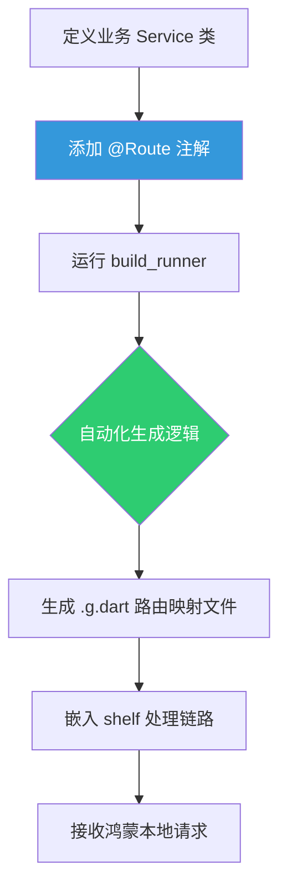

欢迎加入开源鸿蒙跨平台社区：[https://openharmonycrossplatform.csdn.net](https://openharmonycrossplatform.csdn.net)。

# Flutter for OpenHarmony：shelf_router_generator — 高效构建鸿蒙本地 Web 服务路由

## 前言

在现代跨平台应用中，服务端渲染或本地 HTTP 服务正变得越来越重要。无论是为了在鸿蒙端实现高性能的资源分发，还是为了在局域网内进行设备间的轻量级调速，构建一个稳定且易维护的 Web 路由体系是核心支撑。

`shelf_router_generator` 配合 `shelf` 框架，为 Dart 服务端开发提供了极其强大的“代码生成”能力。它可以让我们抛弃繁重的手动路由配置，通过简单的注解（Annotation）就能在 **OpenHarmony** 设备上构建起一套专业级的本地 RESTful API 服务。

## 一、为什么要在鸿蒙端构建 HTTP 服务？

### 1.1 场景化需求
- **本地资源服务器**：将鸿蒙应用内的资源通过 HTTP 暴露给 Webview，绕过沙箱限制。
- **分布式协作**：在鸿蒙平板上运行微服务，接收同一个局域网内其他 HarmonyOS 终端的控制指令。
- **模拟后端调试**：在开发阶段快速搭建一个本地 Mock 系统。

### 1.2 自动化生成的威力
- **类型安全**：编译期检查路由参数。
- **极简申明**：通过 `@Route.get` 替代复杂的 `router.add('GET', ...)`。
- **逻辑解耦**：像处理普通的 Dart 类方法一样处理 HTTP 请求。

### 1.3 路由生成模型（Mermaid）



## 二、核心 API 与集成流程

### 2.1 引入依赖
在 `pubspec.yaml` 中配置必要的生成环境：

```yaml
dependencies:
  # 服务端基础库
  shelf: ^1.4.1
  shelf_router: ^1.1.4

dev_dependencies:
  # 生成器环境
  build_runner: ^2.4.6
  shelf_router_generator: ^1.0.6
```

### 2.2 编写带注解的 Service 类
创建一个专门处理 API 请求的类：

```dart
import 'package:shelf/shelf.dart';
import 'package:shelf_router/shelf_router.dart';

part 'api_service.g.dart'; // ✅ 准备关联生成的代码

class ApiService {
  // 💡 通过注解申明 GET 路由
  @Route.get('/hello')
  Future<Response> _sayHello(Request request) async {
    return Response.ok('你好，来自鸿蒙设备的服务端响应！');
  }

  // 🎨 获取动态参数
  @Route.get('/user/<id>')
  Future<Response> _getUser(Request request, String id) async {
    return Response.ok('查询用户 ID: $id');
  }

  // 生成路由的主入口
  Handler get handler => _$ApiServiceRouter(this);
}
```

### 2.3 生成代码
运行鸿蒙开发终端指令：

```bash
dark run build_runner build
```

## 三、鸿蒙应用实战场景

### 3.1 场景一：分布式数据传输小车
将鸿蒙平板作为“控制中心”，启动一个本地服务器接收各终端传感器的 JSON 数据推送。由于使用了 `shelf_router_generator`，增加一个新的协议接口只需新增一个方法。

### 3.2 场景二：应用内离线文档预览
在本地启动静态资源服务，配合 `shelf_static`，让鸿蒙应用内的复杂 HTML 帮助文档能像网络页面一样被 Webview 全功能解析。

<!-- IMAGE_PLACEHOLDER: [鸿蒙本地服务端运行日志截图] -->
<!-- 类型: 截图 -->
<!-- 内容: 展示鸿蒙系统控制台输出本地服务已在 127.0.0.1:8080 启动并正确响应路由的日志 -->

## 四、OpenHarmony 平台适配建议

### 4.1 网络权限与防火墙
在鸿蒙设备上启动服务器需要特定的系统授权。
- **✅ 建议**：确保在 `module.json5` 中申请了局域网访问或互联网权限。
- **📌 提醒**：如果您希望从其他鸿蒙手机访问该服务的 IP，记得检查鸿蒙系统的防火墙规则是否允许对应的端口（如 8080）入站。

### 4.2 功耗与生命周期管控
在鸿蒙移动终端上长时间运行 Web 服务会加剧电量消耗。
- **⚠️ 警告**：不要让服务随应用常驻。建议在应用进入后台或关闭时，显式调用 `server.close()` 释放 HTTP 监听句柄。

### 4.3 性能资源限制
- **🎨 优化策略**：`shelf` 是基于异步非阻塞模型的，在鸿蒙高性能计算节点上表现优异。但在处理大量并发连接时，注意控制内存池的大小，避免触发鸿蒙系统的 OOM。

## 五、完整示例代码

此示例演示了如何从 0 到 1 开启一个带路由的鸿蒙本地服务器。

```dart
import 'dart:io';
import 'package:shelf/shelf.dart';
import 'package:shelf/shelf_io.dart' as io;
import 'package:shelf_router/shelf_router.dart';

// 实际开发中需通过 build_runner 生成
// part 'server.g.dart'; 

class LocalServer {
  final router = Router();

  void setup() {
    // 💡 模拟生成的路由逻辑
    router.get('/info', (Request request) {
      return Response.ok('鸿蒙设备型号: Mate 60 Pro\n状态: 正常运行中');
    });
  }

  Future<void> start() async {
    setup();
    // ✅ 实战：绑定到本地环回地址
    final server = await io.serve(router.call, InternetAddress.loopbackIPv4, 8081);
    print('鸿蒙本地服务已开启：${server.address.address}:${server.port}');
  }
}

void main() async {
  final ohosServer = LocalServer();
  await ohosServer.start();
}
```

## 六、总结

`shelf_router_generator` 的引入，让在 **OpenHarmony** 上开发分布式边缘计算应用变得异常简单。它通过“配置即代码”的理念，大大缩短了从业务构想到 RESTful 系统落地的时间。

核心要点回顾：
1. **注解驱动**：极大地降低了路由维护成本。
2. **本地 Web 服务**：是解决鸿蒙应用跨场景交互的“核武器”。
3. **鸿蒙适配**：重视网络防火墙策略与系统功耗管理。
4. **生成效率**：通过 build_runner 实现静态类型检查，减少运行时 Bug。

希望利用这套路方案，能为您的鸿蒙全场景开发带来源源不断的创新动力！

---

> 📦 **完整代码已上传至 AtomGit**：[open-harmony-examples/shelf_router_generator](https://atomgit.com/dragonbady/open-harmony-examples/tree/main/examples/shelf_router_generator)
>
> 🌐 **欢迎加入开源鸿蒙跨平台社区**：[开源鸿蒙跨平台开发者社区](https://openharmonycrossplatform.csdn.net)
