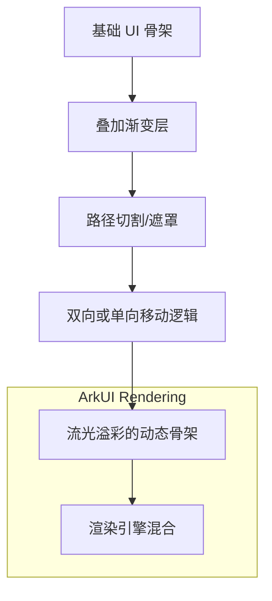

在网络请求未完成前，传统的旋转进度条往往显得单调且带有明显的卡顿感。为了提升应用的中级质感，流光动效（Shimmer Effect）成为了移动端加载体验的主流方案。`shimmer` 库作为该领域的佼佼者，深受全球 Flutter 开发者的喜爱。本文将带你实战如何在 OpenHarmony 平台上引入这道“高级光效”，让你的鸿蒙应用秒变质感大作。

<!-- 封面图占位 -->


## 1. 为什么骨架屏（Shimmer）如此重要？

骨架屏并不是简单的加载指示器，它的核心价值在于：
- **占位感知**：预先勾勒出内容的轮廓，让用户知道“即将出现什么”。
- **平滑过渡**：减少网络返回数据后的视觉闪烁感。
- **高级质感**：模拟真实光束扫过界面的动效，显著提升 UI 的精密感。

## 2. 架构设计：Shimmer 的光学模拟算法

`shimmer` 库通过叠加层技术，在子组件上覆盖了一层移动的渐变遮罩。



## 3. 针对 OpenHarmony 的适配策略

### 3.1 线性渐变的硬件加速
鸿蒙的 GPU 环境对 `LinearGradient` 的硬件加速支持非常友好。在使用 `shimmer` 时，建议将流光方向设定为由左上至右下（45度角），这在鸿蒙屏幕上能够呈现出最均匀的光泽过渡。

### 3.2 性能开销控制
尽管 `shimmer` 很美，但它是基于循环动画持续重绘的。在鸿蒙系统进入低功耗模式或应用处于切后台状态时，建议显式停止或移除 Shimmer 组件，以节省系统资源。

## 4. 业务场景实战：构建一个鸿蒙风的新闻列表加载页

我们将构建一个典型的新闻资讯列表占位图效果。

### 代码实现

```dart
import 'package:flutter/material.dart';
import 'package:shimmer/shimmer.dart';

class OhosArticleShimmer extends StatelessWidget {
  const OhosArticleShimmer({super.key});

  @override
  Widget build(BuildContext context) {
    return Scaffold(
      appBar: AppBar(title: const Text('鸿蒙新闻极速加载')),
      body: Container(
        padding: const EdgeInsets.symmetric(horizontal: 16.0, vertical: 16.0),
        child: Column(
          children: [
            Expanded(
              child: Shimmer.fromColors(
                baseColor: Colors.grey[300]!,
                highlightColor: Colors.grey[100]!,
                child: ListView.builder(
                  itemBuilder: (_, __) => Padding(
                    padding: const EdgeInsets.bottom(15.0),
                    child: Row(
                      crossAxisAlignment: CrossAxisAlignment.start,
                      children: <Widget>[
                        Container(
                          width: 80.0,
                          height: 80.0,
                          color: Colors.white,
                        ),
                        const Padding(
                          padding: EdgeInsets.symmetric(horizontal: 8.0),
                        ),
                        Expanded(
                          child: Column(
                            crossAxisAlignment: CrossAxisAlignment.start,
                            children: <Widget>[
                              Container(
                                width: double.infinity,
                                height: 12.0,
                                color: Colors.white,
                              ),
                              const Padding(
                                padding: EdgeInsets.symmetric(vertical: 4.0),
                              ),
                              Container(
                                width: double.infinity,
                                height: 12.0,
                                color: Colors.white,
                              ),
                              const Padding(
                                padding: EdgeInsets.symmetric(vertical: 4.0),
                              ),
                              Container(
                                width: 100.0,
                                height: 12.0,
                                color: Colors.white,
                              ),
                            ],
                          ),
                        )
                      ],
                    ),
                  ),
                  itemCount: 8,
                ),
              ),
            ),
          ],
        ),
      ),
    );
  }
}
```

## 5. 适配建议与避坑指南

1. **颜色选型**：在鸿蒙的暗黑模式（Dark Mode）下，务必调整 `baseColor` 为深灰色（如 `Colors.grey[800]`），`highlightColor` 为中灰色（如 `Colors.grey[700]`），否则白色流光在黑夜中会显得极其刺眼。
2. **嵌套深度**：不要在 `shimmer` 组件内部放置过于复杂的交互控件。它是为“纯占位视图”设计的。
3. **低配设备照顾**：在某些入门级的鸿蒙穿戴设备或平板上，如果发现流光有明显跳帧，可适当通过 `period` 属性延长动画周期。

## 6. 总结

`shimmer` 库是提升鸿蒙应用视觉精细度的“平价神器”。它通过极其简单的代码封装，为原本枯燥的数据等待过程注入了令人舒适的视觉节奏。在追求极致用户体验的当下，学会使用骨架屏已成为每一位鸿蒙开发者的必修课。

---
> 欢迎关注我的博客 [HappyPhper](https://blog.csdn.net/wangbaolong)，一同打造更精美的鸿蒙 Flutter 应用。
