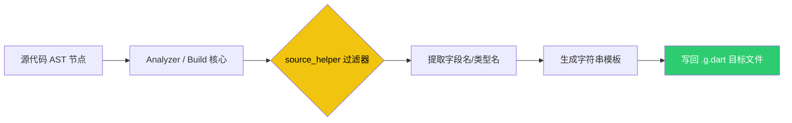

欢迎加入开源鸿蒙跨平台社区：[https://openharmonycrossplatform.csdn.net](https://openharmonycrossplatform.csdn.net)。

# Flutter for OpenHarmony：source_helper — 自动化代码生成的得力助手


在进行 **Flutter for OpenHarmony** 开发时，随着项目复杂度的增加，我们经常需要编写大量的“样板代码”（Boilerplate Code）。比如，为每一个类编写 `toJson` 和 `fromJson`，或者由于类名太长而需要频繁地进行字符串映射。

虽然 `json_serializable` 等库解决了序列化问题，但在编写这些自动化生成库的底层代码（Generator）时，手动解析类的源码结构、提取字段名是一项非常繁琐且易错的工作。`source_helper` 作为一个专门为“代码生成器开发者”打造的辅助库，提供了一系列极其好用的扩展方法。今天，我们就来看看如何利用它来简化我们的自动化生产线。

## 一、为什么需要 source_helper？

### 1.1 让代码解析变得优雅
在编写 `build_runner` 兼容的生成器时，我们需要操作 `analyzer` 包中的 `Element` 对象。直接操作这些复杂的 AST 节点会产生非常多的冗余代码。

### 1.2 核心优势
- **即拿即用的扩展**：为 `FieldElement`、`Type` 等对象提供了诸如 `name`、`isEnum` 等极简访问方式。
- **一致性处理**：自动处理 Dart 类命名中的驼峰转下划线、首字母大小写等常见场景。
- **纯开发辅助**：它不参与运行期的业务逻辑，只为加速生成代码。

### 1.3 代码生成演进模型（Mermaid）



## 二、核心 API 与功能讲解

### 2.1 引入依赖
在您的生成器项目（通常是独立包）的 `pubspec.yaml` 中配置：

```yaml
dependencies:
  # 源码解析助手核心
  source_helper: ^1.3.1
  # 通常配合 analyzer 使用
  analyzer: '>=5.0.0 <7.0.0'
```

### 2.2 基础源码辅助操作
在生成器逻辑中快速获取字段属性。

```dart
import 'package:source_helper/source_helper.dart';
import 'package:analyzer/dart/element/element.dart';

void processFields(List<FieldElement> fields) {
  for (final field in fields) {
    // 💡 自动处理字段名到蛇形命名的转换
    final jsonKey = field.name.snakeCase; 
    
    // 🎨 一键判断是否为布尔类型
    if (field.type.isDartCoreBool) {
      print('处理布尔字段: ${field.name}');
    }

    // 🎨 获取去重后的类名（处理泛型）
    final typeName = field.type.getDisplayString(withNullability: false);
  }
}
```

### 2.3 字符串助手扩展
针对生成的文本模板进行清洗。

```dart
String generateTemplate(String className) {
  // 🎨 确保生成的类名遵循正确的 PascalCase 规范
  return 'class ${className.pascalCase}Generated { ... }';
}
```

## 三、鸿蒙应用实战场景

### 3.1 场景一：定制化的鸿蒙 API 模型生成项
当我们在为鸿蒙特有的 N-API 接口编写 Dart 封装层时。由于接口数量巨大，我们可以编写一个自定义生成器，利用 `source_helper` 快速提取每一个 C 语言映射类的方法签名，自动生成类型安全的 Dart 调用代码，极大减少手工转录的错误率。

### 3.2 场景二：极简的国际化 Key 生成
在鸿蒙应用的多语言适配中。扫描 JSON 翻译文件目录，利用该库对文件路径进行归一化处理，自动生成一套强类型的多语言 ID 静态类。

<!-- IMAGE_PLACEHOLDER: [生成器生成的代码预览截图] -->
<!-- 类型: 截图 -->
<!-- 内容: 展示一段由生成器产生的整洁代码，每个字段都由于采用了 source_helper 而命名准确规范 -->

## 四、OpenHarmony 平台适配建议

### 4.1 命名不规范后的鲁棒性。
- **✅ 建议**：鸿蒙原生某些模块的返回字段可能是非标准的命名（如 `OHOS_ID`）。在编写生成器逻辑时，利用 `source_helper` 的各种 `Case` 转化函数，将这些“异想天开”的字段名强制转换为鸿蒙应用开发中推崇的 `camelCase` 风格，增强代码可读性。

### 4.2 结合 SourceGen 进行深度链式调用
- **📌 提醒**：`source_helper` 最好的搭档是 `source_gen`。两者的结合能让您的鸿蒙库在 `build_runner` 扫描阶段的稳定性提升一个量级。

### 4.3 编译时性能的监控
- **⚠️ 警告**：虽然辅助库很方便，但如果在大规模扫描中过度使用复杂的正则处理，可能会拖慢鸿蒙项目的编译速度。建议只在关键的节点应用转换函数。

## 六、总结

在 **Flutter for OpenHarmony** 走向工程化成熟的道路上，我们需要更聪明的工作方式。`source_helper` 虽然只是一个默默无闻的小众工具，但它却像一把锋利的解剖刀，精准地处理着源码中那些繁琐的细节，让我们的自动化工具开发变得前所未有的顺滑。

核心要点回顾：
1. **源码解析加速**：简化 AST 元素的访问链条。
2. **命名工具箱**：内置丰富的驼峰、蛇形、帕斯卡命名转换，适配各种生成场景。
3. **鸿蒙适配**：助力实现更规范、更具标准美感的生成代码。
4. **开发效率提升**：降低自定义 `build_runner` 插件的开发门槛。

善用工具，让您的鸿蒙开发不仅是逻辑的堆砌，更是工业化生产的艺术！

---

> 📦 **完整代码已上传至 AtomGit**：[open-harmony-examples/source_helper](https://atomgit.com/dragonbady/open-harmony-examples/tree/main/examples/source_helper)
>
> 🌐 **欢迎加入开源鸿蒙跨平台社区**：[开源鸿蒙跨平台开发者社区](https://openharmonycrossplatform.csdn.net)
