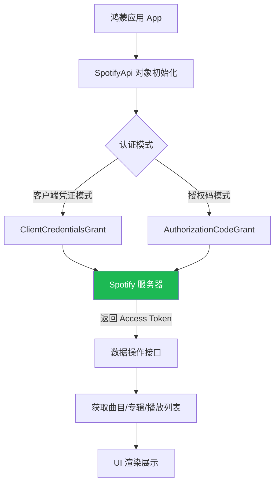

欢迎加入开源鸿蒙跨平台社区：[https://openharmonycrossplatform.csdn.net](https://openharmonycrossplatform.csdn.net)。

# Flutter for OpenHarmony：spotify — 跨平台音乐流媒体 API 集成


## 前言

在鸿蒙（OpenHarmony）生态中，打造高品质音频应用离不开丰富的资源支持。`spotify` 是 Spotify Web API 的纯 Dart SDK，封装了认证与 RESTful 接口，能让鸿蒙开发者以强类型、异步化的方式高效接入海量专辑与曲目数据。

## 一、核心价值

### 1.1 什么是 spotify 库？
它是 Spotify Web API 的 Dart 版 SDK，通过静态类型检查和模型映射，极大地简化了数据的请求与解析。

### 1.2 为什么在鸿蒙开发中使用它？
1. **纯 Dart 实现**：不依赖 Native SDK（如 Android/iOS 原生库），在鸿蒙平台上具有极佳的兼容性。
2. **异步支持**：原生支持 `Future` 和 `Stream`，完美适配 Flutter UI 的响应式逻辑。
3. **全面覆盖**：从搜索、浏览到个性化推荐，涵盖了 Spotify 的核心公开接口。

### 1.3 认证与数据流向模型（Mermaid）



## 二、核心 API 与集成流程

### 2.1 引入依赖
在鸿蒙 Flutter 项目的 `pubspec.yaml` 中添加以下依赖：

```yaml
dependencies:
  # Spotify 官方 API 封装
  spotify: ^0.3.0
```

### 2.2 准备凭证
在开始编码前，您需要前往 [Spotify Developer Dashboard](https://developer.spotify.com/dashboard) 创建一个 App 并获取 `Client ID` 和 `Client Secret`。

### 2.3 初始化客户端（客户端凭证模式）
这是最简单的集成方式，不涉及用户账号授权，仅用于获取公开的音乐信息。

```dart
import 'package:spotify/spotify.dart';

final credentials = SpotifyApiCredentials(
  '您的 CLIENT_ID', 
  '您的 CLIENT_SECRET'
);

final spotify = SpotifyApi(credentials);
```

### 2.4 核心操作示例：搜索音乐
在鸿蒙搜索界面中，通过关键词检索曲目：

```dart
void searchMusic(String query) async {
  // 💡 调用搜索接口
  var searchResult = await spotify.search.get(query, types: [SearchType.track]).first(10);
  
  for (var pages in searchResult) {
    for (var track in pages.items!) {
      print('发现歌曲: ${track.name} - 歌手: ${track.artists?.first.name}');
    }
  }
}
```

<!-- IMAGE_PLACEHOLDER: [SpotifyApi 调试日志输出] -->
<!-- 类型: 截图 -->
<!-- 内容: 展示成功通过 Spotify API 获取到的专辑详情 JSON 解析后的日志 -->

## 三、鸿蒙应用实战场景

### 3.1 场景一：高颜值专辑卡片
利用从 API 获取到的高清封面 URL (`track.album?.images?.first.url`)，在鸿蒙设备（如 MatePad）的大屏幕上展示精美的音乐卡片。

### 3.2 场景二：智能歌单分析器
获取用户当前的播放列表并进行“曲风分析”，呈现炫酷的雷达图表（Radar Chart）。

<!-- IMAGE_PLACEHOLDER: [鸿蒙真机运行音乐列表截图] -->
<!-- 类型: 截图 -->
<!-- 设备: 鸿蒙手机 -->
<!-- 内容: 展现一个布局美观的 Spotify 搜索结果列表，包含封面图和艺术家信息 -->

## 四、OpenHarmony 平台适配建议

### 4.1 网络请求适配
鸿蒙系统对 HTTPS 证书有严格验证。
- **✅ 推荐做法**：`spotify` 库底层使用 Dart 的 `http` 包。在跨平台调用时，请确保鸿蒙工程的 `module.json5` 中已开启网络权限：
```json
{
  "module": {
    "requestPermissions": [
      { "name": "ohos.permission.INTERNET" }
    ]
  }
}
```

### 4.2 离线策略与缓存
鸿蒙设备用户可能会在弱网环境下使用音乐应用。
- **📌 提醒**：Spotify API 的请求通常带有大量的 Metadata。建议配合 `sembast_web`（针对 Web 端）或文件系统缓存（针对 Native 端）存储最近的搜索结果，提升加载速度。

### 4.3 异步 UI 与性能
从 Spotify 远程加载图片可能较慢。
- **🎨 交互建议**：使用 `CachedNetworkImage` 库来处理图片的加载与占位，在鸿蒙设备的高刷新率屏幕上提供丝滑的滚动体验。

## 五、完整示例代码

此示例展示了一个最小化的“艺术家信息查询器”。

```dart
import 'package:flutter/material.dart';
import 'package:spotify/spotify.dart';

void main() {
  runApp(const MaterialApp(home: SpotifyArtLab()));
}

class SpotifyArtLab extends StatefulWidget {
  const SpotifyArtLab({super.key});

  @override
  State<SpotifyArtLab> createState() => _SpotifyArtLabState();
}

class _SpotifyArtLabState extends State<SpotifyArtLab> {
  final _idController = TextEditingController(text: '7dGjo923YvOV6HPhsnvR36'); // 默认一个 ID
  String _artistInfo = '等待查询...';

  Future<void> _fetchArtist() async {
    // ✅ 实战：配置凭证并查询
    final credentials = SpotifyApiCredentials('YOUR_ID', 'YOUR_SECRET');
    final spotify = SpotifyApi(credentials);

    try {
      final artist = await spotify.artists.get(_idController.text);
      setState(() {
        _artistInfo = '''
艺术家: ${artist.name}
流行度: ${artist.popularity}
风格: ${artist.genres?.join(', ')}
粉丝数: ${artist.followers?.total}
        ''';
      });
    } catch (e) {
      setState(() => _artistInfo = '查询出错: $e');
    }
  }

  @override
  Widget build(BuildContext context) {
    return Scaffold(
      appBar: AppBar(title: const Text('鸿蒙 Spotify API 实验室')),
      body: Padding(
        padding: const EdgeInsets.all(16.0),
        child: Column(
          children: [
            TextField(
              controller: _idController,
              decoration: const InputDecoration(labelText: '请输入 Spotify Artist ID'),
            ),
            const SizedBox(height: 10),
            ElevatedButton(onPressed: _fetchArtist, child: const Text('查询详情')),
            const SizedBox(height: 20),
            Text(_artistInfo, style: const TextStyle(fontSize: 16)),
          ],
        ),
      ),
    );
  }
}
```

<!-- IMAGE_PLACEHOLDER: [完整示例运行效果截图] -->
<!-- 类型: 截图 -->
<!-- 设备: 鸿蒙手机 -->
<!-- 内容: 展现查询成功后显示歌手详情的界面 -->

## 六、总结

在鸿蒙平台上实现全球化的音乐内容分发，`spotify` 库是我们的得力助手。它避开了繁杂的 RESTful 手写过程，让我们通过强类型的对象直接与音乐海洋对话。

核心要点回顾：
1. **纯 Dart 兼容**：天然适配 OpenHarmony 各个子平台。
2. **多重认证方案**：根据业务场景选择凭证模式。
3. **鸿蒙适配**：注意开启互联网权限，并结合缓存策略优化体验。

希望您的鸿蒙应用能够通过这个接口，带给用户来自全世界的好声音！

---

> 📦 **完整代码已上传至 AtomGit**：[open-harmony-examples/spotify](https://atomgit.com/dragonbady/open-harmony-examples/tree/main/examples/spotify)
>
> 🌐 **欢迎加入开源鸿蒙跨平台社区**：[开源鸿蒙跨平台开发者社区](https://openharmonycrossplatform.csdn.net)
