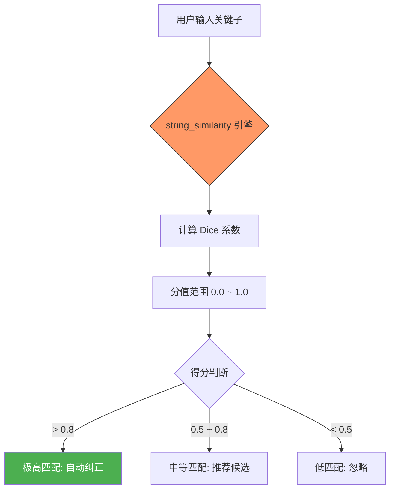

欢迎加入开源鸿蒙跨平台社区：[https://openharmonycrossplatform.csdn.net](https://openharmonycrossplatform.csdn.net)。

# Flutter for OpenHarmony：string_similarity — 智能字符串相似度匹配


## 前言

在鸿蒙（OpenHarmony）应用开发中，搜索纠错、内容去重及相似推荐是提升体验的关键。`string_similarity` 基于 Dice's Coefficient 算法提供轻量级的模糊匹配方案，能通过科学的相似度分值帮助开发者精准处理用户输入。

## 一、核心价值

### 1.1 语义纠错的挑战
传统的 `contains` 或正则匹配只能处理硬匹配，对于用户输入错误（如将 "HarmonyOS" 输成 "HarmanyOS"）往往无能为力。

### 1.2 string_similarity 的优势
- **轻量且纯净**：全 Dart 编写，天然适配鸿蒙系统，无原生依赖。
- **算法科学**：采用 Sorensen-Dice 系数，能够很好地处理局部字符重合度。
- **API 丰富**：不仅能计算两两相似度，还能从一组字符串中寻找最匹配的一项。

### 1.3 逻辑引擎模型（Mermaid）



## 二、核心 API 与功能讲解

### 2.1 引入依赖
在 `pubspec.yaml` 中添加：

```yaml
dependencies:
  # 字符串相似度算法库
  string_similarity: ^2.0.0
```

### 2.2 基础相似度计算
计算两个词之间的契合度得分。

```dart
import 'package:string_similarity/string_similarity.dart';

void checkSimilarity() {
  // 💡 比较鸿蒙与鸿梦的相似度
  double score = 'HarmonyOS'.similarityTo('HarmanyOS');
  print('相似度得分: $score'); // 输出约为 0.77
}
```

### 2.3 寻找最佳匹配（Best Match）
在处理鸿蒙系统的联系人搜索建议时非常管用。

```dart
void findBest() {
  var comparisonList = ['华为手机', '华为平板', '华为手表', '小米手机'];
  var result = StringSimilarity.findBestMatch('华伟手机', comparisonList);
  
  // 🎨 获取最接近的匹配项
  print('最匹配项: ${result.bestMatch.target}'); // 华为手机
  print('匹配得分: ${result.bestMatch.rating}');
}
```

## 三、常用应用场景实战

### 3.1 场景一：搜索建议自动纠错
当用户在鸿蒙应用商城的搜索框中输入错别字时，我们可以通过相似度计算给出一个“您是不是想找：XXX”的提示。

```dart
// 💡 构建搜索智能纠偏逻辑
List<String> getSuggestions(String input, List<String> database) {
  var bestMatch = StringSimilarity.findBestMatch(input, database);
  
  // 如果相似度超过 0.6，则认为是可以推荐的
  return bestMatch.ratings
      .where((rating) => rating.rating! > 0.6)
      .map((rating) => rating.target!)
      .toList();
}
```

### 3.2 场景二：内容去重系统
在处理鸿蒙分布式通知或本地缓存时，如果两条动态内容高度相似（相似度 > 0.95），可以考虑进行折叠处理。

## 四、OpenHarmony 平台适配建议

### 4.1 国际化与多语言
鸿蒙应用支持全球化布局。
- **📌 提醒**：`string_similarity` 在处理英文单词时效果最佳。
- **✅ 建议**：对于中文匹配（如“鸿蒙系统” vs “红梦系统”），算法是基于字符单元的，依然能提供不错的参考值，但建议在计算前先剔除掉标点符号和空白符，以提高准确率。

### 4.2 性能性能建议
- **避免超大规模列表匹配**：如果您有 1 万条数据需要实时对比，在鸿蒙低端设备上可能会导致 UI 微卡。建议预先分片或在后台线程执行。
- **Isolate 并行化**：对于计算密集型的批量匹配任务，利用 Dart 的 `Isolate` 可以让鸿蒙应用保持 120Hz 的丝滑刷新率。

## 五、完整示例代码

此示例演示了一个简单的“鸿蒙词库纠错器”。

```dart
import 'package:flutter/material.dart';
import 'package:string_similarity/string_similarity.dart';

void main() {
  runApp(const MaterialApp(home: SimilarityLab()));
}

class SimilarityLab extends StatefulWidget {
  const SimilarityLab({super.key});

  @override
  State<SimilarityLab> createState() => _SimilarityLabState();
}

class _SimilarityLabState extends State<SimilarityLab> {
  final _inputController = TextEditingController();
  final List<String> _ohosWords = ['HarmonyOS', 'OpenHarmony', 'ArkUI', 'DevEco Studio', '分布式通信'];
  String _bestResult = '等待输入...';

  void _onSearch(String val) {
    if (val.isEmpty) return;
    
    // ✅ 实战：从鸿蒙词库中寻找最契合的词
    final match = StringSimilarity.findBestMatch(val, _ohosWords);
    
    setState(() {
      _bestResult = '''
输入词: $val
最匹配: ${match.bestMatch.target}
契合度: ${(match.bestMatch.rating! * 100).toStringAsFixed(1)}%
      ''';
    });
  }

  @override
  Widget build(BuildContext context) {
    return Scaffold(
      appBar: AppBar(title: const Text('Flutter for OpenHarmony：智能纠偏')),
      body: Padding(
        padding: const EdgeInsets.all(16.0),
        child: Column(
          children: [
            TextField(
              controller: _inputController,
              decoration: const InputDecoration(
                labelText: '输入鸿蒙相关术语',
                hintText: '试试输入: Harmany',
                border: OutlineInputBorder(),
              ),
              onChanged: _onSearch,
            ),
            const SizedBox(height: 20),
            Container(
              padding: const EdgeInsets.all(16),
              color: Colors.blueGrey[50],
              child: Text(_bestResult, style: const TextStyle(fontSize: 18)),
            ),
          ],
        ),
      ),
    );
  }
}
```

## 六、总结

`string_similarity` 为鸿蒙应用注入了“容错”的智慧。在 **Flutter for OpenHarmony** 开发中，它可以极大地提升用户的主观搜索体验，降低因输入错误带来的挫败感。

核心要点回顾：
1. **Dice 算法**：比简单的字符统计更具语义参考价值。
2. **Best Match**：处理集合匹配的高效利器。
3. **鸿蒙适配**：注意在中文语境下的预处理，并利用 Isolate 处理大规模计算。

希望您的鸿蒙应用能够通过这个工具，变得更懂用户的心！

---

> 📦 **完整代码已上传至 AtomGit**：[open-harmony-examples/string_similarity](https://atomgit.com/dragonbady/open-harmony-examples/tree/main/examples/string_similarity)
>
> 🌐 **欢迎加入开源鸿蒙跨平台社区**：[开源鸿蒙跨平台开发者社区](https://openharmonycrossplatform.csdn.net)
