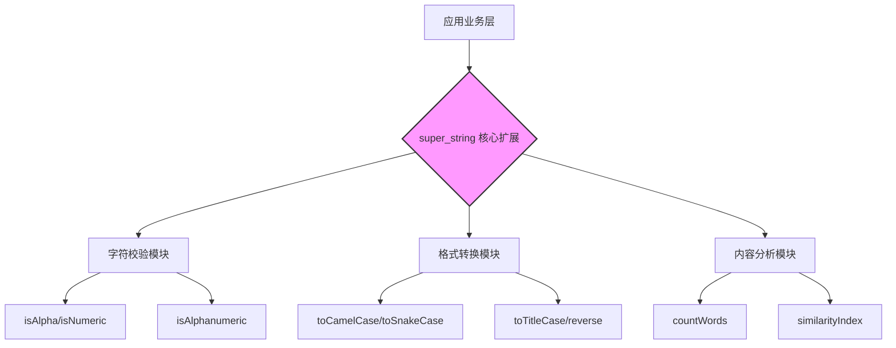

欢迎加入开源鸿蒙跨平台社区：[https://openharmonycrossplatform.csdn.net](https://openharmonycrossplatform.csdn.net)。

# Flutter for OpenHarmony：super_string — 打造强力字符串处理引擎


## 前言

在鸿蒙（OpenHarmony）业务开发中，原生字符串操作往往难以应对复杂的变换与校验需求。`super_string` 通过扩展方法引入了丰富的判空、格式转换及内容分析工具，能显著提升文本处理效率。

## 一、核心价值

### 1.1 原生 Dart 的局限性
Dart 的 `String` 类虽然支持 `substring`、`contains`、`replace` 等基础操作，但在处理以下场景时代码会变得冗长：
- 判空并剔除空白字符。
- 复杂的缩略词处理。
- 各种命名风格（驼峰、蛇形、帕斯卡等）的相互转换。
- 字符串的反转与统计。

### 1.2 super_string 的核心优势
`super_string` 通过扩展（Extensions）的方式，直接为 Dart 的 `String` 类型注入了大量实用的工具方法。它的特点是：
- **无侵入性**：不需要修改原始字符串类，通过 `import` 即可激活。
- **语义化强**：方法名直观，如 `.isAlpha`、`.toCamelCase` 等，代码可读性极佳。
- **轻量级**：库体积非常小，对应用性能几乎无影响。

### 1.3 架构原理示意图（Mermaid）



## 二、核心 API 与组件详解

在 OpenHarmony 项目中集成 `super_string` 非常简单，只需在 `pubspec.yaml` 中添加依赖即可。

### 2.1 依赖配置
```yaml
dependencies:
  flutter:
    sdk: flutter
  # 字符串处理增强库
  super_string: ^2.1.0 
```

### 2.2 字符校验（Validation）
在处理鸿蒙系统的用户注册、联系人搜索等界面时，输入校验是重中之重。

```dart
import 'package:super_string/super_string.dart';

void validateInput(String input) {
  // 📌 检查是否全是字母
  print('是否全是字母: ${input.isAlpha}'); 
  
  // 📌 检查是否全是数字
  print('是否全是数字: ${input.isNumeric}');
  
  // 📌 检查是否是字母数字组合
  print('是否字母数字组合: ${input.isAlphanumeric}');
  
  // 📌 检查是否全部大写或小写
  print('是否全大写: ${input.isUpperCase}');
  print('是否全小写: ${input.isLowerCase}');
}
```

### 2.3 格式转换（Transformation）
鸿蒙跨平台应用往往需要适配多端（手机、平板、智慧屏），在 UI 展示上，字符串的格式化非常重要。

```dart
void transformStrings() {
  String rawText = 'open_harmony_flutter_development';
  
  // 🎨 转换为驼峰命名
  print(rawText.toCamelCase()); // openHarmonyFlutterDevelopment
  
  // 🎨 转换为帕斯卡命名
  print(rawText.toPascalCase()); // OpenHarmonyFlutterDevelopment
  
  // 🎨 转换为首字母大写标题风格
  print('welcome to ohos'.toTitleCase()); // Welcome To Ohos
  
  // 🎨 字符串反转
  print('Hello OHOS'.reverse()); // SOHO olleH
}
```

<!-- IMAGE_PLACEHOLDER: [运行效果截图] -->
<!-- 类型: 截图 -->
<!-- 设备: 鸿蒙设备 -->
<!-- 内容: 展示格式转换后的字符串在文本组件中的效果 -->

## 三、常见应用场景实战

### 3.1 场景一：搜索框智能提示
在鸿蒙应用的搜索功能中，我们需要实时过滤用户输入的非法字符，并进行关键词匹配。

```dart
// 💡 使用 super_string 简化搜索关键词处理
String processSearchQuery(String query) {
  if (query.isEmpty) return '';
  
  // 剔除两端空白并统计有效词数
  print('关键词词数: ${query.wordCount}');
  
  // 如果关键词太长，进行自动缩略
  return query.length > 10 ? query.substring(0, 10) + '...' : query;
}
```

### 3.2 场景二：复杂数据解析与展示
当从后端（如通过 `dio` 库）获取到一些非标准命名的 JSON 字段时，可以使用 `super_string` 动态转换显示名。

```dart
// 💡 动态将蛇形命名的字段转换为友好的标题展示
String formatFieldName(String field) {
  return field.replaceAll('_', ' ').toTitleCase();
}

// 示例：user_login_time -> User Login Time
```

<!-- IMAGE_PLACEHOLDER: [实战场景效果] -->
<!-- 类型: 截图 -->
<!-- 设备: 鸿蒙设备 -->
<!-- 内容: 搜索提示列表和格式化后的表单项 -->

## 四、OpenHarmony 平台适配建议

### 4.1 国际化与本地化支持
OpenHarmony 系统高度重视国际化能力。虽然 `super_string` 主要针对英文字符串集，但在处理中文语境下的拼音输入、多语言标签库时，仍有巨大的辅助作用。

⚠️ **注意**：在使用 `isAlpha` 或 `isAlphanumeric` 时，如果是中文字符，这些方法通常会返回 `false`。在进行纯中文字串校验时，建议结合正则表达式。

### 4.2 性能性能建议
鸿蒙设备类型多样，从嵌入式穿戴设备到高性能平板。`super_string` 的操作大部分是基于基础算法的字符串扫描。
- **避免高频循环调用**：虽然开销小，但在 `ListView.builder` 的每一行中进行复杂的 `toCamelCase` 转换仍是不明智的，建议在数据模型化阶段就处理完毕。
- **大文本处理**：如果字符串长度超过 1MB，建议在 `Isolate` 中执行转换操作，避免阻塞鸿蒙系统的主 UI 线程。

### 4.3 渲染适配
在鸿蒙的折叠屏设备上，UI 布局可能会动态变化。利用 `super_string` 的切片和修剪功能，结合 `LayoutBuilder` 可以更好地控制文本截断。

## 五、完整示例代码

以下代码演示了如何在鸿蒙 Flutter 应用中使用 `super_string` 建立一个简单的“字符串魔术师”实验室。

```dart
import 'package:flutter/material.dart';
import 'package:super_string/super_string.dart';

void main() {
  runApp(const MaterialApp(home: SuperStringLab()));
}

class SuperStringLab extends StatefulWidget {
  const SuperStringLab({super.key});

  @override
  State<SuperStringLab> createState() => _SuperStringLabState();
}

class _SuperStringLabState extends State<SuperStringLab> {
  final TextEditingController _controller = TextEditingController();
  String _result = '等待输入...';

  void _processInput(String val) {
    setState(() {
      // ✅ 实战：综合运用多种增强方法
      if (val.isEmpty) {
        _result = '请输入内容';
        return;
      }
      
      _result = '''
原始长度: ${val.length}
词数统计: ${val.wordCount}
全字母: ${val.isAlpha ? '是' : '否'}
全数字: ${val.isNumeric ? '是' : '否'}
反转效果: ${val.reverse()}
驼峰转换: ${val.toCamelCase()}
标题转化: ${val.toTitleCase()}
      ''';
    });
  }

  @override
  Widget build(BuildContext context) {
    return Scaffold(
      appBar: AppBar(
        title: const Text('Flutter for OpenHarmony：字符串实验室'),
        backgroundColor: Colors.blueAccent,
      ),
      body: Padding(
        padding: const EdgeInsets.all(16.0),
        child: Column(
          children: [
            TextField(
              controller: _controller,
              decoration: const InputDecoration(
                labelText: '输入任意字符串',
                border: OutlineInputBorder(),
                hintText: '例如：hello_world 或 12345',
              ),
              onChanged: _processInput,
            ),
            const SizedBox(height: 20),
            Container(
              width: double.infinity,
              padding: const EdgeInsets.all(16),
              decoration: BoxDecoration(
                color: Colors.grey[200],
                borderRadius: BorderRadius.circular(8),
              ),
              child: Text(
                _result,
                style: const TextStyle(fontSize: 16, height: 1.5),
              ),
            ),
          ],
        ),
      ),
    );
  }
}
```

<!-- IMAGE_PLACEHOLDER: [完整示例运行截图] -->
<!-- 类型: 截图 -->
<!-- 设备: 鸿蒙设备 -->
<!-- 内容: 字符串实验室应用主界面 -->

## 六、总结

`super_string` 虽小，却能显著减少模板代码，让业务逻辑更聚焦。在 **Flutter for OpenHarmony** 开发中，我们可以放心地使用这个库，因为它不涉及底层 Native 模块，具有天然的跨平台兼容性。

通过本文的学习，您应该掌握了：
1. `super_string` 的安装与基础校验方法。
2. 各种命名风格的快速转换。
3. 在鸿蒙搜索、表单解析等实战场景中的应用。
4. 针对鸿蒙多端的适配建议。

希望这个小工具能为您的鸿蒙跨平台之旅锦上添花！

---

> 📦 **完整代码已上传至 AtomGit**：[open-harmony-examples/super_string](https://atomgit.com/dragonbady/open-harmony-examples/tree/main/examples/super_string)
>
> 🌐 **欢迎加入开源鸿蒙跨平台社区**：[开源鸿蒙跨平台开发者社区](https://openharmonycrossplatform.csdn.net)
