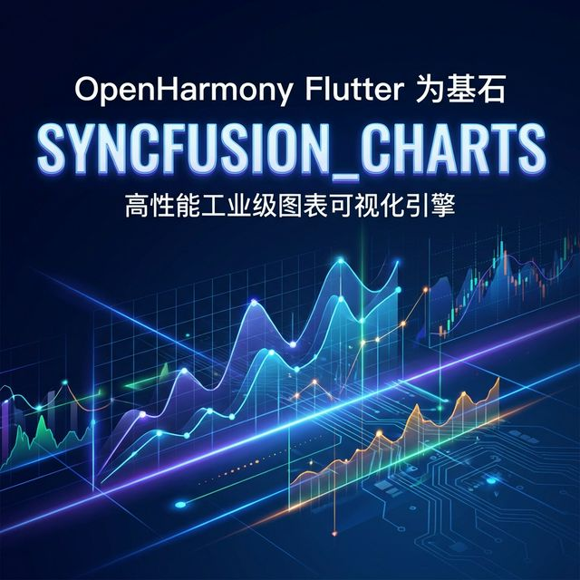
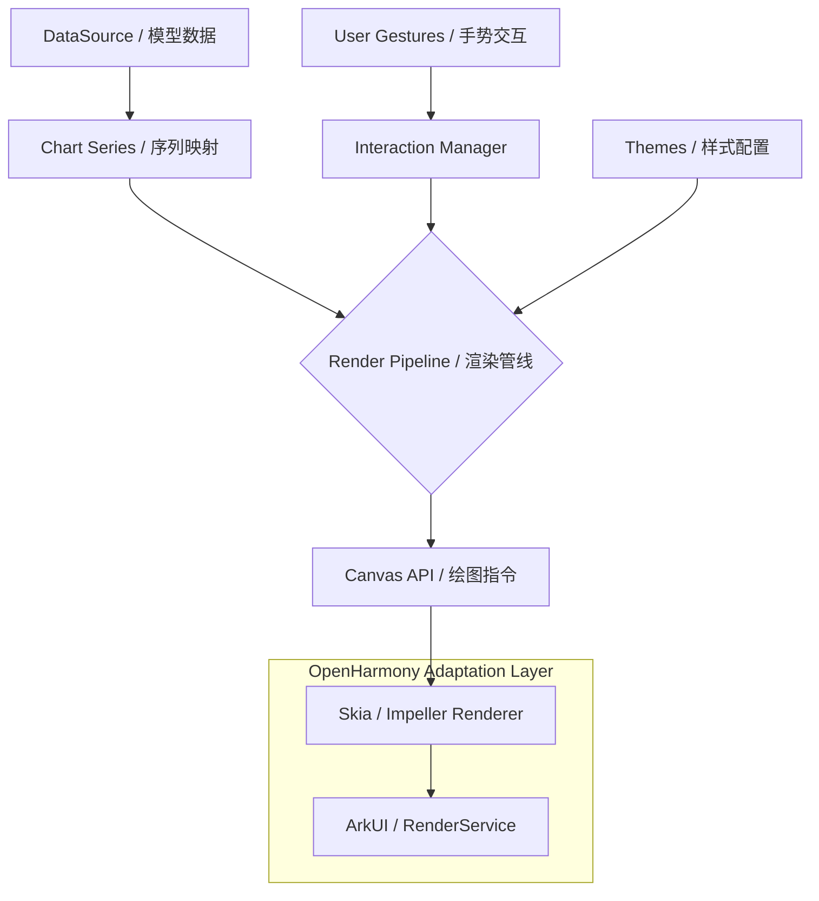

随着移动应用对数据展示要求的不断提高，高性能、交互顺滑的图表库成为了开发者的刚需。Syncfusion 提供的 `syncfusion_flutter_charts` 是目前 Flutter 生态中最强大的图表库之一，它不仅支持超过 30 种图表类型，还专门针对大数据量渲染进行了深度优化。在本文中，我们将探讨如何将这一工业级图表库引入 OpenHarmony 环境，为鸿蒙应用注入强大的数据分析能力。

<!-- 封面图占位 -->


## 1. 为什么选择 Syncfusion Flutter Charts？

`syncfusion_flutter_charts` 的核心优势在于**性能**与**灵活性**：
- **极致渲染**：支持渲染数万个数据点，且保持 60FPS 的丝滑缩放和平移体验。
- **全场景支持**：折线图、柱状图、饼图、散点图、雷达图、极坐标图等一应俱全。
- **高度可定制**：所有的轴、标签、图例、提示框（Tooltip）均可自定义。
- **跨平台一致性**：在 Android、iOS 及现在的 OpenHarmony 上拥有完全一致的呈现效果。

## 2. 架构设计：Syncfusion Charts 的渲染工作流

Syncfusion 采用了自研的渲染管线，能够高效处理地理数据和数值数据。以下是其内部核心架构组件：



## 3. 适配 OpenHarmony 的关键点

### 3.1 渲染引擎对齐
Syncfusion Charts 重度依赖 Flutter 的 Canvas API。在 OpenHarmony 平台上，请确保 Flutter Embedding 层的 Skia 或 Impeller 引擎配置正确，以获得最佳的硬件加速效果。

### 3.2 字体加载
Syncfusion 默认可能使用系统字体。在鸿蒙设备上，如果某些特殊字符显示不全，建议通过 `SyncfusionCharts` 的全局主题显式指定鸿蒙原生字体 `HarmonyOS Sans`。

## 4. 业务场景实战：构建一个动态股价走势图

下面通过一个典型的金融场景示例，展示如何在鸿蒙应用中使用折线图展示动态数据。

### 代码实现

```dart
import 'package:flutter/material.dart';
import 'package:syncfusion_flutter_charts/charts.dart';

class OhosStockChart extends StatefulWidget {
  const OhosStockChart({super.key});

  @override
  State<OhosStockChart> createState() => _OhosStockChartState();
}

class _OhosStockChartState extends State<OhosStockChart> {
  late List<_ChartData> data;
  late TooltipBehavior _tooltip;

  @override
  void initState() {
    // 模拟鸿蒙系统本地采集的金融数据
    data = [
      _ChartData('09:30', 3200),
      _ChartData('10:30', 3250),
      _ChartData('11:30', 3220),
      _ChartData('13:30', 3280),
      _ChartData('14:30', 3310),
      _ChartData('15:00', 3305),
    ];
    _tooltip = TooltipBehavior(enable: true, header: '股价详情');
    super.initState();
  }

  @override
  Widget build(BuildContext context) {
    return Scaffold(
      appBar: AppBar(title: const Text('鸿蒙金融行情监控')),
      body: Center(
        child: Container(
          height: 350,
          padding: const EdgeInsets.all(16),
          child: SfCartesianChart(
            primaryXAxis: const CategoryAxis(
              title: AxisTitle(text: '交易时间'),
            ),
            primaryYAxis: const NumericAxis(
              labelFormat: '{value}￥',
              title: AxisTitle(text: '价格'),
            ),
            title: const ChartTitle(text: '上证指数实时分时图'),
            legend: const Legend(isVisible: true),
            tooltipBehavior: _tooltip,
            series: <CartesianSeries<_ChartData, String>>[
              LineSeries<_ChartData, String>(
                dataSource: data,
                xValueMapper: (_ChartData sales, _) => sales.time,
                yValueMapper: (_ChartData sales, _) => sales.price,
                name: '基准组合',
                // 设置鸿蒙风格的渐变蓝
                color: Colors.blueAccent,
                markerSettings: const MarkerSettings(isVisible: true),
                dataLabelSettings: const DataLabelSettings(isVisible: true),
              )
            ],
          ),
        ),
      ),
    );
  }
}

class _ChartData {
  _ChartData(this.time, this.price);
  final String time;
  final double price;
}
```

## 5. 适配建议与避坑指南

1. **内存优化**：在处理实时动态数据流（如同花顺那种秒级刷新）时，务必使用 `updateDataSource` 接口，而不是简单的 `setState` 重建整个 Chart 对象。
2. **交互响应**：鸿蒙系统的手势拦截器有时会影响图表的缩放体验。如果发现缩放不够灵敏，请在 `SfCartesianChart` 外层包裹一个 `GestureDetector` 的透传层。
3. **多端适配**：利用 `syncfusion_flutter_charts` 在鸿蒙折叠屏上的表现非常好，它能够根据容器大小平滑地重新布局图例和标签。

## 6. 总结

`syncfusion_flutter_charts` 为 OpenHarmony 开发者提供了一套开箱即用的专业级数据展示方案。无论是金融理财、运动健康还是物联监控场景，它都能以极高的渲染效率和完美的交互体验，助力鸿蒙应用在数据维度更上一层楼。

---
> 欢迎关注我的博客 [HappyPhper](https://blog.csdn.net/wangbaolong)，持续分享 Flutter 适配鸿蒙的深度技术实践。
