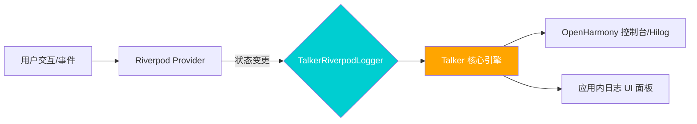

欢迎加入开源鸿蒙跨平台社区：[https://openharmonycrossplatform.csdn.net](https://openharmonycrossplatform.csdn.net)。

# Flutter for OpenHarmony：talker_riverpod_logger — 透明的状态监控体系


## 前言

随着鸿蒙（OpenHarmony）应用状态依赖的增加，追踪状态变化会变得愈发困难。`talker_riverpod_logger` 结合 `talker` 日志框架，能实时监控并结构化输出 Riverpod 的所有变更，极大简化了复杂业务逻辑下的调试流程。

## 一、核心价值

### 1.1 状态管理的“黑盒”问题
在复杂的业务逻辑中，一个 `Provider` 的改变可能引发数个衍生 `Provider` 的级联反应。手动在每个 `Provider` 里写 `print` 既不雅观又难以维护。

### 1.2 talker_riverpod_logger 的核心优势
- **全量监听**：自动监听所有或指定的 Provider 变更。
- **美化输出**：利用颜色和结构化的控制台输出，一眼定位问题。
- **深度整合**：与 `Talker` 框架无缝对接，支持日志持久化和自定义过滤。

### 1.3 监控链路模型（Mermaid）



## 二、核心 API 与集成详解

### 2.1 引入依赖
在鸿蒙 Flutter 项目的 `pubspec.yaml` 中添加以下全家桶：

```yaml
dependencies:
  # 状态管理
  flutter_riverpod: ^2.4.9
  # 日志核心
  talker: ^4.1.0
  # Riverpod 专用日志适配器
  talker_riverpod_logger: ^4.1.0
```

### 2.2 基础初始化
将日志记录器作为监听器传入 `ProviderScope`。

```dart
import 'package:flutter_riverpod/flutter_riverpod.dart';
import 'package:talker_riverpod_logger/talker_riverpod_logger.dart';
import 'package:talker/talker.dart';

void main() {
  // 1. 初始化 Talker 引擎
  final talker = Talker();

  runApp(
    ProviderScope(
      observers: [
        // 2. 注册 Riverpod 日志监听器
        TalkerRiverpodObserver(
          talker: talker,
          settings: const TalkerRiverpodLoggerSettings(
            printProviderAdded: true,    // 打印 Provider 添加日志
            printProviderUpdated: true,  // 打印 Provider 更新日志
            printProviderDisposed: true, // 打印 Provider 销毁日志
          ),
        ),
      ],
      child: const MyApp(),
    ),
  );
}
```

### 2.3 自定义日志过滤
有时候我们不希望基础的 Provider（如简单的常量）干扰日志，可以进行过滤。

```dart
// 💡 只监听特定的状态变更，例如只关注名为 'UserAuth' 的 Provider
final observer = TalkerRiverpodObserver(
  talker: talker,
  settings: TalkerRiverpodLoggerSettings(
    enabled: true,
    filter: (provider) => provider.name == 'UserAuthProvider',
  ),
);
```

<!-- IMAGE_PLACEHOLDER: [Talker 控制台美化输出效果] -->
<!-- 类型: 截图 -->
<!-- 内容: 展示分颜色的 Provider 更新日志，包含 Old Value 和 New Value -->

## 三、常见应用场景实战

### 3.1 场景一：定位非法状态跳变
当一个布尔值状态意外地从 `false` 变为 `true` 时，日志会清晰地显示变更的时间点和数值，帮助开发者快速回溯业务逻辑。

### 3.2 场景二：优化 Provider 销毁逻辑
在鸿蒙应用的页面切换中，通过 `printProviderDisposed: true`，我们可以观察 `autoDispose` 的 Provider 是否如期释放内存，避免内存泄漏。

<!-- IMAGE_PLACEHOLDER: [鸿蒙手机运行状态实时监控截图] -->
<!-- 类型: 截图 -->
<!-- 设备: 鸿蒙手机 -->
<!-- 内容: 展现一个购物车应用，点击增加按钮时控制台实时滚动的状态日志 -->

## 四、OpenHarmony 平台适配建议

### 4.1 适配鸿蒙原生日志系统（HiLog）
鸿蒙系统有一套完整的原生日志规范 `HiLog`。Flutter 的 `print` 输出虽然能看到，但在生产环境中建议对接。
- **✅ 推荐做法**：为 `Talker` 添加一个自定义的 `TalkerObserver`，在监听到日志时，通过插件调用鸿蒙原生的 `HiLog` API，这样可以在系统的日志分析工具中过滤出我们的状态变更。

### 4.2 控制台颜色兼容
鸿蒙 DevEco Studio 的控制台对 ANSI 颜色转义字符的支持程度可能因版本而异。
- **📌 提醒**：如果发现日志出现乱码字符，请在 `Talker` 初始化时关闭颜色输出：
  `TalkerSettings(useConsoleLogs: true, useColors: false)`。

### 4.3 内存与性能
日志记录本身会消耗少许 CPU 周期。
- **⚠️ 警告**：在鸿蒙低端设备或正式发布版本中，务必通过 `kReleaseMode` 环境变量关闭日志功能：
```dart
observers: kReleaseMode ? [] : [TalkerRiverpodObserver(talker: talker)],
```

## 五、完整示例代码

此示例演示了一个简单的计数器加异常监控。

```dart
import 'package:flutter/material.dart';
import 'package:flutter_riverpod/flutter_riverpod.dart';
import 'package:talker/talker.dart';
import 'package:talker_riverpod_logger/talker_riverpod_logger.dart';

// 1. 定义一个状态
final counterProvider = StateProvider<int>((ref) => 0);

void main() {
  final talker = Talker();
  runApp(
    ProviderScope(
      observers: [TalkerRiverpodObserver(talker: talker)],
      child: const MaterialApp(home: CounterLogApp()),
    ),
  );
}

class CounterLogApp extends ConsumerWidget {
  const CounterLogApp({super.key});

  @override
  Widget build(BuildContext context, WidgetRef ref) {
    final count = ref.watch(counterProvider);

    return Scaffold(
      appBar: AppBar(title: const Text('Riverpod 鸿蒙日志实验室')),
      body: Center(
        child: Column(
          mainAxisAlignment: MainAxisAlignment.center,
          children: [
            const Text('当前计数（查看控制台日志）：', style: TextStyle(fontSize: 18)),
            Text('$count', style: const TextStyle(fontSize: 48, fontWeight: FontWeight.bold)),
          ],
        ),
      ),
      floatingActionButton: FloatingActionButton(
        onPressed: () => ref.read(counterProvider.notifier).state++,
        child: const Icon(Icons.add),
      ),
    );
  }
}
```

<!-- IMAGE_PLACEHOLDER: [完整示例运行效果截图] -->
<!-- 类型: 截图 -->
<!-- 设备: 鸿蒙模拟器 -->
<!-- 内容: 展现计数器界面和对应的控制台日志输出 -->

## 六、总结

`talker_riverpod_logger` 是提升鸿蒙跨平台应用可维护性的“扫描仪”。它不仅让状态库不再是黑盒，更通过其强大的美化展示能力，提升了开发者的编码幸福感。

核心要点回顾：
1. **自动监控**：无需手动打桩，自动收集 Provider 生命周期。
2. **结构化展现**：区分 Add, Update, Dispose 三大状态。
3. **鸿蒙适配**：注意 ANSI 颜色兼容性，并优先对接 HiLog。
4. **性能管控**：发布版中务必移除或禁用日志 Observer。

希望您的 Riverpod 状态流在鸿蒙平台上如丝般顺滑，且一切尽在掌握！

---

> 📦 **完整代码已上传至 AtomGit**：[open-harmony-examples/talker_riverpod_logger](https://atomgit.com/dragonbady/open-harmony-examples/tree/main/examples/talker_riverpod_logger)
>
> 🌐 **欢迎加入开源鸿蒙跨平台社区**：[开源鸿蒙跨平台开发者社区](https://openharmonycrossplatform.csdn.net)
