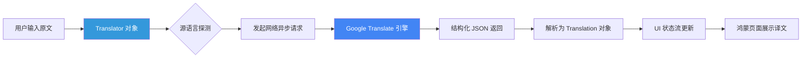

欢迎加入开源鸿蒙跨平台社区：[https://openharmonycrossplatform.csdn.net](https://openharmonycrossplatform.csdn.net)。

# Flutter for OpenHarmony：translator — 多语言实时翻译实战


## 前言

在全球化场景下，实时翻译是提升应用国际化质感的关键。`translator` 库基于谷歌翻译端点，以纯 Dart 实现，提供了一套无需复杂配置即可上手的在线翻译方案，能帮助鸿蒙（OpenHarmony）开发者优雅地打通全球语言链路。

## 一、核心价值

### 1.1 极简集成体验
许多翻译服务需要繁琐的注册、实名以及复杂的 SDK 导入。`translator` 库以纯 Dart 实现，只需几行代码即可实现在线翻译，非常适合鸿蒙跨平台应用的早期原型开发和轻量级需求。

### 1.2 核心优势
- **全语种支持**：覆盖了从中、英、日、韩到各种稀有语种。
- **异步处理**：原生支持 Future 模式，完美契合 Flutter 的响应式 UI 刷新逻辑。
- **自动检测**：支持源语言自动识别，让用户输入无需手动切换语种。

### 1.3 翻译数据流向表（Mermaid）



## 二、核心 API 与功能讲解

### 2.1 引入依赖
在 `pubspec.yaml` 中配置：

```yaml
dependencies:
  # 极简在线翻译库
  translator: ^0.1.7
```

### 2.2 基础翻译调用
将一段中文翻译为鸿蒙系统常用的其他国际语言。

```dart
import 'package:translator/translator.dart';

void runTranslation() async {
  final translator = GoogleTranslator();

  // 💡 简单翻译: 自动探测 -> 英文
  var translation = await translator.translate("你好，开源鸿蒙！", to: 'en');
  
  print('原文: ${translation.source}');
  print('译文: ${translation.text}');
  print('源语言代码: ${translation.sourceLanguage}');
}
```

### 2.3 批量与特定语种转换
从英文翻译为繁体中文，满足不同鸿蒙用户的习惯。

```dart
void translateToTraditional() async {
  final translator = GoogleTranslator();
  
  // 🎨 指定精确的源语言（from）和目标语言（to）
  var result = await translator.translate(
    "OpenHarmony is a next-generation OS.", 
    from: 'en', 
    to: 'zh-tw'
  );
  
  print('繁体输出: $result');
}
```

## 三、鸿蒙应用实战场景

### 3.1 场景一：分布式社交实时聊天
在鸿蒙手机的聊天应用中，当收到其他语种的消息时，用户长按消息内容，应用通过 `translator` 库即时在气泡下方展示译文，实现跨语言分布式沟通。

### 3.2 场景二：扫描识别后的内容翻译
在鸿蒙平板上，通过 OCR 识别提取出图片中的文字，随后直接调用 `translator` 展示翻译结果，构建一个强大的“教育/旅行”助手。

<!-- IMAGE_PLACEHOLDER: [鸿蒙翻译助手应用界面截图] -->
<!-- 类型: 截图 -->
<!-- 设备: 鸿蒙手机 -->
<!-- 内容: 展示左右分栏的翻译界面，上方输入中文，下方实时滚动显示出对应的优美英文翻译 -->

## 四、OpenHarmony 平台适配建议

### 4.1 网络权限与地区适配
- **✅ 建议**：确保在 `module.json5` 中申请了 `ohos.permission.INTERNET`。由于该库依赖于特定网络端点，如果您的鸿蒙应用主要在中国大陆分发，请确保网络环境能够触达公共的翻译代理服务。

### 4.2 流量与并发限制
- **📌 提醒**：`translator` 库底层使用的是公共端点。在高频率、大规模的商业化鸿蒙应用中，可能会触发请求限流。
- **🎨 最佳实践**：建议增加简单的重试机制（Retry），或者在正式环境后期切换到鸿蒙华为云（Huawei Cloud）的专业翻译引擎，并利用 `translator` 库的 API 设计进行平滑替换。

### 4.3 文本超长处理
- **⚠️ 警告**：不要一次性发送超过 5000 字符的段落进行翻译，这不仅会导致网络超时，也可能导致 UI 渲染卡顿。建议对鸿蒙应用内的长篇文章进行按段落切分后，再分批异步执行翻译。

## 五、完整示例代码

此示例演示了一个带加载状态的“鸿蒙语言魔方”。

```dart
import 'package:flutter/material.dart';
import 'package:translator/translator.dart';

void main() => runApp(const MaterialApp(home: TranslatorLab()));

class TranslatorLab extends StatefulWidget {
  const TranslatorLab({super.key});

  @override
  State<TranslatorLab> createState() => _TranslatorLabState();
}

class _TranslatorLabState extends State<TranslatorLab> {
  final _translator = GoogleTranslator();
  final _inputController = TextEditingController();
  String _translatedText = '译文将显示在这里...';
  bool _isTranslating = false;

  void _translate() async {
    if (_inputController.text.isEmpty) return;

    setState(() => _isTranslating = true);

    // ✅ 实战：执行核心翻译逻辑
    try {
      final res = await _translator.translate(_inputController.text, to: 'en');
      setState(() => _translatedText = res.text);
    } catch (e) {
      setState(() => _translatedText = '翻译出错，请检查网络：$e');
    } finally {
      setState(() => _isTranslating = false);
    }
  }

  @override
  Widget build(BuildContext context) {
    return Scaffold(
      appBar: AppBar(title: const Text('translator 鸿蒙翻译实验室')),
      body: Padding(
        padding: const EdgeInsets.all(16.0),
        child: Column(
          children: [
            TextField(
              controller: _inputController,
              decoration: const InputDecoration(
                hintText: '输入中文内容...',
                border: OutlineInputBorder(),
              ),
              maxLines: 3,
            ),
            const SizedBox(height: 20),
            ElevatedButton(
              onPressed: _isTranslating ? null : _translate, 
              child: Text(_isTranslating ? '正在沟通星辰大海...' : '翻译为英文'),
            ),
            const SizedBox(height: 30),
            Container(
              padding: const EdgeInsets.all(16),
              width: double.infinity,
              color: Colors.grey[100],
              child: Text(_translatedText, style: const TextStyle(fontSize: 18, color: Colors.blueAccent)),
            ),
          ],
        ),
      ),
    );
  }
}
```

## 六、总结

在鸿蒙平台的多元化场景中，`translator` 库作为一个轻量级的“开路先锋”，极大地降低了开发者引入多语言能力的成本。它证明了在 **Flutter for OpenHarmony** 体系下，即使是一个小巧的 Dart 库，也能为用户带来极大的跨国界便利。

核心要点回顾：
1. **零配置启动**：无需复杂的密钥申请，开箱即用。
2. **全语种探测**：自动识别用户输入的语言种类。
3. **异步联动**：与 Flutter UI 丝滑对接，不阻塞鸿蒙主线程。
4. **鸿蒙适配**：注意网络连通性，并合理控制请求频率。

让您的鸿蒙应用，从此掌握通往全球的语言通行证！

---

> 📦 **完整代码已上传至 AtomGit**：[open-harmony-examples/translator](https://atomgit.com/dragonbady/open-harmony-examples/tree/main/examples/translator)
>
> 🌐 **欢迎加入开源鸿蒙跨平台社区**：[开源鸿蒙跨平台开发者社区](https://openharmonycrossplatform.csdn.net)
