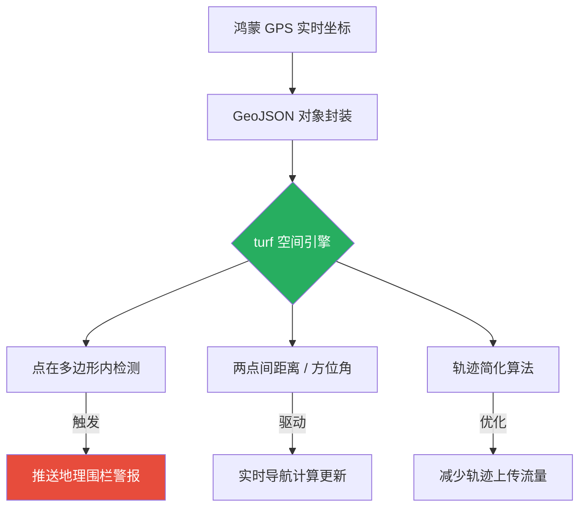

欢迎加入开源鸿蒙跨平台社区：[https://openharmonycrossplatform.csdn.net](https://openharmonycrossplatform.csdn.net)。

# Flutter for OpenHarmony：turf — 开启高级地理空间分析能力


## 前言

随着鸿蒙（OpenHarmony）系统在出行与物流领域的推进，本地化地理空间数据处理变得至关重要。`turf` 库提供了一套完整的地理空间算子，支持在终端侧完成点在面内判断、大圆路径计算及轨迹简化等功能，无需依赖后端数据库。

## 一、核心价值

### 1.1 让地理计算脱离后端依赖
许多复杂的空间运算以往需要依赖后端数据库（如 PostGIS）。通过 `turf`，这些计算可以在鸿蒙终端本地完成，极大提升了应用的响应速度和离线工作能力。

### 1.2 核心优势
- **GeoJSON 标准化**：无缝对接高德、百度或谷歌地图的原始经纬度数据。
- **功能全覆盖**：支持计算距离、面积、中心点、包络矩形、采样简化及复杂的布尔运算。
- **纯 Dart 实现**：不依赖特定操作系统的 NDK 库，确保在鸿蒙各个硬件平台上结果的一致性。

### 1.3 空间运算模型（Mermaid）



## 二、核心 API 与功能讲解

### 2.1 引入依赖
在 `pubspec.yaml` 中配置：

```yaml
dependencies:
  # 地理空间运算核心库
  turf: ^0.1.0 
```

### 2.2 基础距离计算
在鸿蒙应用中计算两个位置间的地理距离。

```dart
import 'package:turf/turf.dart';

void calculateDistance() {
  // 💡 定义两个点（经度, 纬度）
  final from = Point(coordinates: Position(114.05, 22.54)); // 深圳福田
  final to = Point(coordinates: Position(114.12, 22.56));   // 深圳罗湖
  
  // 🎨 计算距离，支持多种单位（公里, 米, 英里等）
  final dist = distance(from, to, Unit.kilometers);
  print('两地直线跨度约为: ${dist.toStringAsFixed(2)} 公里');
}
```

### 2.3 地理围栏判断（点在面内）
检测资产是否处于设定的鸿蒙电子围栏范围内。

```dart
void checkInFence() {
  // 🎨 定义一个多边形围栏区域
  final poly = Polygon(coordinates: [
    [
      Position(100, 0), Position(101, 0), 
      Position(101, 1), Position(100, 1), 
      Position(100, 0)
    ]
  ]);
  
  final pt = Point(coordinates: Position(100.5, 0.5));
  
  // ✅ 实战：执行布尔判断
  final isInside = booleanPointInPolygon(pt, poly);
  print('是否在围栏内: $isInside');
}
```

## 三、鸿蒙应用实战场景

### 3.1 场景一：智能办公打卡助手
通过捕获鸿蒙手机的定位，配合 `turf` 的 `booleanPointInPolygon` 方法。当用户进入公司设定的 GeoJSON 多边形范围内，应用自动激活打卡按钮，由于是本地计算，几乎零延迟。

### 3.2 场景二：运动轨迹平滑与展示
在鸿蒙穿戴设备记录运动时，原始 GPS 数据点由于信号飘移可能非常密集。通过 `turf` 的 `simplify` 算子，可以将冗余的轨迹点进行智能抽稀，既能保持路径形状，又能降低数据同步到鸿蒙大屏时的 CPU 解析消耗。

<!-- IMAGE_PLACEHOLDER: [基于 turf 进行空间分析的可视化截图] -->
<!-- 类型: 截图 -->
<!-- 内容: 展现复杂的地理围栏多边形，以及被简化后依然丝滑的地图运动轨迹 -->

## 四、OpenHarmony 平台适配建议

### 4.1 高频率计算的异步隔离
- **✅ 建议**：复杂的空间布尔运算（如判断点是否在拥有上千个顶点的复杂多边形内）是非常消耗 CPU 的。在鸿蒙主线程刷新地图时，务必将此类计算放入 **Isolate** 中。

### 4.2 坐标系标准转换
- **📌 提醒**：`turf` 遵循的是 WGS84 国际标准坐标系。在对接国内特定厂商地图（如 GCJ-02 火星坐标系）时，务必先进行坐标纠偏转换后再传入 `turf` 运算，否则会产生几十米甚至上百公里的偏差。

### 4.3 内存阈值管理
- **⚠️ 警告**：GeoJSON 对象结构较深，解析千万级的轨迹点可能会产生大量临时对象。在内存受限的鸿蒙嵌入式面板上，建议分片加载空间属性。

## 五、完整示例：距离测算器

演示一个可在鸿蒙端运行的空间工具雏形。

```dart
import 'package:flutter/material.dart';
import 'package:turf/turf.dart' as t;

void main() => runApp(const MaterialApp(home: TurfLab()));

class TurfLab extends StatefulWidget {
  const TurfLab({super.key});

  @override
  State<TurfLab> createState() => _TurfLabState();
}

class _TurfLabState extends State<TurfLab> {
  String _result = '等待计算...';

  void _runCalc() {
    // 1. 设置点坐标
    final p1 = t.Point(coordinates: t.Position(120.12, 30.27));
    final p2 = t.Point(coordinates: t.Position(121.47, 31.23));

    // 2. ✅ 实战：计算两地方位角与距离
    final bearing = t.bearing(p1, p2);
    final distance = t.distance(p1, p2, t.Unit.kilometers);

    setState(() {
      _result = '距离: ${distance.toStringAsFixed(1)} km\n方位角: ${bearing.toStringAsFixed(1)}°';
    });
  }

  @override
  Widget build(BuildContext context) {
    return Scaffold(
      appBar: AppBar(title: const Text('turf 鸿蒙地理空间实验室')),
      body: Center(
        child: Column(
          children: [
            const Icon(Icons.map, size: 80, color: Colors.green),
            const SizedBox(height: 20),
            Text(_result, textAlign: TextAlign.center, style: const TextStyle(fontSize: 18)),
            const SizedBox(height: 30),
            ElevatedButton(onPressed: _runCalc, child: const Text('开始空间计算')),
          ],
        ),
      ),
    );
  }
}
```

## 六、总结

在鸿蒙系统通往智慧生活的愿景中，地理空间能力是连接虚拟与现实的纽带。通过 `turf` 库，我们将专业的地理信息系统（GIS）能力引入到了 **Flutter for OpenHarmony** 开发者手中。

核心要点回顾：
1. ** GeoJSON 标准化**：与全球主流地图服务无缝握手。
2. **终端本地化计算**：降低后台依赖，提升离线交互韧性。
3. **功能矩阵完整**：满足从简单距离到复杂拓扑分析的所有需求。
4. **鸿蒙适配**：重视坐标系标准统一与大计算量的 Isolate 并发隔离。

带上地理空间的智慧，让您的鸿蒙应用更懂脚下的这片土地！

---

> 📦 **完整代码已上传至 AtomGit**：[open-harmony-examples/turf](https://atomgit.com/dragonbady/open-harmony-examples/tree/main/examples/turf)
>
> 🌐 **欢迎加入开源鸿蒙跨平台社区**：[开源鸿蒙跨平台开发者社区](https://openharmonycrossplatform.csdn.net)
