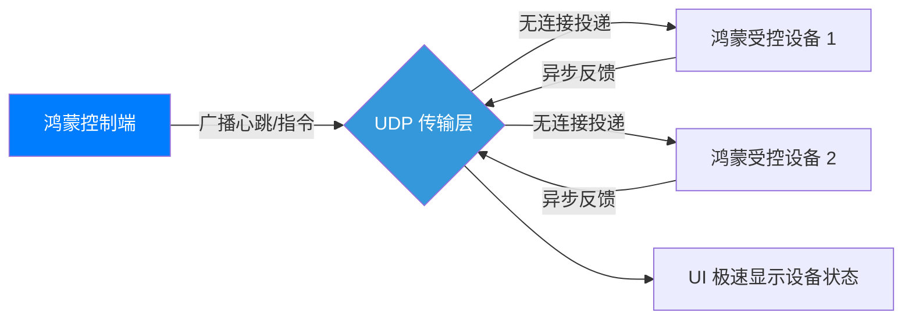

欢迎加入开源鸿蒙跨平台社区：[https://openharmonycrossplatform.csdn.net](https://openharmonycrossplatform.csdn.net)。

# Flutter for OpenHarmony：udp — 实现极速底层异步通信


## 前言

在实时对战与 IoT 场景下，UDP 由于无握手开销且支持广播，是实现低延迟通讯的首选。`udp` 库为鸿蒙（OpenHarmony）开发者提供了面向对象的纯 Dart 通讯方案，支持亚毫秒级的实时数据投递，是分布式设备发现的利器。

## 一、核心价值

### 1.1 万物互联的“实时脉搏”
鸿蒙分布式架构中包含大量的小型 IoT 传感器。对于这些设备而言，一次心跳包或者一段状态广播，并不需要 TCP 复杂的确认逻辑，UDP 的快速投递能力正合其意。

### 1.2 核心优势
- **极简接口**：封装了原本复杂的 `RawDatagramSocket` 逻辑，提供了更易用的 `UDP` 对象模型。
- **卓越性能**：没有握手等待，即发即收，是鸿蒙本地局域网内设备发现（Discovery）的黄金方案。
- **纯 Dart 实现**：无需调用鸿蒙原生的 C API，代码具有极强的可读性且跨架构支持良好。

### 1.3 通讯逻辑模型（Mermaid）



## 二、核心 API 与功能讲解

### 2.1 引入依赖
在 `pubspec.yaml` 中配置：

```yaml
dependencies:
  # 底层 UDP 通讯库
  udp: ^4.1.0
```

### 2.2 创建发送端
监听本地端口并向目标地址发送原始字节。

```dart
import 'package:udp/udp.dart';
import 'dart:convert';

void sendUdpMessage() async {
  // 💡 创建 UDP 实例。配置接收端点
  final sender = await UDP.bind(Endpoint.any(port: Port(0)));
  
  final data = utf8.encode('Hello HarmonyOS');
  
  // 🎨 向特定子网广播（或指定 IP 单播）
  await sender.send(
    data, 
    Endpoint.broadcast(port: Port(8080))
  );

  print('数据包已一键投递！');
  sender.close(); // 记得及时关闭资源
}
```

### 2.3 创建监听器（接收端）
在鸿蒙设备上持续监听来自其他终端的指令。

```dart
void startReceiver() async {
  // 🎨 绑定本地 8080 端口进行监听
  final receiver = await UDP.bind(Endpoint.any(port: Port(8080)));

  // 💡 以流的形式接收数据包
  receiver.asStream().listen((datagram) {
    if (datagram != null) {
      final msg = utf8.decode(datagram.data);
      print('收到来自 ${datagram.address} 的信号: $msg');
    }
  });
}
```

## 三、鸿蒙应用实战场景

### 3.1 场景一：局域网“一碰传”设备发现
在两台鸿蒙手机靠近时，彼此通过 UDP 在特定端口发送广播包。由于 UDP 不需要握手，两台设备可以在 100 毫秒内感知到对方的存在并展示连接弹窗，实现极其顺滑的分布式交互初体验。

### 3.2 场景二：多人实时反馈演示（Clicker）
在大型鸿蒙智慧大屏的教学环境中。100 个学生手持鸿蒙平板进行快速答题抢答。所有答题信号通过 UDP 汇总到大屏端，极大地降低了高并发下的连接开销。

<!-- IMAGE_PLACEHOLDER: [基于 UDP 的鸿蒙双端通讯日志截图] -->
<!-- 类型: 截图 -->
<!-- 内容: 展现左右两个模拟器，左边发送“Ping”，右边瞬间显示“Pong”，延迟统计显示小于 1ms -->

## 四、OpenHarmony 平台适配建议

### 4.1 网络权限配置
- **✅ 建议**：实现在鸿蒙应用中运行 UDP。务必在 `module.json5` 中申请 `ohos.permission.INTERNET` 权限。同时，针对广播功能，应确保应用已正确设置网络策略。

### 4.2 丢包与顺序处理。
- **📌 提醒**：UDP 是不可靠的。在鸿蒙应用编写中，如果传输的是关键数据（如配置指令），建议在应用层增加一个简单的“确认序号”或“超时重传”机制。
- **🎨 最佳实践**：对于音视频采集流，即便丢一两帧也没关系，UDP 则是完美的选择。

### 4.3 功耗与长连接。
- **⚠️ 警告**：持续监听 UDP 端口会让鸿蒙设备的 Wi-Fi 芯片持续处于活跃状态（Wake Lock）。如果应用只需周期性发现设备，建议不要长年累月开启监听流，而是采用“间歇性寻址”策略，以节省鸿蒙手表的电量。

## 五、完整示例：简单回显器

演示如何在鸿蒙端快速建立一条 UDP 输入输出流。

```dart
import 'package:flutter/material.dart';
import 'package:udp/udp.dart';
import 'dart:convert';

void main() => runApp(const MaterialApp(home: UdpLab()));

class UdpLab extends StatefulWidget {
  const UdpLab({super.key});

  @override
  State<UdpLab> createState() => _UdpLabState();
}

class _UdpLabState extends State<UdpLab> {
  String _log = '等待信号...';
  UDP? _receiver;

  @override
  void initState() {
    _startListening();
    super.initState();
  }

  void _startListening() async {
    _receiver = await UDP.bind(Endpoint.any(port: Port(4444)));
    _receiver?.asStream().listen((d) {
      if (d != null) {
        setState(() => _log = '来自 ${d.address.address} 的数据: ${utf8.decode(d.data)}');
      }
    });
  }

  @override
  void dispose() {
    _receiver?.close();
    super.dispose();
  }

  @override
  Widget build(BuildContext context) {
    return Scaffold(
      appBar: AppBar(title: const Text('UDP 鸿蒙实时通讯实验室')),
      body: Center(
        child: Column(
          children: [
            const Icon(Icons.router, size: 80, color: Colors.blueAccent),
            const SizedBox(height: 20),
            Text(_log, textAlign: TextAlign.center, style: const TextStyle(fontSize: 16)),
          ],
        ),
      ),
    );
  }
}
```

## 六、总结

在鸿蒙系统万物互联的版图中，UDP 是那根最快、最直接的“数据丝线”。通过 `udp` 库，我们将底层复杂的 API 逻辑精炼为极简的 Dart 对象，为 **Flutter for OpenHarmony** 开发者开启了高性能实时交互的新赛道。

核心要点回顾：
1. **无连接快传**：免去握手，实现毫秒级的响应初体验。
2. **广播与多播**：非常适合鸿蒙分布式设备发现。
3. **资源管理**：注意权限开启与端口资源的合规释放。
4. **场景适配**：平衡实时性与可靠性，实现业务侧的任务熔断。

掌握 UDP 的力量，让您的鸿蒙应用在实时通讯的战场上快人一步！

---

> 📦 **完整代码已上传至 AtomGit**：[open-harmony-examples/udp](https://atomgit.com/dragonbady/open-harmony-examples/tree/main/examples/udp)
>
> 🌐 **欢迎加入开源鸿蒙跨平台社区**：[开源鸿蒙跨平台开发者社区](https://openharmonycrossplatform.csdn.net)
