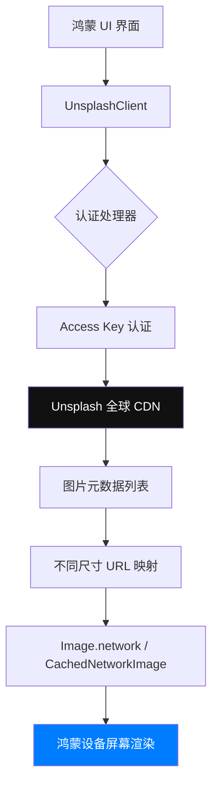

欢迎加入开源鸿蒙跨平台社区：[https://openharmonycrossplatform.csdn.net](https://openharmonycrossplatform.csdn.net)。

# Flutter for OpenHarmony：unsplash_client — 打造惊艳的高清壁纸素材库

## 前言

在现代移动应用设计中，高质量的视觉素材是提升用户体验的关键。Unsplash 作为一个提供海量免费高分辨率摄影作品的平台，其丰富的图片库成为了许多壁纸类、创意类及生活方式类应用的首选。

在 **Flutter for OpenHarmony** 开发中，如何专业地集成 Unsplash 的丰富资源？`unsplash_client` 库通过对 Unsplash API 的深度封装，为我们提供了从搜索、筛选到下载的全链路解决方案。今天，我们将实战如何在鸿蒙设备上构建一个视觉效果拉满的图片发现引擎。

## 一、为什么集成 Unsplash API？

### 1.1 卓越的资源质量
Unsplash 的图片均经过人工审核，构图专业且分辨率极高，非常适合鸿蒙系统（如搭载高性能显示屏的华为 Mate 系列）展示。

### 1.2 为什么在鸿蒙上使用 unsplash_client？
- **强类型模型**：自动将 JSON 转换为 Dart 对象，极大减少手动解析错误。
- **分页支持**：内置完善的分页加载逻辑，适配鸿蒙列表流畅滚动。
- **高性能加载**：支持获取不同尺寸的 URL（Raw, Full, Regular, Small, Thumb），帮助我们平衡显示效果与网络负载。

### 1.3 数据交互模型（Mermaid）



## 二、核心 API 与功能讲解

### 2.1 引入依赖
在 `pubspec.yaml` 中配置：

```yaml
dependencies:
  # Unsplash 客户端 SDK
  unsplash_client: ^1.1.0
```

### 2.2 账户初始化
您需要先在 [Unsplash Developer](https://unsplash.com/developers) 申请一个 Access Key。

```dart
import 'package:unsplash_client/unsplash_client.dart';

final client = UnsplashClient(
  settings: UnsplashClientSettings(
    credentials: UnsplashCredentials(
      accessKey: '您的 ACCESS_KEY',
    ),
  ),
);
```

### 2.3 核心功能：图片搜索
在鸿蒙应用的探索页面，根据关键词检索绝美图片：

```dart
Future<void> searchWallpapers(String query) async {
  // 💡 获取第一页的 10 张图片
  final result = await client.search.photos(
    query: query,
    page: 1,
    perPage: 10,
    orientation: PhotoOrientation.landscape, // 🎨 适合横屏平板
  ).go();

  for (var photo in result.results) {
    print('发现摄影师: ${photo.user.name}');
    print('高清图片链接: ${photo.urls.regular}'); 
  }
}
```

## 三、鸿蒙应用实战场景

### 3.1 场景一：折叠屏高清壁纸中心
利用鸿蒙折叠屏展开后的广阔视野，调用 `unsplash_client` 获取 `Full` 级别的超清图，为用户提供沉浸式的壁纸预览和设为桌面的功能。

### 3.2 场景二：文章配图智能匹配
在资讯或笔记类鸿蒙应用中，根据文章标题关键字自动通过 SDK 获取一张氛围感十足的 Unsplash 图片作为封面，提升整体质感。

<!-- IMAGE_PLACEHOLDER: [Unsplash 壁纸在鸿蒙平板上的预览效果截图] -->
<!-- 类型: 截图 -->
<!-- 设备: 鸿蒙平板 -->
<!-- 内容: 展现一个瀑布流布局的极简美学图片墙 -->

## 四、OpenHarmony 平台适配建议

### 4.1 流量分档策略
鸿蒙用户在不同网络环境下（移动流量 vs Wi-Fi）对体验的需求不同。
- **✅ 建议**：通过鸿蒙网络检测 API，在移动数据下请求 `small` 尺寸，在 Wi-Fi 下请求 `regular` 或 `full` 尺寸。

### 4.2 缓存与性能空间管理
Unsplash 图片体积通常较大。
- **📌 提醒**：务必配合 `flutter_cache_manager` 或者是鸿蒙原生的缓存清理机制。避免因壁纸预览次数过多导致鸿蒙系统报“存储空间不足”。

### 4.3 渲染流畅度
- **⚠️ 警告**：大规模列表加载 4K 图片会导致鸿蒙应用内存压力激增（OOM）。建议利用 `ResizeImage` 对图片进行降采样渲染，仅在最终全屏展示时加载超清原图。

## 五、完整示例代码

此示例演示了一个简单的“鸿蒙今日精选图片”组件。

```dart
import 'package:flutter/material.dart';
import 'package:unsplash_client/unsplash_client.dart';

class UnsplashGallery extends StatefulWidget {
  const UnsplashGallery({super.key});

  @override
  State<UnsplashGallery> createState() => _UnsplashGalleryState();
}

class _UnsplashGalleryState extends State<UnsplashGallery> {
  late UnsplashClient _client;
  List<Photo> _photos = [];

  @override
  void initState() {
    super.initState();
    // ✅ 实战：配置并初始化
    _client = UnsplashClient(
      settings: UnsplashClientSettings(
        credentials: UnsplashCredentials(accessKey: 'YOUR_KEY'),
      ),
    );
    _loadRandomPhotos();
  }

  Future<void> _loadRandomPhotos() async {
    try {
      final photos = await _client.photos.random(count: 3).go();
      setState(() => _photos = photos);
    } catch (e) {
      debugPrint('加载失败: $e');
    }
  }

  @override
  Widget build(BuildContext context) {
    return Scaffold(
      appBar: AppBar(title: const Text('Unsplash 鸿蒙视觉库')),
      body: _photos.isEmpty
          ? const Center(child: CircularProgressIndicator())
          : ListView.builder(
              itemCount: _photos.length,
              itemBuilder: (context, index) {
                final photo = _photos[index];
                return Card(
                  margin: const EdgeInsets.all(10),
                  child: Column(
                    children: [
                      Image.network(photo.urls.small.toString()),
                      ListTile(
                        title: Text('作者: ${photo.user.name}'),
                        subtitle: Text('赞数: ${photo.likes}'),
                      ),
                    ],
                  ),
                );
              },
            ),
    );
  }
}
```

## 六、总结

`unsplash_client` 为鸿蒙应用开启了连接全球顶级摄影素材的大门。在 **Flutter for OpenHarmony** 追求极致美学的趋势下，灵活运用这个库，能让您的应用在视觉竞争中脱颖而出。

核心要点回顾：
1. **统一模型**：极大简化从 Unsplash 检索复杂元数据的过程。
2. **多尺寸适配**：根据鸿蒙设备的屏幕与网络状况灵活选图。
3. **鸿蒙适配**：注意大图渲染时的内存管理与资源分档。

让您的每一行代码，由于 Unsplash 的加入而充满艺术生命力！

---

> 📦 **完整代码已上传至 AtomGit**：[open-harmony-examples/unsplash_client](https://atomgit.com/dragonbady/open-harmony-examples/tree/main/examples/unsplash_client)
>
> 🌐 **欢迎加入开源鸿蒙跨平台社区**：[开源鸿蒙跨平台开发者社区](https://openharmonycrossplatform.csdn.net)
