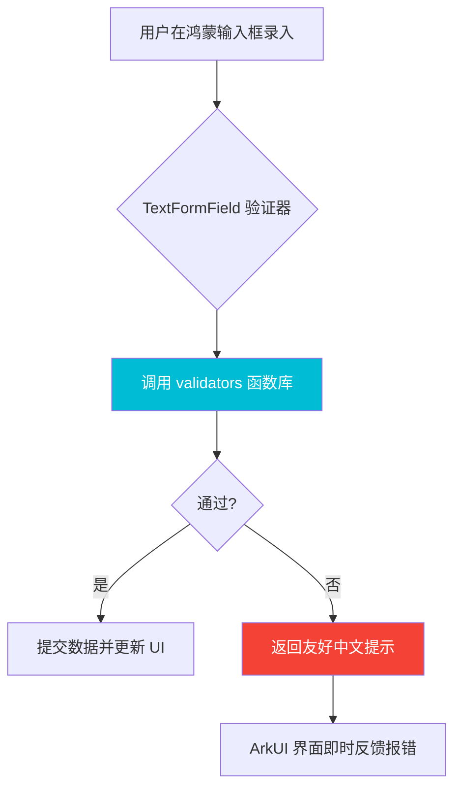

欢迎加入开源鸿蒙跨平台社区：[https://openharmonycrossplatform.csdn.net](https://openharmonycrossplatform.csdn.net)。

# Flutter for OpenHarmony：validators — 极简且强大的鸿蒙数据校验专家库

## 前言

在任何移动应用中，对用户输入的数据进行校验都是保障业务安全与数据质量的第一道防线。无论是邮箱格式、手机号码、强密码校验，还是复杂的 URL 验证，如果每一处都手写正则表达式，不仅代码难以阅读，还容易引入各种边界漏洞。

在 **Flutter for OpenHarmony** 开发中，我们需要一套更专业、更具工业标准的校验工具。`validators` 库通过提供大量开箱即用的语义化函数，极大地简化了这一过程。今天，我们将探索如何在鸿蒙应用中优雅地实现精准的数据验证。

## 一、为什么需要 validators 库？

### 1.1 让正则表达式退居幕后
正则表达式虽然强大，但对于大多数开发者来说简直是“天书”。`validators.isEmail(str)` 显然比一长串难懂的正则符号更具可读性。

### 1.2 核心优势
- **全面性**：涵盖了 IP 地址、字母、数字、Base64、JSON、UUID 等数十种校验规则。
- **一致性**：基于广泛使用的 Node.js `validator.js` 逻辑移植，规则经过了全球数百万项目的验证。
- **纯 Dart 实现**：在鸿蒙的全场景终端上都能保持极高的运行效率和稳定性。

### 1.3 校验工作流模型（Mermaid）



## 二、核心 API 与功能讲解

### 2.1 引入依赖
在 `pubspec.yaml` 中引入：

```yaml
dependencies:
  # 语义化校验库
  validators: ^3.0.0
```

### 2.2 基础逻辑验证
处理鸿蒙应用中最常见的身份与格式校验。

```dart
import 'package:validators/validators.dart';

void runChecks() {
  // 💡 邮箱校验
  print(isEmail('dev@ohos.com')); // true
  
  // 💡 纯字母校验
  print(isAlpha('HarmonyOS')); // true
  
  // 💡 长度范围校验
  print(isByteLength('123', 2, 5)); // true (检查字节长度)
  
  // 💡 是否为数字
  print(isNumeric('2024')); // true
}
```

### 2.3 复杂内容验证
在鸿蒙企业级应用中，有时需要校验特殊的数据结构。

```dart
void advancedChecks() {
  // 🎨 是否为有效的 JSON 格式
  print(isJSON('{"id": 1}')); // true
  
  // 🎨 是否为有效的 URL
  print(isURL('https://openharmony.cn')); // true
  
  // 🎨 是否包含特定子串
  print(contains('Welcome to Harmony', 'Harmony')); // true
}
```

## 三、鸿蒙应用实战场景

### 3.1 场景一：高颜值表单即时验证
在鸿蒙手机的个人信息修改界面，结合 `TextFormField` 的 `validator` 属性，实现秒级的输入合规性反馈。

### 3.2 场景二：后台管理系统的 IP 过滤
在鸿蒙办公平板的“网络管理”插件中，使用 `isIP` 方法校验用户输入的服务器地址是否符合 IPv4 或 IPv6 规范。

<!-- IMAGE_PLACEHOLDER: [验证失败时的鸿蒙表单反馈截图] -->
<!-- 类型: 截图 -->
<!-- 内容: 展示输入框下方出现的红色错误提示，内容清晰易懂 -->

## 四、OpenHarmony 平台适配建议

### 4.1 中文字符处理
- **📌 提醒**：`isAlpha` 等函数默认只支持 A-Z/a-z。
- **✅ 建议**：在鸿蒙应用的中文环境下，如果需要验证“纯中文字符串”，`validators` 本身可能无法完全满足，建议结合简单的中文字符范围正则 `^[\u4e00-\u9fa5]+$`。

### 4.2 全球化适配
- **🎨 最佳实践**：鸿蒙系统具有高度的国际化属性。在使用 `isEmail` 等国际通用规则时，`validators` 表现非常优异；但在校验电话号码（`isMobilePhone`）时，务必根据鸿蒙系统提供的 `i18n` 接口获取当前国家码，以选择正确的校验模板。

### 4.3 性能感应
- **⚠️ 警告**：不要在页面的每一帧 `build` 方法里执行复杂的 `isURL` 校验。
- **🎨 优化**：校验逻辑应只在 `onChanged` 配合防抖，或者在只有提交按钮被点击时才触发。

## 五、完整示例代码

此示例演示了一个功能完备的“鸿蒙注册表单”校验逻辑。

```dart
import 'package:flutter/material.dart';
import 'package:validators/validators.dart' as v;

void main() => runApp(const MaterialApp(home: ValidatorLab()));

class ValidatorLab extends StatefulWidget {
  const ValidatorLab({super.key});

  @override
  State<ValidatorLab> createState() => _ValidatorLabState();
}

class _ValidatorLabState extends State<ValidatorLab> {
  final _formKey = GlobalKey<FormState>();

  @override
  Widget build(BuildContext context) {
    return Scaffold(
      appBar: AppBar(title: const Text('validators 鸿蒙校验实验室')),
      body: Form(
        key: _formKey,
        child: Padding(
          padding: const EdgeInsets.all(16.0),
          child: Column(
            children: [
              TextFormField(
                decoration: const InputDecoration(labelText: '邮箱地址'),
                // ✅ 实战：简洁的语义化校验
                validator: (val) => (val != null && v.isEmail(val)) ? null : '请输入合法的邮箱格式',
              ),
              const SizedBox(height: 15),
              TextFormField(
                decoration: const InputDecoration(labelText: '企业官网 URL'),
                validator: (val) => (val != null && v.isURL(val)) ? null : 'URL 格式错误',
              ),
              const SizedBox(height: 30),
              ElevatedButton(
                onPressed: () {
                  if (_formKey.currentState!.validate()) {
                    ScaffoldMessenger.of(context).showSnackBar(const SnackBar(content: Text('校验通过，正在保存...')));
                  }
                },
                child: const Text('提交审核'),
              ),
            ],
          ),
        ),
      ),
    );
  }
}
```

## 六、总结

`validators` 让原本枯燥且易错的字符串校验变成了一种享受。在 **Flutter for OpenHarmony** 专业化交付的过程中，依靠此类成熟的工具库，不仅能大幅提升代码质量，更能让项目的可维护性提升到一个新的台阶。

核心要点回顾：
1. **语义化 API**：一眼看穿代码逻辑，降低团队沟通成本。
2. **场景全覆盖**：从简单的非空判断到复杂的格式分析。
3. **鸿蒙适配**：注意中文差异化处理，并结合 Form 机制提供动态反馈。
4. **工业标准**：借力全球开源社区验证过的校验规则。

现在，开启您的鸿蒙开发之旅，让错误输入无处遁形！

---

> 📦 **完整代码已上传至 AtomGit**：[open-harmony-examples/validators](https://atomgit.com/dragonbady/open-harmony-examples/tree/main/examples/validators)
>
> 🌐 **欢迎加入开源鸿蒙跨平台社区**：[开源鸿蒙跨平台开发者社区](https://openharmonycrossplatform.csdn.net)
