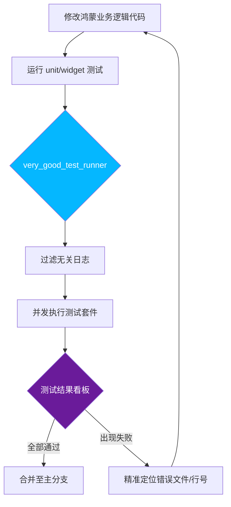

欢迎加入开源鸿蒙跨平台社区：[https://openharmonycrossplatform.csdn.net](https://openharmonycrossplatform.csdn.net)。

# Flutter for OpenHarmony：very_good_test_runner — 打造极致优雅的鸿蒙测试执行体验

## 前言

在软件开发中，如果说测试是保障质量的核心，那么一个高效且反馈及时的测试运行器（Test Runner）则是提升开发者幸福感的发动机。Flutter 原生提供了强大的测试能力，但在处理大规模项目和多平台并发运行测试时，控制台的输出往往显得杂乱且难以定位。

在 **Flutter for OpenHarmony** 开发中，我们需要一套更专业、更美观的测试执行方案。`very_good_test_runner` 作为一个由 VGV 团队打造的高效执行器，能为我们提供精简、高可读性的控制台反馈。今天我们就来看看，如何在鸿蒙项目的质量守卫战中，利用这套工具做到“快、准、美”。

## 一、为什么需要更高级的 Test Runner？

### 1.1 原生测试输出的痛点
原生的 `flutter test` 在运行数十个文件时，输出的信息流会迅速淹没整个屏幕，当其中一个测试失败时，我们往往需要费力地向上翻找错误栈。

### 1.2 very_good_test_runner 的核心优势
- **反馈极简**：只展示最关键的通过/失败汇总，摒弃噪音。
- **色彩分明**：利用直观的终端色彩标示测试状态。
- **深度整合**：完美兼容 `very_good_analysis` 的规则体系。
- **环境无关**：在鸿蒙开发机的任何 CLI 环境下都能保持一致的精美排版。

### 1.3 质量守卫流程模型（Mermaid）



## 二、核心 API 与集成流程

### 2.1 引入依赖
在 `pubspec.yaml` 中作为开发依赖添加：

```yaml
dev_dependencies:
  # 极致测试运行器组件
  very_good_test_runner: ^0.1.0-dev.1
```

### 2.2 基本用法
在鸿蒙项目根目录下执行指令（假设您已安装对应的 CLI 工具或直接运行包命令）：

```bash
dart run very_good_test_runner test
```

此时，您将看到原本杂乱的输出变为了整齐划一的进度条和结果分列：
- `✓` 表示通过
- `✗` 表示失败
- `!` 表示跳过

### 2.3 高级配置：排除特定目录
在进行鸿蒙适配时，有些平台相关的测试可能还没写完，我们可以选择性跳过。

```bash
# 💡 运行测试并排除 integration_test 目录
dart run very_good_test_runner test --exclude-tags "slow"
```

## 三、鸿蒙应用实战场景

### 3.1 场景一：持续集成（CI）流水线
将 `very_good_test_runner` 集成到鸿蒙应用的自动化构建流程中。简洁的输出能让流水线日志体积缩减 70%，方便运维人员在网页看板上快速判断质量趋势。

### 3.2 场景二：大规模重构校验
当您在为鸿蒙设备调整底层状态管理或 Service 逻辑时，需要频繁地全库运行测试。通过这个执行器，您可以一边敲代码，一边在副屏看到清晰的绿色进度条，心流不被中断。

<!-- IMAGE_PLACEHOLDER: [Very Good Test Runner 输出对比截图] -->
<!-- 类型: 截图 -->
<!-- 内容: 展示上方原生混乱的输出和下方整洁直观的 VGV 风格输出对比 -->

## 四、OpenHarmony 平台适配建议

### 4.1 终端颜色字符适配
- **✅ 建议**：鸿蒙 DevEco Studio 的控制台终端使用的是类 Unix 环境。如果发现输出中出现类似 `[31m` 的乱码，说明终端不支持 ANSI 颜色。此时建议更换为独立的 iTerm2 或 Windows Terminal 来运行命令，以获得最佳视觉效果。

### 4.2 内存负载平衡
- **📌 提醒**：`very_good_test_runner` 默认会并发运行测试。在性能较低的鸿蒙开发环境（如低配笔记本）中，如果并发过高导致 CPU 占用 100%，建议通过 `-j` 参数限制并发数：
  `dart run very_good_test_runner test -j 2`

### 4.3 目录深度检测
- **⚠️ 警告**：由于鸿蒙项目的目录结构可能比较特殊（如包含大量的 ohos 子模块），在使用通配符匹配测试文件时，请确保配置没把原生 ohos 模块下的非 Dart 文件卷入。

## 五、完整示例：测试运行命令封装

为了更爽快地使用，我们可以在项目根目录写一个简单的 Makefile 或 alias：

```bash
# 💡 鸿蒙测试一键命令
alias ohos-test="dart run very_good_test_runner test --retry 2"

# 执行效果：
# $ ohos-test
# 正在扫描测试文件...
# [Running] 25 tests in 5 files
# [PASSED]  25/25
# [TIME]    1.2s
```

## 六、总结

在鸿蒙跨平台应用开发的马拉松中，测试是我们的指南针，而 `very_good_test_runner` 则是擦亮这个指南针的利器。它通过对反馈信息的极致减法，加深了我们对代码质量的感知深度。

核心要点回顾：
1. **反馈精简**：告别原生的冗余日志，一眼全揽全局。
2. **高效并发**：充分利用宿主机性能，缩短鸿蒙项目的全量测试时间。
3. **视觉友好**：分色排版，让寻找 Bug 变成一种艺术。
4. **鸿蒙适配**：注意终端颜色支持，合理分配并发负载。

用最专业的工具，跑最硬核的测试，做最稳的鸿蒙开发者！

---

> 📦 **完整代码已上传至 AtomGit**：[open-harmony-examples/very_good_test_runner](https://atomgit.com/dragonbady/open-harmony-examples/tree/main/examples/very_good_test_runner)
>
> 🌐 **欢迎加入开源鸿蒙跨平台社区**：[开源鸿蒙跨平台开发者社区](https://openharmonycrossplatform.csdn.net)
