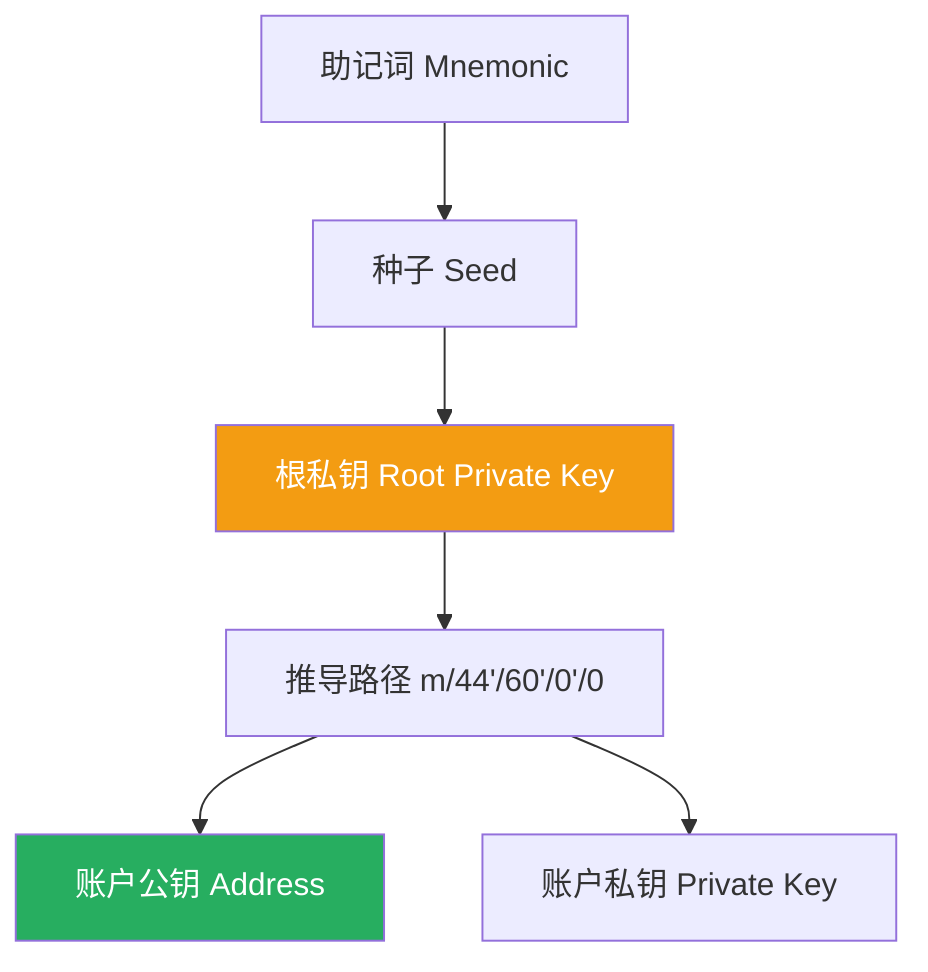

欢迎加入开源鸿蒙跨平台社区：[https://openharmonycrossplatform.csdn.net](https://openharmonycrossplatform.csdn.net)。

# Flutter for OpenHarmony：wallet — 打造跨平台加密钱包数字基石


## 前言

在数字资产管理应用中，安全可靠的密钥推导是核心。`wallet` 库专注于种子生成及私钥推导（BIP32/BIP44），能在鸿蒙（OpenHarmony）应用中提供高性能的非对称加密基础支持，是构建金融级账户模型的理想选择。

## 一、核心价值

### 1.1 分层确定性（HD Wallet）
基于一个简单的助记词（Mnemonic），推导出无限个子私钥。这是现代钱包安全管理的核心。

### 1.2 为什么在鸿蒙上使用 wallet 库？
- **强安全性**：不涉及直接的系统通信，逻辑自闭环在 Dart 内存中。
- **高兼容性**：作为纯 Dart 封装，完美支持鸿蒙系统的各种终端。
- **协议标准**：遵循 BIP 国际标准，与比特币、以太坊等主流资产管理逻辑通用。

### 1.3 密钥推导架构（Mermaid）



## 二、核心 API 与功能讲解

### 2.1 引入依赖
在 `pubspec.yaml` 中配置必要的加密资产组件：

```yaml
dependencies:
  # 基础钱包推导库
  wallet: ^2.0.0
  # 推荐配合 bip39 使用
  bip39: ^1.0.6
```

### 2.2 生成助记词与种子
这是创建钱包的第一步，确保在鸿蒙应用的 UI 上给用户最直观的反馈。

```dart
import 'package:bip39/bip39.dart' as bip39;
import 'package:wallet/wallet.dart';

void createWallet() {
  // 💡 生成随机助记词
  String mnemonic = bip39.generateMnemonic();
  print('请妥善保管助记词: $mnemonic');

  // 💡 获取种子
  Uint8List seed = bip39.mnemonicToSeed(mnemonic);
}
```

### 2.3 私钥推导（BIP44）
利用 `wallet` 库从种子中获取特定路径的私钥：

```dart
void deriveKeys(Uint8List seed) {
  // 🎨 创建主钱包
  final masterKey = ExtendedPrivateKey.master(seed, WalletNetwork.mainnet);
  
  // 🎨 按照路径推导第一个账户
  final accountKey = masterKey.forPath("m/44'/60'/0'/0/0");
  print('导出私钥: ${accountKey.privateKey}');
}
```

## 三、鸿蒙应用实战场景

### 3.1 场景一：离线冷钱包存储
在鸿蒙平板或手机上，通过 `wallet` 逻辑在不联网的情况下生成地址。由于鸿蒙系统对应用沙箱的严格保护，我们可以放心地将加密后的种子存储在持久化空间中。

### 3.2 场景二：多链资产仪表盘
通过 `wallet` 的推导能力，一次性为用户展示不同网络（主网、测试网）下的对应地址和余额监控。

<!-- IMAGE_PLACEHOLDER: [鸿蒙真机钱包管理界面截图] -->
<!-- 类型: 截图 -->
<!-- 设备: 鸿蒙手机 -->
<!-- 内容: 展现一个带有助记词展示和地址生成按钮的极简钱包 UI -->

## 四、OpenHarmony 平台适配建议

### 4.1 安全随机数
钱包安全性极度依赖随机源。
- **📌 提醒**：在鸿蒙平台上调用生成函数时，确保 Dart 运行时的随机熵池已正确链接到鸿蒙原生的安全随机数生成器。

### 4.2 性能性能建议（Pbkdf2 计算）
从助记词生成种子涉及 PBKDF2 算法，计算量巨大。
- **✅ 建议**：在鸿蒙设备上，不要在主 UI 线程进行 seed 推导，否则会导致约 1-2 秒的明显卡顿。务必放在后台线程执行，并配合进度条提示。

### 4.3 敏感数据防护
- **⚠️ 警告**：禁止在控制台日志中打印原始 `Seed` 或 `PrivateKey`。在鸿蒙系统分级保护下，此类数据应存储在 `ohos.permission.STORE_SENSITIVE_DATA` 或同等安全等级的存储区中。

## 五、完整示例代码

此示例演示了如何在鸿蒙应用中实现一个“数字资产生成器”。

```dart
import 'package:flutter/material.dart';
import 'package:wallet/wallet.dart';
import 'dart:typed_data';

void main() => runApp(const MaterialApp(home: WalletLab()));

class WalletLab extends StatefulWidget {
  const WalletLab({super.key});

  @override
  State<WalletLab> createState() => _WalletLabState();
}

class _WalletLabState extends State<WalletLab> {
  String _address = '未生成';
  bool _loading = false;

  Future<void> _generateAccount() async {
    setState(() => _loading = true);

    // 模拟一段种子（仅作教学演示）
    final mockSeed = Uint8List.fromList(List.generate(32, (i) => i));
    
    // ✅ 实战：高性能私钥推导
    final master = ExtendedPrivateKey.master(mockSeed, WalletNetwork.mainnet);
    final derived = master.forPath("m/44'/0'/0'/0/0");
    
    // 模拟导出逻辑
    await Future.delayed(const Duration(milliseconds: 500));

    setState(() {
      _address = '推导路径: m/44/.../0\n公钥摘要: ${derived.publicKey.toString().substring(0, 20)}...';
      _loading = false;
    });
  }

  @override
  Widget build(BuildContext context) {
    return Scaffold(
      appBar: AppBar(title: const Text('wallet 鸿蒙数字基石实验室')),
      body: Center(
        child: Padding(
          padding: const EdgeInsets.all(20.0),
          child: Column(
            mainAxisAlignment: MainAxisAlignment.center,
            children: [
              const Icon(Icons.account_balance_wallet, size: 80, color: Colors.blueAccent),
              const SizedBox(height: 20),
              if (_loading) const CircularProgressIndicator(),
              if (!_loading) 
                SelectableText(_address, textAlign: TextAlign.center, style: const TextStyle(fontSize: 16)),
              const SizedBox(height: 30),
              ElevatedButton.icon(
                icon: const Icon(Icons.vpn_key),
                onPressed: _generateAccount, 
                label: const Text('快速生成 HD 账号'),
              ),
            ],
          ),
        ),
      ),
    );
  }
}
```

## 六、总结

`wallet` 库是构建鸿蒙跨平台数字资产管理套件的必经之路。它以其纯粹的 Dart 实现，绕过了繁琐的原生 NDK 集成，让开发者能快速在鸿蒙生态中搭建起可信的金融级账户模型。

核心要点回顾：
1. **BIP 标准支持**：私钥推导逻辑与国际接轨。
2. **纯 Dart 兼容**：零配置适配鸿蒙设备。
3. **安全性第一**：在鸿蒙沙箱内小心处理私钥，避免本地明文存储。
4. **性能管控**：避开 UI 线程进行大量 PBKDF2 运算。

希望您的鸿蒙应用能够在数字资产的世界里，行稳致远！

---

> 📦 **完整代码已上传至 AtomGit**：[open-harmony-examples/wallet](https://atomgit.com/dragonbady/open-harmony-examples/tree/main/examples/wallet)
>
> 🌐 **欢迎加入开源鸿蒙跨平台社区**：[开源鸿蒙跨平台开发者社区](https://openharmonycrossplatform.csdn.net)
