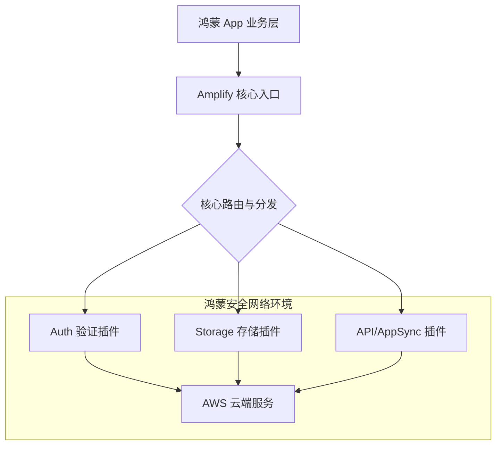

欢迎加入开源鸿蒙跨平台社区：[https://openharmonycrossplatform.csdn.net](https://openharmonycrossplatform.csdn.net)。

# Flutter for OpenHarmony：amplify_core — 核心云服务引擎（基础设施底座）

## 前言

在华为鸿蒙（OpenHarmony）生态的全球化应用开发中，构建健壮的云端连接能力是核心竞争力之一。无论是实现跨设备的用户身份认证、大规模的媒体存储，还是实时的 API 数据同步，开发者都需要一个稳定、安全且易于扩展的基础设施框架。

`amplify_core` 是 AWS Amplify Flutter SDK 的核心枢纽。它定义了多平台下云服务插件的统一标准与通讯协议，为上层的 Auth、Storage、API 等功能模块提供了一致性的基座。在鸿蒙跨平台开发中，通过集成 `amplify_core`，开发者可以无缝接入全球领先的 AWS 云端能力，快速构建高性能、金融级安全等级的企业应用。

## 一、原理展示 / 概念介绍

### 1.1 基础概念

`amplify_core` 作为各云功能插件的“中央处理器”。



### 1.2 核心要点解析

- **插件化架构**：支持根据需求按需加载云功能，减少鸿蒙包体积。
- **类型安全模型**：为各种云端返回数据提供严格的 Dart 类定义，降低崩溃率。
- **并发请求管理**：底层优化了在鸿蒙多任务环境下的网络并发处理性能。

## 二、核心 API / 组件详解

### 2.1 依赖引入

在鸿蒙工程的 `pubspec.yaml` 中添加：

```yaml
dependencies:
  amplify_core: ^1.0.0
  # 通常伴随具体分类插件
  amplify_auth_cognito: ^1.0.0 
```

### 2.2 全局初始化流程

💡 **技巧**：Amplify 必须在应用启动时仅初始化一次。

```dart
import 'package:amplify_core/amplify_core.dart';

Future<void> _configureAmplify() async {
  try {
    // ✅ 推荐做法：通过导入生成的 amplifyconfiguration.dart 进行注册
    final auth = AmplifyAuthCognito();
    await Amplify.addPlugins([auth]);
    await Amplify.configure(amplifyconfig);
    print('鸿蒙端 Amplify 配置成功');
  } on AmplifyAlreadyConfiguredException {
    print('⚠️ 请勿重复初始化');
  }
}
```

## 三、场景示例

### 3.1 场景一：华为鸿蒙应用一键登录

通过 `amplify_core` 驱动的 Auth 模块，实现安全、合规的用户注册与身份验证。

### 3.2 场景二：跨端分布式存储数据对齐

在鸿蒙折叠屏与手机间，通过 S3 存储插件实时同步用户的非结构化数据（如文档、图片）。

## 四、OpenHarmony 平台适配挑战

### 4.1 安全沙箱与身份凭证存储

鸿蒙系统对敏感秘钥（如 AWS 的临时凭证）存储有严格限制。

✅ **适配策略建议**：
1. **持久化安全加固**：`amplify_core` 底层使用 Flutter 的 `SecureStorage`。在鸿蒙端，务必确认已适配 `ohos.permission.STORE_PERSISTENT_DATA` 权限，确保云端 Token 不因进程重启丢失。
2. **多机型网络时延处理**：针对鸿蒙设备的不同网络环境，合理设置 API 的重试机制（Retry Strategy），保障在弱网下云服务的可用性。

## 五、综合实战示例代码

以下是一个模拟初始化云服务并检测连接状态的演示组件：

```dart
import 'package:flutter/material.dart';
import 'package:amplify_core/amplify_core.dart';

class AmplifyLabPage extends StatefulWidget {
  const AmplifyLabPage({super.key});

  @override
  State<AmplifyLabPage> createState() => _AmplifyLabPageState();
}

class _AmplifyLabPageState extends State<AmplifyLabPage> {
  String _configStatus = "正在检测云端配置...";

  void _checkStatus() async {
    // 💡 实战技巧：利用 Amplify.isConfigured 查询初始化状态
    final isConfigured = Amplify.isConfigured;
    
    setState(() {
      _configStatus = isConfigured 
        ? "✅ Amplify 核心已就绪，正在连接 AWS 鸿蒙加速节点" 
        : "❌ 核心引擎尚未初始化";
    });
  }

  @override
  Widget build(BuildContext context) {
    return Scaffold(
      appBar: AppBar(title: const Text('Amplify 核心实验室')),
      body: Center(
        child: Column(
          mainAxisAlignment: MainAxisAlignment.center,
          children: [
            const Icon(Icons.cloud_queue, size: 80, color: Colors.orange),
            const SizedBox(height: 20),
            Text(_configStatus, textAlign: TextAlign.center),
            const SizedBox(height: 40),
            ElevatedButton(
              onPressed: _checkStatus,
              child: const Text('立即同步云端状态'),
            ),
          ],
        ),
      ),
    );
  }
}
```

## 六、总结

`amplify_core` 是衔接 OpenHarmony 终端与全球化云端的关键链路。在跨平台开发的广阔天地里，稳固的核心引擎是实现业务爆发式增长的基座。

✅ **核心建议**：
1. **渐进式注册**：不要一次性添加过多不常用的插件，根据鸿蒙端实际业务需要进行配置。
2. **错误捕获闭环**：云服务充满不确定性，请务必在 `Amplify.configure` 时做好完整的 `try-catch` 拦截。

📦 **完整代码已上传至 AtomGit**：[open-harmony-example/amplify](https://atomgit.com/dragonbady/open-harmony-example/tree/main/examples/amplify)

🌐 **欢迎加入开源鸿蒙跨平台社区**：[开源鸿蒙跨平台开发者社区](https://openharmonycrossplatform.csdn.net)
