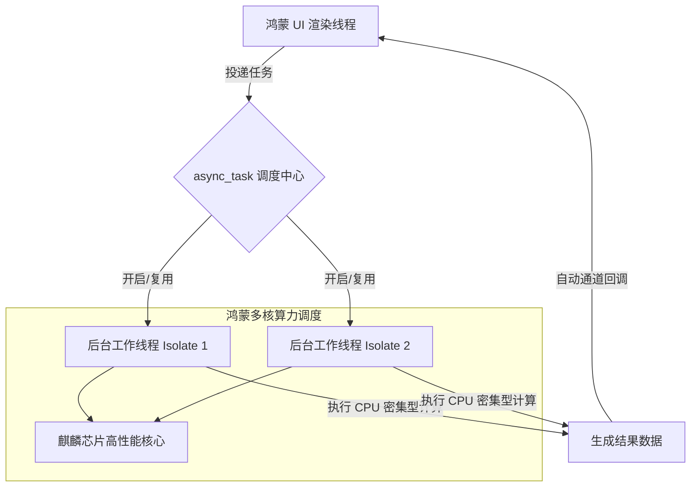

欢迎加入开源鸿蒙跨平台社区：[https://openharmonycrossplatform.csdn.net](https://openharmonycrossplatform.csdn.net)。

# Flutter for OpenHarmony：async_task — 高性能并发处理引擎（异步治理底座）

## 前言

在追求极致流畅的华为鸿蒙（OpenHarmony）旗舰应用开发中，UI 线程的每一毫秒都弥足珍贵。如果在渲染线程直接处理如海量 JSON 解析、大数据矩阵变换或图像特征提取等 CPU 密集型操作，势必会导致界面掉帧（Jank），严重影响鸿蒙系统的沉浸式体验。

`async_task` 是一款专为 Dart/Flutter 设计的强力后台任务执行器。它不仅简化了繁琐的 `Isolate` 管理，更通过一套优雅的 API，实现了任务的后台化、流式处理以及结果自动对齐。在构建鸿蒙平台的专业生产力工具、短视频编辑或高刷游戏应用时，它是你平衡系统算力与 UI 响应能力的“黄金分割线”。

## 一、原理展示 / 概念介绍

### 1.1 基础概念

`async_task` 核心在于将“重活”卸载（Offload）到后台执行单元。



### 1.2 核心要点解析

- **自动管理 Isolate**：无需手动控制 `spawn` 或 `kill`，库会自动处理执行环境的生命周期。
- **类型安全任务模型**：通过定义 `AsyncTask` 子类，强类型约束输入参数与输出结果。
- **异步流支持**：支持任务执行过程中的进度回传，完美适配鸿蒙端长耗时任务的进度条展示。

## 二、核心 API / 组件详解

### 2.1 依赖引入

在鸿蒙工程的 `pubspec.yaml` 中添加：

```yaml
dependencies:
  async_task: ^1.1.0
```

### 2.2 定义高性能异步任务

以计算鸿蒙系统日志的哈希签名为例：

```dart
import 'package:async_task/async_task.dart';

// ✅ 推荐做法：继承 AsyncTask 并在 execute 中实现重度计算
class HeavyLogProcessor extends AsyncTask<String, String> {
  final String rawData;
  HeavyLogProcessor(this.rawData);

  @override
  Task instantiatedTask() => this;

  @override
  FutureOr<String> execute() {
    // 💡 这里的逻辑在鸿蒙后台 Isolate 运行，不阻塞 UI
    return "Processed: ${rawData.hashCode}";
  }
}
```

### 2.3 启动与调度

```dart
void startProcessing() {
  final task = HeavyLogProcessor("大量日志内容...");
  // 💡 自动通过调度器执行
  AsyncExecutor().execute(task).then((result) => print(result));
}
```

## 三、场景示例

### 3.1 场景一：鸿蒙端大规模数据离线清洗

在鸿蒙平板等设备上处理本地百万级记录的数据库导出，通过 `async_task` 分流处理，主界面保持丝滑。

### 3.2 场景二：智能相册的边缘计算

在本地进行人脸检测算法初期的数据灰度化和归一化处理。

## 四、OpenHarmony 平台适配挑战

### 4.1 内存共享与大数据拷贝开销

`Isolate` 之间默认无法共享内存。当任务涉及到几百 MB 的 `Uint8List` 传递时，全量拷贝可能会消耗显著的时间。

✅ **适配策略建议**：
1. **使用 TransferableTypedData**：在鸿蒙端处理大字节流时，利用 `TransferableTypedData` 实现“零拷贝”级别的数据移动。
2. **多核亲和性**：针对鸿蒙设备的不同 SoC 架构，合理限制并发数量（通常不超过 CPU 核心数），避免因线程频繁切换导致的上下文开销，保护鸿蒙系统能效。

## 五、综合实战示例代码

以下是一个演示如何在鸿蒙端并行计算斐波那契数列的实战组件：

```dart
import 'package:flutter/material.dart';
import 'package:async_task/async_task_extension.dart';

// 模拟长耗时递归任务
class FibonacciTask extends AsyncTask<int, int> {
  final int n;
  FibonacciTask(this.n);

  @override
  FutureOr<int> execute() {
    return _fib(n);
  }

  int _fib(int n) => n <= 1 ? n : _fib(n - 1) + _fib(n - 2);

  @override
  Task instantiatedTask() => this;
}

class AsyncTaskLab extends StatefulWidget {
  const AsyncTaskLab({super.key});

  @override
  State<AsyncTaskLab> createState() => _AsyncTaskLabState();
}

class _AsyncTaskLabState extends State<AsyncTaskLab> {
  final _executor = AsyncExecutor(parallelism: 2); // 💡 设置鸿蒙核心并行度
  String _status = "等待计算任务...";

  void _runTask() async {
    setState(() => _status = "后台并行计算中...");
    
    // 💡 实战技巧：投递复杂任务，UI 依然可以响应交互
    final result = await _executor.execute(FibonacciTask(40));
    
    setState(() {
      _status = "✅ 鸿蒙后台计算结果: $result";
    });
  }

  @override
  Widget build(BuildContext context) {
    return Scaffold(
      appBar: AppBar(title: const Text('async_task 并发实验室')),
      body: Center(
        child: Column(
          mainAxisAlignment: MainAxisAlignment.center,
          children: [
            const CircularProgressIndicator(), // 展示 UI 的流畅性
            const SizedBox(height: 30),
            Text(_status),
            const SizedBox(height: 40),
            ElevatedButton(onPressed: _runTask, child: const Text('开启鸿蒙多核后台计算')),
          ],
        ),
      ),
    );
  }
}
```

## 六、总结

在鸿蒙系统的顶级体验中，“异步”不仅是处理网络请求的手段，更是支撑起复杂计算逻辑不仅卡的底座。`async_task` 让每一滴硬件性能都物尽其用。

✅ **核心建议**：
1. **重活后台化**：原则上，任何超过 16ms（对应 60FPS）的计算逻辑都应考虑进入 `async_task`。
2. **任务颗粒度**：过小的任务由于跨 Isolate 启动有开销，反而变慢。应将一系列碎片操作打包为一个连贯的 Task 投递。
3. **结合鸿蒙监控**：在开发阶段结合 DevEco-Studio 的 Profiler 工具，观察 Isolate 的分担情况。

📦 **完整代码已上传至 AtomGit**：[open-harmony-example/async_task](https://atomgit.com/dragonbady/open-harmony-example/tree/main/examples/async_task)

🌐 **欢迎加入开源鸿蒙跨平台社区**：[开源鸿蒙跨平台开发者社区](https://openharmonycrossplatform.csdn.net)
