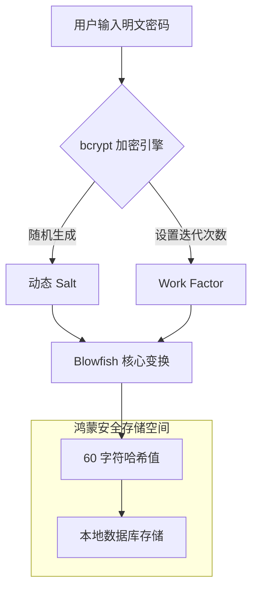

欢迎加入开源鸿蒙跨平台社区：[https://openharmonycrossplatform.csdn.net](https://openharmonycrossplatform.csdn.net)。

# Flutter for OpenHarmony：bcrypt — 金融级降级安全加密（身份校验底座）

## 前言

在华为鸿蒙（OpenHarmony）生态的各类应用中，尤其是涉及政务、金融及隐私社交的场景，用户账号的安全性是底层架构的生命线。绝不能以明文或仅使用 MD5 这种早已被证明不安全的算法来存储用户密码。

`bcrypt` 是一种专门为密码哈希设计的、能够对抗彩虹表攻击和暴力破解的高强度算法。它的核心优势是通过可调节的“工作因子”（Cost Factor）来控制计算耗时，使得攻击者的成本呈指数级增长。在构建鸿蒙平台的本地账户体系或离线权限验证时，`bcrypt` 是构建加固型防御体系的核心组件。

## 一、原理展示 / 概念介绍

### 1.1 基础概念

`bcrypt` 结合了 Salt（盐）和 Key Stretching（密钥拉伸）技术。



### 1.2 核心要点解析

- **自动盐集成**：每次加密都会自动生成随机盐并包含在生成的哈希字符串中，极大简化了开发者的存储逻辑。
- **可调节成本**：随着鸿蒙硬件主频的迭代（如麒麟芯片性能提升），开发者可以调高工作因子以保持相同的抗破解强度。
- **单向不可逆**：无法通过哈希值还原密码，只能通过匹配校验。

## 二、核心 API / 组件详解

### 2.1 依赖引入

在鸿蒙工程的 `pubspec.yaml` 中添加以下依赖：

```yaml
dependencies:
  bcrypt: ^1.1.3
```

### 2.2 密码哈希生成

生成一个用于存储的安全哈希值：

```dart
import 'package:bcrypt/bcrypt.dart';

void registerUser(String password) {
  // ✅ 推荐做法：默认 cost 为 10，对于当前鸿蒙旗舰 SoC 平衡性极佳
  final String hashedPassword = BCrypt.hashpw(password, BCrypt.gensalt());
  
  // 💡 技巧：存储 hashedPassword 即可，它已包含 Salt
  print('存储到数据库的密文: $hashedPassword');
}
```

### 2.3 登录校验

将输入的明文与数据库中的密文进行比对：

```dart
bool checkLogin(String inputPassword, String storedHash) {
  // ✅ 推荐做法：使用 checkpw 进行原子级安全校验
  return BCrypt.checkpw(inputPassword, storedHash);
}
```

## 三、场景示例

### 3.1 场景一：鸿蒙单机版“密码管理器”

开发一个在鸿蒙设备本地运行的私密记事本，应用首个启动密码通过 `bcrypt` 加固，防止设备丢失后被物理提取密码。

### 3.2 场景二：离线 IoT 设备管理权限

在无网环境下，通过校验管理员密码哈希来开启鸿蒙鸿蒙智能网关的高级设置权限。

## 四、OpenHarmony 平台适配挑战

### 4.1 计算密集型任务与 UI 掉帧

由于 `bcrypt` 故意设计得“慢”，在鸿蒙端调用 `hashpw` 可能会引发主线程长达 100~300ms 的阻塞，导致界面掉帧。

✅ **适配策略建议**：
1. **异步分流**：使用 Flutter 的 `compute` 函数或鸿蒙的 `Worker` 在后台执行加密计算。
2. **硬件加速互补**：虽然 `bcrypt` 是纯算法实现，但在麒麟芯片的高性能核心上运行更佳。建议在大批量处理数据时，通过 `Isolate` 充分榨干多核性能。

## 五、综合實战示例代码

以下是一个模拟鸿蒙手机“本地私密保险箱”设置密码与验证的完整示例：

```dart
import 'package:flutter/material.dart';
import 'package:bcrypt/bcrypt.dart';
import 'package:flutter/foundation.dart'; // 用于 compute

class BcryptLab extends StatefulWidget {
  const BcryptLab({super.key});

  @override
  State<BcryptLab> createState() => _BcryptLabState();
}

class _BcryptLabState extends State<BcryptLab> {
  String _savedHash = "";
  String _status = "请先设置初始密码";

  // 💡 异步计算辅助方法
  static String _asyncHash(String pass) => BCrypt.hashpw(pass, BCrypt.gensalt());

  void _handleSetPassword(String pwd) async {
    setState(() => _status = "密码加密中...");
    // 💡 实战技巧：在后台线程计算，保护鸿蒙 UI 流畅
    final hash = await compute(_asyncHash, pwd);
    setState(() {
      _savedHash = hash;
      _status = "✅ 密码已加固存储：\n$hash";
    });
  }

  void _handleVerify(String input) {
    if (_savedHash.isEmpty) return;
    final isRight = BCrypt.checkpw(input, _savedHash);
    setState(() {
      _status = isRight ? "🎉 验证成功！欢迎进入鸿蒙保险箱" : "❌ 验证失败！指纹与密码不匹配";
    });
  }

  @override
  Widget build(BuildContext context) {
    final controller = TextEditingController();
    return Scaffold(
      appBar: AppBar(title: const Text('Bcrypt 安全实验室')),
      body: Padding(
        padding: const EdgeInsets.all(20),
        child: Column(
          children: [
            const Icon(Icons.security, size: 80, color: Colors.indigo),
            const SizedBox(height: 20),
            TextField(controller: controller, decoration: const InputDecoration(labelText: '输入密码')),
            const SizedBox(height: 20),
            Text(_status, textAlign: TextAlign.center, style: const TextStyle(fontWeight: FontWeight.bold)),
            const Spacer(),
            Row(
              children: [
                Expanded(child: ElevatedButton(onPressed: () => _handleSetPassword(controller.text), child: const Text('注册保存'))),
                const SizedBox(width: 10),
                Expanded(child: OutlinedButton(onPressed: () => _handleVerify(controller.text), child: const Text('登录匹配'))),
              ],
            )
          ],
        ),
      ),
    );
  }
}
```

## 六、总结

在 OpenHarmony 安全之屋中，`bcrypt` 是一道坚实的暗锁。它以“时间换取安全性”的哲学，保障了在极端环境下用户隐私不被算法攻破。

✅ **核心建议**：
1. **不要发明轮子**：密码学极其复杂，直接使用经过全球开发者验证的 `bcrypt` 库是跨平台开发的最佳实践。
2. **配合系统保护**：如果鸿蒙设备支持指纹/面容，应结合 `local_auth` 库作为第一道门锁，`bcrypt` 作为底层数据持久化锁。
3. **适当的 Cost 分段**：低功耗鸿蒙穿戴设备（如手表）建议成本因子设为 8，高性能手机/Pad 建议设为 12。

📦 **完整代码已上传至 AtomGit**：[open-harmony-example/bcrypt](https://atomgit.com/dragonbady/open-harmony-example/tree/main/examples/bcrypt)

🌐 **欢迎加入开源鸿蒙跨平台社区**：[开源鸿蒙跨平台开发者社区](https://openharmonycrossplatform.csdn.net)
