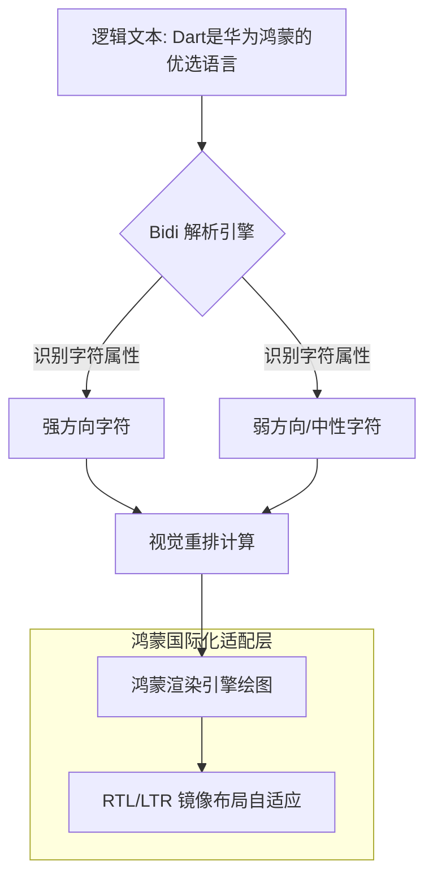

欢迎加入开源鸿蒙跨平台社区：[https://openharmonycrossplatform.csdn.net](https://openharmonycrossplatform.csdn.net)。

# Flutter for OpenHarmony：bidi — 语言排版全球通（国际化适配底座）

## 前言

在华为鸿蒙（OpenHarmony）生态走向全球舞台的过程中，应用必须具备顶级的“包容性设计”。对于阿拉伯语、希伯来语等从右向左（RTL）书写的语言，如果简单的将 UI 镜像翻转而不处理复杂的“中英文混排”双向文本问题，会导致排版混乱与语义歧义。

`bidi` 是一款专为处理双向文本（Bi-Directional）设计的工具库。它不仅能够准确检测文本的视觉书写方向，还能解析和重排嵌套的文本片段，确保在鸿蒙应用的复杂列表、搜索框以及富文本展示中，无论是 LTR 还是 RTL 字符都能各得其所。对于追求细节、对标国际化标准的鸿蒙应用而言，它是构建全球化视野不可或缺的技术拼图。

## 一、原理展示 / 概念介绍

### 1.1 基础概念

双向文本算法（Bidi Algorithm）的核心是处理逻辑顺序与视觉顺序的映射。



### 1.2 核心要点解析

- **方向检测**：自动判断一段文本是应以 RTL 还是 LTR 为主导方向，无需开发者手动打标。
- **视觉顺序重组**：将保存在内存中的逻辑文本流，根据 Unicode 规则转换为显示用的视觉流。
- **镜像适配辅助**：协助开发者决定 UI 组件（如返回图标、进度条）是否应当根据当前文本语境进行翻转。

## 二、核心 API / 组件详解

### 2.1 依赖引入

在鸿蒙工程的 `pubspec.yaml` 中添加以下依赖：

```yaml
dependencies:
  bidi: ^0.1.0 # 请根据实际版本锁定
```

### 2.2 文本方向动态检测

在鸿蒙端处理用户输入的混合文本：

```dart
import 'package:bidi/bidi.dart' as bidi;

void detectLanguageFlow(String input) {
  // ✅ 推荐做法：通过 Bidi 类检测文本的主导方向
  final bool isRtl = bidi.Bidi.hasAnyRtl(input);
  
  if (isRtl) {
    print('💡 发现 RTL 字符，鸿蒙 UI 需要考虑镜像适配');
  }
}
```

### 2.3 包裹文本保护

💡 **技巧**：使用 Unicode 隔离字符防止中英文混排时的符号飘移问题。

## 三、场景示例

### 3.1 场景一：鸿蒙多语言社交应用标题

当一条动态包含“阿拉伯语动态 @李华 (China)”时，`bidi` 确保括号中的内容不会因为双向冲突而出现在错误的一侧。

### 3.2 场景二：分布快流转中的 RTL 处理

在鸿蒙多设备流转建议中，确保设备名称与状态描述在 RTL 语境下对齐逻辑一致。

## 四、OpenHarmony 平台适配挑战

### 4.1 系统字体与文本对齐的联动

鸿蒙系统设置中切换语言为阿拉伯语后，系统全局方向会变为 RTL。

✅ **适配策略建议**：
1. **统一自适应对齐**：在 Flutter 代码中，尽量使用 `TextAlign.start` 和 `TextAlign.end` 替代硬编码的 `left` / `right`。结合 `bidi` 库在数据层预判内容方向，动态调整布局重心。
2. **符号与镜像**：部分鸿蒙系统自带图标（如返回箭头）具备自动镜像能力。对于自定义画笔（Canvas）绘制的内容，需在 `bidi` 计算后手动执行 `canvas.scale(-1, 1)` 操作。

## 五、综合实战示例代码

以下是一个演示如何根据内容方向动态调整鸿蒙卡片文字排列的组件：

```dart
import 'package:flutter/material.dart';
import 'package:bidi/bidi.dart' as bidi;

class BidiLabPage extends StatefulWidget {
  const BidiLabPage({super.key});

  @override
  State<BidiLabPage> createState() => _BidiLabPageState();
}

class _BidiLabPageState extends State<BidiLabPage> {
  final TextEditingController _controller = TextEditingController();
  TextDirection _currentDirection = TextDirection.ltr;

  void _onTextChanged(String value) {
    // 💡 实战示例：实时检测输入方向并重置鸿蒙卡片对齐方式
    final isRtl = bidi.Bidi.hasAnyRtl(value);
    setState(() {
      _currentDirection = isRtl ? TextDirection.rtl : TextDirection.ltr;
    });
  }

  @override
  Widget build(BuildContext context) {
    return Scaffold(
      appBar: AppBar(title: const Text('Bidi 双向文本实验室')),
      body: Padding(
        padding: const EdgeInsets.all(20),
        child: Column(
          children: [
            const Icon(Icons.translate_outlined, size: 80, color: Colors.blueGrey),
            const SizedBox(height: 30),
            TextField(
              controller: _controller,
              onChanged: _onTextChanged,
              decoration: const InputDecoration(
                hintText: '输入混排文本 (试下阿拉伯语+中文)',
                border: OutlineInputBorder(),
              ),
            ),
            const SizedBox(height: 40),
            Directionality(
              textDirection: _currentDirection,
              child: Container(
                width: double.infinity,
                padding: const EdgeInsets.all(16),
                decoration: BoxDecoration(color: Colors.grey[100], borderRadius: BorderRadius.circular(12)),
                child: Text(
                  _controller.text.isEmpty ? "预览区域" : _controller.text,
                  style: const TextStyle(fontSize: 18),
                ),
              ),
            ),
            const SizedBox(height: 20),
            Text("当前视觉策略: ${_currentDirection == TextDirection.rtl ? 'RTL (从右向左)' : 'LTR (从左向右)'}")
          ],
        ),
      ),
    );
  }
}
```

## 六、总结

在立志全球化的 OpenHarmony 应用中，每一个字符的正确渲染都是对用户尊重的体现。`bidi` 库屏蔽了底层复杂的 Unicode 解析细节，让开发者能以极低的成本获得专业的国际化排版能力。

✅ **核心建议**：
1. **早检查、早预防**：在数据入库或显示前即通过 `bidi` 类库进行方向标记。
2. **结合主题切换**：利用 Flutter 的 `DirectionalBox` 等组件配合 `bidi` 结果，实现优雅的镜像 UI 切换。
3. **测试覆盖**：在验证鸿蒙国际化版本时，不仅要测试纯 RTL，更要大量测试 LTR+RTL 的混排样例，这是最容易由于 BiDi 处理不当而翻车的地方。

📦 **完整代码已上传至 AtomGit**：[open-harmony-example/bidi](https://atomgit.com/dragonbady/open-harmony-example/tree/main/examples/bidi)

🌐 **欢迎加入开源鸿蒙跨平台社区**：[开源鸿蒙跨平台开发者社区](https://openharmonycrossplatform.csdn.net)
