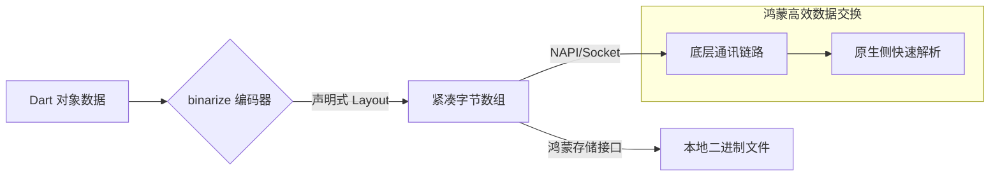

欢迎加入开源鸿蒙跨平台社区：[https://openharmonycrossplatform.csdn.net](https://openharmonycrossplatform.csdn.net)。

# Flutter for OpenHarmony：binarize — 高效二进制封包引擎（底层通讯底座）

## 前言

在华为鸿蒙（OpenHarmony）生态的深度开发中，高性能的底层通讯、私有协议对接以及传感器数据的原始存储是不可绕过的课题。传统的 JSON 序列化虽然方便，但在处理大规模短脉冲数据或高频 NAPI 交互时，冗余的字符开销不仅消耗珍贵的 Flash 寿命，更会由于复杂的解析逻辑导致 UI 帧率抖动。

`binarize` 是一款专为 Dart/Flutter 设计的高性能二进制序列化库。它通过声明式的 DSL（领域特定语言）定义数据结构，能够将复杂的 Dart 对象直接映射为紧凑的字节流（Byte Range）。在构建鸿蒙平台的物联网（IoT）网关、音频原始流传输以及高性能游戏同步协议时，它是你追求极致能效比的不二之选。

## 一、原理展示 / 概念介绍

### 1.1 基础概念

`binarize` 采用预定义布局（Layout）的模式进行读写。



### 1.2 核心要点解析

- **声明式 Layout**：通过 `uint32`, `string`, `list`, `nested` 等基本算子组合出复杂的数据结构。
- **内存对齐与端序**：支持大端（Big-Endian）与小端（Little-Endian）切换，完美适配鸿蒙不同硬件平台的字节序要求。
- **无损压缩效应**：相比 JSON，在处理结构化数值时，体积通常可缩小 60%~90%。

## 二、核心 API / 组件详解

### 2.1 依赖引入

在鸿蒙工程的 `pubspec.yaml` 中添加：

```yaml
dependencies:
  binarize: ^1.1.0
```

### 2.2 定义通讯协议布局

模拟一个典型的鸿蒙智能灯泡控制协议：

```dart
import 'package:binarize/binarize.dart';

// ✅ 推荐做法：预先定义静态 Layout 提升复用性
final lightControlPayload = Payload.reusable(
  (builder) => builder
    ..uint8('brightness') // 亮度 0-255
    ..uint32('color_hex') // 颜色十六进制
    ..string('command_id', length: 8) // 指令 ID 限制长度
);
```

### 2.3 数据封包与解包

💡 **技巧**：在鸿蒙端处理 NAPI 返回的 `Uint8List` 时，直接使用 `binarize` 进行快速反序列化。

## 三、场景示例

### 3.1 场景一：鸿蒙健康监测传感器数据存储

运动健康应用需要每秒记录多次心率与步数。使用 `binarize` 可以将一整天的轨迹数据压缩在极小的文件内。

### 3.2 场景二：分布快同步（Dynamic Sync）

在鸿蒙分布式任务流转中，快速同步一个轻量级的组件状态。

## 四、OpenHarmony 平台适配挑战

### 4.1 字节序（Endianness）的陷阱

鸿蒙运行的设备可能基于 ARM（小端）或某些特殊 SoC（需注意端序）。

✅ **适配策略建议**：
1. **显式声明端序**：在 `binarize` 初始化 Reader/Writer 时，明确指定端序，确保数据在不同 CPU 架构的鸿蒙设备间流转时语义一致。
2. **Buffer 零拷贝优化**：在处理来自鸿蒙原生侧的庞大 Byte 数据时，尽量使用 `Uint8List.view` 进行视图操作，避免在内存中进行全量数据拷贝。

## 五、综合实战示例代码

以下是一个模拟鸿蒙手机“用户画像同步”的二进制序列化演示：

```dart
import 'dart:typed_data';
import 'package:flutter/material.dart';
import 'package:binarize/binarize.dart';

class BinarizeLab extends StatefulWidget {
  const BinarizeLab({super.key});

  @override
  State<BinarizeLab> createState() => _BinarizeLabState();
}

class _BinarizeLabState extends State<BinarizeLab> {
  String _info = "准备模拟二进制封包...";
  Uint8List? _lastBuffer;

  void _runSerialization() {
    // 💡 实战示例：构建一个复杂的用户配置协议
    final userProfile = Payload.reusable((b) => b
      ..uint32('uid')
      ..string('nickName')
      ..boolean('isAdmin'));

    // 1. 编码过程
    final writer = PayloadWriter(userProfile);
    writer.set('uid', 10001);
    writer.set('nickName', '鸿蒙开发者');
    writer.set('isAdmin', true);
    final buffer = writer.toBuffer();

    // 2. 解码过程
    final reader = PayloadReader(userProfile, buffer);
    final uid = reader.get<int>('uid');
    final name = reader.get<String>('nickName');

    setState(() {
      _lastBuffer = buffer;
      _info = "⚡ 原始字节长度: ${buffer.length}\n"
              "✅ 解析成功：ID=$uid, 昵称=$name";
    });
  }

  @override
  Widget build(BuildContext context) {
    return Scaffold(
      appBar: AppBar(title: const Text('Binarize 二进制实验室')),
      body: Padding(
        padding: const EdgeInsets.all(24),
        child: Column(
          children: [
            const Icon(Icons.binary_outlined, size: 80, color: Colors.blueGrey),
            const SizedBox(height: 20),
            Text(_info, style: const TextStyle(height: 1.5, fontSize: 16)),
            const Divider(height: 40),
            if (_lastBuffer != None)
              Text("字节预览: ${_lastBuffer!.take(10).toList().toString()}..."),
            const Spacer(),
            ElevatedButton.icon(
              onPressed: _runSerialization,
              icon: const Icon(Icons.compress),
              label: const Text('执行鸿蒙协议二进制封包'),
              style: ElevatedButton.styleFrom(minimumSize: const Size.fromHeight(50)),
            ),
          ],
        ),
      ),
    );
  }
}
```

## 六、总结

`binarize` 为 OpenHarmony 端的高性能通讯提供了坚实的底层技术保障。它不仅能让你的应用“更轻”，还能让数据交换变得“更快”。

✅ **核心建议**：
1. **Schema 管理**：将所有 Layout 定义集中管理，作为单源真相（Single Source of Truth），防止前后端协议版本不一致。
2. **渐进式迁移**：初期可以仅对图片元数据、坐标流等高频数据进行二进制化，普通的配置项仍可保留 JSON。
3. **结合 Protobuf 思路**：对于极其庞大的系统，可以考虑 `binarize` 配合 `protobuf` 插件，在鸿蒙端实现工业级的协议栈。

📦 **完整代码已上传至 AtomGit**：[open-harmony-example/binarize](https://atomgit.com/dragonbady/open-harmony-example/tree/main/examples/binarize)

🌐 **欢迎加入开源鸿蒙跨平台社区**：[开源鸿蒙跨平台开发者社区](https://openharmonycrossplatform.csdn.net)
