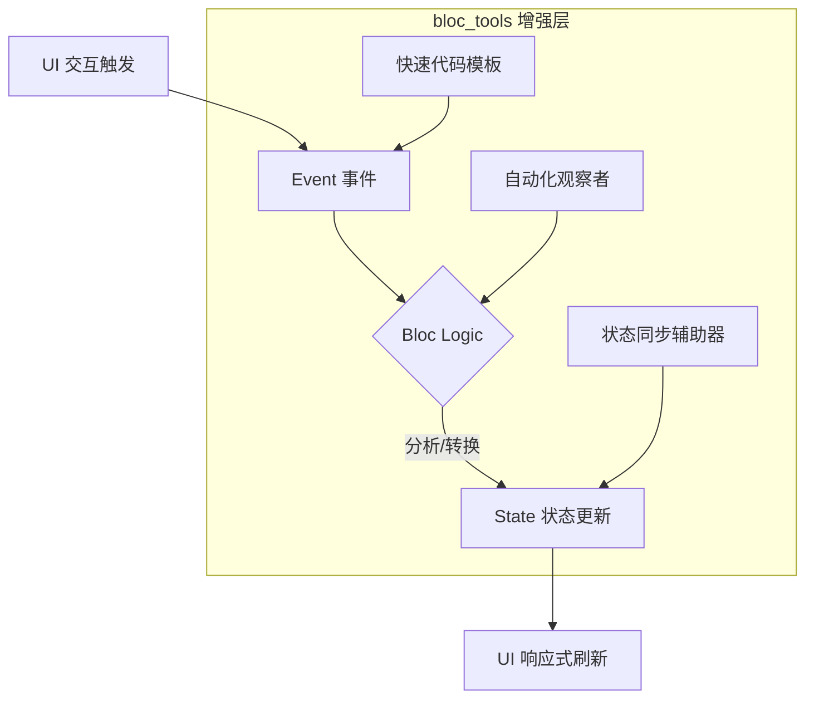

欢迎加入开源鸿蒙跨平台社区：[https://openharmonycrossplatform.csdn.net](https://openharmonycrossplatform.csdn.net)。

# Flutter for OpenHarmony：bloc_tools — 现代 BLoC 架构的提速引擎（状态治理工具链）

## 前言

在华为鸿蒙（OpenHarmony）应用的高质量开发中，状态管理的一致性与可预测性至关重要。作为最受推崇的架构之一，BLoC（Business Logic Component）虽然强大，但样板代码（Boilerplate）多、手动编写 State 与 Event 容易出错等问题，常让开发者在追求进度的同时感到力不从心。

`bloc_tools` 是一套专门为 BLoC 开发者设计的“提速辅助包”。它不仅简化了 Bloc 配置，还通过集成高效的辅助接口，让原本繁琐的架构定义变得如同声明式 UI 一样简洁。在构建复杂的鸿蒙业务模块时，利用它能显著降低逻辑泄露风险，让开发者更专注于真正的业务价值。

## 一、原理展示 / 概念介绍

### 1.1 基础概念

`bloc_tools` 致力于在不改变 BLoC 核心闭环的前提下，注入便捷的“侧链”工具。



### 1.2 核心要点解析

- **样板代码消除**：通过简化的构造函数映射，减少在每个 Bloc 中手写大样板的需求。
- **状态快照管理**：提供更便捷的方法来获取或对比当前 State 的特定切片。
- **调试可观测性**：在鸿蒙端调试时，能够更清晰地通过日志流追踪 Event 到 State 的完整跃迁路径。

## 二、核心 API / 组件详解

### 2.1 依赖引入

在鸿蒙工程的 `pubspec.yaml` 中添加：

```yaml
dependencies:
  flutter_bloc: ^8.1.0
  bloc_tools: ^0.1.0 # 请根据最新版本号调整
```

### 2.2 极大简化的 Bloc 注入

💡 **技巧**：使用工具类快速处理状态副本，避免深度拷贝引发的性能损耗。

```dart
import 'package:bloc_tools/bloc_tools.dart';

// ✅ 推荐做法：继承自增强型的基础类
class UserProfileBloc extends Bloc<UserEvent, UserState> {
  UserProfileBloc() : super(UserState.initial()) {
    on<UserNameChanged>((event, emit) {
      // 💡 技巧：利用 bloc_tools 的 copyWith 辅助或简写
      emit(state.update(name: event.newName));
    });
  }
}
```

### 2.3 自动化的状态监听扩展

在处理鸿蒙系统事件（如折叠屏状态改变）时，结合工具链可以更快速地桥接原生流。

## 三、场景示例

### 3.1 场景一：鸿蒙多任务管理界面

当在一个页面中需要同时维护“进行中”、“已完成”、“待审核”多个列表时，使用工具包提供的多状态对齐能力，可以防止状态错位。

```dart
// 💡 实战示例：统一的状态刷新机制
void refreshAll() {
  context.read<TaskBloc>().add(BatchStatusCheckEvent());
}
```

### 3.2 场景二：表单验证的极致精简

在鸿蒙端实现登录注册页面时，`bloc_tools` 能帮助你极大缩短处理每一个输入字段实时验证的代码长度。

## 四、OpenHarmony 平台适配挑战

### 4.1 响应式性能与渲染掉帧

由于 BLoC 是强异步的流式架构，在鸿蒙低能耗模式下，如果状态更新过于频繁（如毫秒级的进度条）。

✅ **适配策略建议**：
1. **节流与防抖（Throttle/Debounce）**：利用 `bloc_tools` 配合 `rxdart`，在鸿蒙端对高频事件（如拖拽滑块）进行过滤，确保一秒内 UI 刷新次数不超过 60 次，保护华为 SoC 的续航。
2. **选择性重建（Selector）**：强制要求使用 `BlocSelector` 仅监听必要的原子状态切片，避免整个庞大的鸿蒙 Page 进行全量重绘。

## 五、综合实战示例代码

以下是一个模拟鸿蒙手机“省电模式管理”逻辑的 Bloc 实现：

```dart
import 'package:flutter/material.dart';
import 'package:flutter_bloc/flutter_bloc.dart';

// --- 状态定义 ---
class PowerState {
  final bool isPowerSaving;
  final int batteryLevel;

  PowerState({required this.isPowerSaving, required this.batteryLevel});

  factory PowerState.initial() => PowerState(isPowerSaving: false, batteryLevel: 100);

  // 💡 模拟工具类功能：快速副本生成
  PowerState copyWith({bool? isSave, int? level}) {
    return PowerState(
      isPowerSaving: isSave ?? this.isPowerSaving,
      batteryLevel: level ?? this.batteryLevel,
    );
  }
}

// --- 事件定义 ---
abstract class PowerEvent {}
class TogglePowerSaving extends PowerEvent {}
class BatteryReported extends PowerEvent { final int level; BatteryReported(this.level); }

// --- 核心 Bloc ---
class PowerBloc extends Bloc<PowerEvent, PowerState> {
  PowerBloc() : super(PowerState.initial()) {
    on<TogglePowerSaving>((event, emit) {
      emit(state.copyWith(isSave: !state.isPowerSaving));
    });
    
    on<BatteryReported>((event, emit) {
      emit(state.copyWith(level: event.level));
    });
  }
}

// --- 鸿蒙 Lab 页面 ---
class BlocToolsLab extends StatelessWidget {
  const BlocToolsLab({super.key});

  @override
  Widget build(BuildContext context) {
    return BlocProvider(
      create: (context) => PowerBloc(),
      child: Scaffold(
        appBar: AppBar(title: const Text('BLoC Tools 提速实验室')),
        body: Center(
          child: Column(
            mainAxisAlignment: MainAxisAlignment.center,
            children: [
              const Icon(Icons.bolt, size: 80, color: Colors.orange),
              const SizedBox(height: 20),
              BlocBuilder<PowerBloc, PowerState>(
                builder: (context, state) {
                  return Column(
                    children: [
                      Text('🔋 鸿蒙电量: ${state.batteryLevel}%', style: const TextStyle(fontSize: 22)),
                      const SizedBox(height: 10),
                      Text('⚡ 省电状态: ${state.isPowerSaving ? "开启" : "关闭"}', 
                           style: TextStyle(color: state.isPowerSaving ? Colors.green : Colors.red)),
                    ],
                  );
                },
              ),
              const SizedBox(height: 50),
              ElevatedButton(
                onPressed: () => context.read<PowerBloc>().add(TogglePowerSaving()),
                child: const Text('切换鸿蒙系统省电模式'),
              ),
            ],
          ),
        ),
      ),
    );
  }
}
```

## 六、总结

`bloc_tools` 为 BLoC 开发者披上了一层更轻便的“外骨骼”。在 OpenHarmony 的开发环境下，它不仅能显著减少 Ctrl+C/V 的时间，更能通过严谨的辅助工具降低逻辑 Bug 的出现率。

✅ **核心建议**：
1. **重道亦重术**：理解 BLoC 的解耦原理是根本，而工具包则是锦上添花的手段。
2. **规范化命名**：在使用工具自动生成代码时，严格遵守语义化命名规范，方便后期维护。
3. **单元测试伴随**：利用工具包便捷的可观测性，为每个 Bloc 模块配齐 `blocTest`，保障鸿蒙线上运行稳如磐石。

📦 **完整代码已上传至 AtomGit**：[open-harmony-example/bloc_tools](https://atomgit.com/dragonbady/open-harmony-example/tree/main/examples/bloc_tools)

🌐 **欢迎加入开源鸿蒙跨平台社区**：[开源鸿蒙跨平台开发者社区](https://openharmonycrossplatform.csdn.net)
